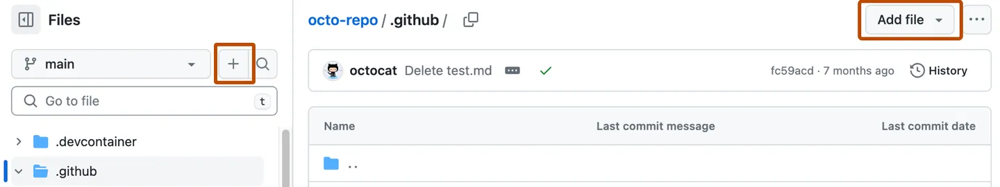
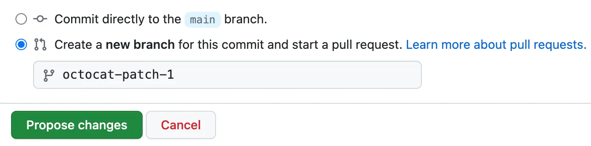

# Laboratorios:
1. [Cómo crear una plantilla de Pull Request (Pull Request Template) en tu repositorio](#lab-cómo-crear-una-plantilla-de-pull-request-pull-request-template-en-tu-repositorio)
2. [Pruebas Unitarias y Mocking en Python](#lab-pruebas-unitarias-y-mocking-en-python)


## lab: Cómo crear una plantilla de Pull Request (Pull Request Template) en tu repositorio

Cuando agregas una plantilla de Pull Request a tu repositorio, los colaboradores verán automáticamente el contenido de la plantilla al crear un nuevo Pull Request.

### Paso a paso para agregar una plantilla de Pull Request

1. **Crea un repositorio y crea la carpeta `.github`**
2. **Entra a la página principal de tu repositorio en GitHub.**


3. **Arriba de la lista de archivos, haz clic en el menú desplegable `Add file` y luego en `Create new file`.**
	- Alternativamente, puedes hacer clic en el ícono de `+` en la vista de archivos a la izquierda.

	

4. **En el campo del nombre del archivo, elige una de las siguientes opciones:**
	- Para que la plantilla sea visible en la raíz del repositorio: `pull_request_template.md`
	- Para que sea visible en la carpeta de documentación: `docs/pull_request_template.md`
	- Para almacenarla en un directorio oculto: `.github/pull_request_template.md`
	- Para crear múltiples plantillas: `.github/PULL_REQUEST_TEMPLATE/nombre_plantilla.md` (puedes tener varias en esa carpeta).

5. **En el cuerpo del nuevo archivo, agrega el contenido de tu plantilla de Pull Request.**
	- Ejemplo de contenido:

	```markdown
	# Pull Request

	## Descripción
	Por favor, incluye un resumen de los cambios y la motivación detrás de ellos.

	## Tipo de cambio
	- [ ] Bugfix
	- [ ] Nueva funcionalidad
	- [ ] Refactorización
	- [ ] Documentación
	- [ ] Otro (especificar):

	## ¿Cómo se ha probado?
	Describe brevemente cómo se ha probado este cambio.

	## Issues relacionados
	Referencia a issues relacionados (Ej: `Closes #123`).

	## Checklist
	- [ ] He revisado mi código antes de solicitar el PR
	- [ ] He realizado pruebas locales
	- [ ] La documentación está actualizada (si aplica)
	- [ ] No hay archivos innecesarios incluidos

	## Notas adicionales
	Incluye cualquier información relevante para los revisores.
	```

5. **Haz clic en `Commit changes...`**

6. **En el campo de mensaje de commit, escribe un mensaje corto y descriptivo sobre el cambio realizado.**
	- Puedes atribuir el commit a más de un autor si es necesario.

7. **Debajo del mensaje de commit, elige si deseas agregar el commit a la rama actual o crear una nueva rama.**
	- Si tu rama actual es la rama principal (main), se recomienda crear una nueva rama y luego hacer un Pull Request.

	

8. **Haz clic en `Commit changes` o `Propose changes`.**

Las plantillas estarán disponibles para los colaboradores una vez que se fusionen en la rama principal del repositorio.

## Lab: Pruebas Unitarias y Mocking en Python

**Duración estimada:** 30–45 min  
**Nivel:** Intermedio  
**Objetivo:** Realizar pruebas unitarias a través de asistente IA Copilot

---

## Ejercicio 1: Configuración global de tests con @workspace /setupTests

Las anotaciones como `@workspace /setupTests` se utilizan para indicar archivos o bloques de código que preparan el entorno de pruebas, por ejemplo, Te preguntará si deseas utilizar pytest o unittest:

```python
Elegiremos pytest
```

---

## Ejercicio 2: Generar Pruebas unitarias de una calculadora con @workspace /test

Si abrimos el archivo Calculator.py y en el prompt usas `@workspace /test`, generará los unit test para el archivo activo. Por ejemplo, para una calculadora te generará algo como:

```python
# @workspace /test
import pytest
from calculator import add, subtract, multiply, divide, power, factorial

def test_add():
	assert add(2, 3) == 5

def test_subtract():
	assert subtract(5, 2) == 3

def test_multiply():
	assert multiply(2, 4) == 8

def test_divide():
	assert divide(10, 2) == 5
	with pytest.raises(ValueError):
		divide(5, 0)

def test_power():
	assert power(2, 3) == 8

def test_factorial():
	assert factorial(5) == 120
	assert factorial(0) == 1
	with pytest.raises(ValueError):
		factorial(-1)
```

---

## Ejercicio 3: Generando tests para funciones matemáticas en math_utils.py

Abrir el archivo `math_utils.py`:

```python
def generate_fibonacci(n):
	"""Generates a list of the first n Fibonacci numbers."""
	if n < 0:
		raise ValueError("Input must be a non-negative integer.")
	fib_sequence = []
	a, b = 0, 1
	for _ in range(n):
		fib_sequence.append(a)
		a, b = b, a + b
	return fib_sequence

def factorial(n):
	"""Calculates the factorial of a number."""
	if n < 0:
		raise ValueError("Factorial is not defined for negative numbers.")
	result = 1
	for i in range(1, n + 1):
		result *= i
	return result
```

Para generar pruebas unitarias para estas funciones, puedes usar el siguiente prompt:

> Genera casos de prueba unitarios para math_utils.py

Y el resultado esperado sería:

```python
import pytest
from math_utils import generate_fibonacci, factorial

def test_generate_fibonacci():
	assert generate_fibonacci(0) == []
	assert generate_fibonacci(1) == [0]
	assert generate_fibonacci(5) == [0, 1, 1, 2, 3]
	assert generate_fibonacci(7) == [0, 1, 1, 2, 3, 5, 8]
	with pytest.raises(ValueError):
		generate_fibonacci(-1)

def test_factorial():
	assert factorial(0) == 1
	assert factorial(1) == 1
	assert factorial(5) == 120
	with pytest.raises(ValueError):
		factorial(-3)
```

Puedes modificar o ampliar los tests para cubrir más casos según lo necesites.

---

## Ejercicio 3: Generando tests con datos dummy para servicios externos

Supón que tienes el siguiente archivo `weather_service.py`:

```python
import requests

def get_weather(location):
	"""Fetches weather information for a given location."""
	response = requests.get(f"https://api.weather.com/v3/weather/{location}")
	return response.json()
```

Para generar pruebas unitarias usando mock y datos dummy, puedes usar el siguiente prompt:

> Genera casos de prueba unitarios usando mock para dependencias externas usando datos dummy

Y el resultado esperado sería:

```python
import pytest
from unittest.mock import patch, Mock
from weather_service import get_weather

def test_get_weather_with_mock():
	dummy_data = {"temp": 25, "condition": "Sunny"}
	mock_response = Mock()
	mock_response.json.return_value = dummy_data
	with patch("weather_service.requests.get", return_value=mock_response) as mock_get:
		result = get_weather("lima")
		mock_get.assert_called_once_with("https://api.weather.com/v3/weather/lima")
		assert result == dummy_data
```

Puedes modificar el `dummy_data` para simular diferentes respuestas y agregar más pruebas para otros escenarios (por ejemplo, manejo de errores).

---


## Ejercicio 4: Ejecutando las pruebas y revisando cobertura

1. Instala `pytest` en tu entorno de Python 3:

	```bash
	pip install pytest
	```

2. (Opcional pero recomendado) Instala el plugin `pytest-cov` para ver la cobertura de código:

	```bash
	pip install pytest-cov
	```

3. Ejecuta las pruebas con:

	```bash
	pytest
	```
	ó
	```bash
	python3 -m pytest
	```

4. Para ver el reporte de cobertura de código, ejecuta:

	```bash
	python3 -m pytest --cov
	```

	Esto mostrará un resumen de qué porcentaje de tu código está cubierto por las pruebas.

5. Deberías ver una salida indicando que las pruebas pasaron correctamente y, si usaste `--cov`, un reporte de cobertura.


---

## Conclusión

Has aprendido a:
- Configurar y usar `pytest`.
- Simular dependencias externas con `unittest.mock`.
- Escribir pruebas unitarias efectivas para código que depende de servicios externos.
- Entender el propósito de las anotaciones `@workspace /test` y `@workspace /setupTests` en la organización y automatización de pruebas.

¡Buen trabajo!
