# Laboratorio 10: Azure DevOps Pipelines - CI/CD con Python

**Duración estimada:** 90–120 min  
**Nivel:** Intermedio  
**Contexto:** En este laboratorio aprenderás a implementar CI/CD con Azure DevOps Pipelines, desde conceptos básicos hasta pipelines complejos con múltiples stages, jobs y artefactos.

---

## Objetivos de aprendizaje

- Entender la arquitectura y componentes de Azure Pipelines (Pipelines, Stages, Jobs, Steps, Tasks)
- Crear pipelines de CI/CD para aplicaciones Python
- Implementar stages y jobs paralelos y secuenciales
- Gestionar artefactos y outputs entre stages
- Configurar cache para optimizar tiempos de ejecución
- Aplicar buenas prácticas de seguridad y organización

---

## Requisitos

- Cuenta de Azure DevOps ([https://dev.azure.com/](https://dev.azure.com/))
- Proyecto en Azure DevOps
- Conocimientos básicos de Git y control de versiones
- Familiaridad con Python y pytest
- Editor de texto o IDE configurado

---

## Estructura del proyecto

```
azure_pipelines_demo/
├── azure-pipelines.yml         # Pipeline principal de CI/CD
├── hello.py                    # Aplicación Python simple
├── tests/
│   └── test_hello.py          # Tests unitarios
├── requirements.txt            # Dependencias Python
├── README.md                   # Documentación del proyecto
└── laboratorio_azure_pipelines.md  # Esta guía
```

---

## Parte 1: Conceptos Fundamentales de Azure Pipelines

### 1.1 ¿Qué es Azure DevOps Pipelines?

**Azure Pipelines** es un servicio de CI/CD en la nube que permite automatizar la construcción, prueba y despliegue de código. Es parte de la suite Azure DevOps.

**Ventajas principales:**
- ✅ **Integración nativa**: Soporte para GitHub, Azure Repos, Bitbucket
- ✅ **Multi-plataforma**: Windows, macOS, Linux
- ✅ **Gratuito**: 1800 minutos/mes para proyectos públicos, 1 agente paralelo gratis
- ✅ **Extensible**: Marketplace con miles de extensiones
- ✅ **Soporte YAML**: Pipelines como código

### 1.2 Componentes de Azure Pipelines

#### **Pipeline (Flujo de trabajo)**
Un **pipeline** es el proceso completo de CI/CD definido en YAML o mediante el diseñador visual.

```yaml
# Ejemplo básico de pipeline
trigger:
  branches:
    include:
    - main

pool:
  vmImage: 'ubuntu-latest'

steps:
- task: UsePythonVersion@0
  inputs:
    versionSpec: '3.11'
```

#### **Stage (Etapa)**
Un **stage** es una colección lógica de jobs. Los stages se ejecutan secuencialmente por defecto.

```yaml
stages:
- stage: Build
  displayName: 'Build Stage'
  jobs:
  - job: BuildJob
    steps: [...]

- stage: Deploy
  displayName: 'Deploy Stage'
  dependsOn: Build  # Espera a que termine Build
  jobs:
  - job: DeployJob
    steps: [...]
```

#### **Job (Trabajo)**
Un **job** es una colección de steps que se ejecutan en un agente. Los jobs dentro de un stage pueden ejecutarse en paralelo.

```yaml
jobs:
- job: TestJob
  displayName: 'Run Tests'
  pool:
    vmImage: 'ubuntu-latest'
  steps: [...]

- job: LintJob
  displayName: 'Run Linting'
  pool:
    vmImage: 'ubuntu-latest'
  steps: [...]
```

#### **Step (Paso)**
Un **step** es la unidad más pequeña de trabajo. Puede ser un script o una tarea (task).

```yaml
steps:
- task: UsePythonVersion@0
  displayName: 'Setup Python 3.11'
  inputs:
    versionSpec: '3.11'

- script: |
    python -m pip install --upgrade pip
    pip install -r requirements.txt
  displayName: 'Install dependencies'
```

#### **Task (Tarea)**
Una **task** es una acción pre-construida del marketplace de Azure DevOps.

```yaml
- task: UsePythonVersion@0      # Task oficial
- task: PublishTestResults@2    # Task oficial
- task: Docker@2                # Task oficial
```

#### **Agent (Agente)**
Un **agent** es una máquina que ejecuta los jobs. Pueden ser:
- **Microsoft-hosted**: Agentes gestionados por Microsoft (ubuntu-latest, windows-latest, macOS-latest)
- **Self-hosted**: Agentes propios que registras en Azure DevOps

---

## Parte 2: Crear tu primer Pipeline

### 2.1 Crear proyecto en Azure DevOps

1. Ve a [https://dev.azure.com/](https://dev.azure.com/)
2. Crea una nueva organización (si no tienes una)
3. Crea un nuevo proyecto: **azure-pipelines-demo**
4. Selecciona visibilidad: **Private** o **Public**

### 2.2 Importar repositorio desde GitHub

1. En tu proyecto, ve a **Repos**
2. Haz clic en **Import repository**
3. Ingresa la URL de tu repositorio de GitHub
4. O crea un nuevo repositorio y sube tu código

### 2.3 Crear archivos del proyecto

#### **Archivo: `hello.py`**

```python
"""
Aplicación Python simple para demostración de CI/CD
"""

def greet(name: str = "World") -> str:
    """Retorna un saludo personalizado"""
    return f"Hello, {name}!"

def add(a: int, b: int) -> int:
    """Suma dos números"""
    return a + b

def main():
    """Función principal"""
    print(greet())
    print(f"2 + 3 = {add(2, 3)}")

if __name__ == "__main__":
    main()
```

#### **Archivo: `tests/test_hello.py`**

```python
"""
Tests unitarios para hello.py
"""
import pytest
from hello import greet, add

def test_greet_default():
    """Test saludo por defecto"""
    assert greet() == "Hello, World!"

def test_greet_custom():
    """Test saludo personalizado"""
    assert greet("DevOps") == "Hello, DevOps!"

def test_add():
    """Test suma de números"""
    assert add(2, 3) == 5
    assert add(-1, 1) == 0
    assert add(0, 0) == 0
```

#### **Archivo: `requirements.txt`**

```txt
pytest==7.4.3
pytest-cov==4.1.0
```

---

## Parte 3: Pipeline Básico

### 3.1 Crear el archivo `azure-pipelines.yml`

**Archivo: `azure-pipelines.yml`**

```yaml
# Azure Pipelines CI/CD para Python
# Documentación: https://aka.ms/yaml

trigger:
  branches:
    include:
    - main
    - develop
  paths:
    exclude:
    - README.md
    - docs/*

pr:
  branches:
    include:
    - main

variables:
  pythonVersion: '3.11'
  buildConfiguration: 'Release'

pool:
  vmImage: 'ubuntu-latest'

stages:
- stage: Test
  displayName: 'Test Stage'
  jobs:
  - job: TestJob
    displayName: 'Run Tests'
    steps:
    # STEP 1: Checkout code
    - checkout: self
      displayName: 'Checkout repository'
      clean: true

    # STEP 2: Setup Python
    - task: UsePythonVersion@0
      displayName: 'Use Python $(pythonVersion)'
      inputs:
        versionSpec: '$(pythonVersion)'
        addToPath: true

    # STEP 3: Display Python version
    - script: |
        python --version
        pip --version
      displayName: 'Display Python version'

    # STEP 4: Cache pip packages
    - task: Cache@2
      displayName: 'Cache pip packages'
      inputs:
        key: 'python | "$(Agent.OS)" | requirements.txt'
        restoreKeys: |
          python | "$(Agent.OS)"
          python
        path: $(Pipeline.Workspace)/.pip

    # STEP 5: Install dependencies
    - script: |
        python -m pip install --upgrade pip
        pip install --cache-dir $(Pipeline.Workspace)/.pip -r requirements.txt
      displayName: 'Install dependencies'

    # STEP 6: Run tests
    - script: |
        export PYTHONPATH="${PYTHONPATH}:$(System.DefaultWorkingDirectory)"
        pytest tests/ -v --junitxml=test-results.xml --cov=. --cov-report=xml --cov-report=html
      displayName: 'Run pytest'

    # STEP 7: Publish test results
    - task: PublishTestResults@2
      displayName: 'Publish test results'
      condition: succeededOrFailed()
      inputs:
        testResultsFormat: 'JUnit'
        testResultsFiles: '**/test-results.xml'
        failTaskOnFailedTests: true
        testRunTitle: 'Python $(pythonVersion) Tests'

    # STEP 8: Publish code coverage
    - task: PublishCodeCoverageResults@1
      displayName: 'Publish code coverage'
      condition: succeededOrFailed()
      inputs:
        codeCoverageTool: 'Cobertura'
        summaryFileLocation: '$(System.DefaultWorkingDirectory)/coverage.xml'
        reportDirectory: '$(System.DefaultWorkingDirectory)/htmlcov'

    # STEP 9: Create build tag
    - bash: |
        BUILD_TAG="$(date +%Y%m%d-%H%M%S)-$(Build.SourceVersion | cut -c1-7)"
        echo "##vso[task.setvariable variable=buildTag;isOutput=true]$BUILD_TAG"
        echo "Build tag: $BUILD_TAG"
      name: meta
      displayName: 'Generate build tag'

    # STEP 10: Save build info
    - bash: |
        mkdir -p $(Build.ArtifactStagingDirectory)/build-info
        echo "Build ID: $(Build.BuildId)" > $(Build.ArtifactStagingDirectory)/build-info/build-info.txt
        echo "Build Number: $(Build.BuildNumber)" >> $(Build.ArtifactStagingDirectory)/build-info/build-info.txt
        echo "Build Tag: $(meta.buildTag)" >> $(Build.ArtifactStagingDirectory)/build-info/build-info.txt
        echo "Source Branch: $(Build.SourceBranch)" >> $(Build.ArtifactStagingDirectory)/build-info/build-info.txt
        echo "Commit: $(Build.SourceVersion)" >> $(Build.ArtifactStagingDirectory)/build-info/build-info.txt
      displayName: 'Save build information'

    # STEP 11: Publish artifact
    - task: PublishBuildArtifacts@1
      displayName: 'Publish build info artifact'
      inputs:
        PathtoPublish: '$(Build.ArtifactStagingDirectory)/build-info'
        ArtifactName: 'build-info'
        publishLocation: 'Container'

- stage: Package
  displayName: 'Package Stage'
  dependsOn: Test
  condition: succeeded()
  jobs:
  - job: PackageJob
    displayName: 'Create Package'
    variables:
      buildTag: $[ stageDependencies.Test.TestJob.outputs['meta.buildTag'] ]
    steps:
    - checkout: self
      displayName: 'Checkout repository'

    - bash: |
        echo "Build tag from Test stage: $(buildTag)"
        mkdir -p dist
        cp hello.py dist/
        cp requirements.txt dist/
        cd dist
        zip -r "../app-$(buildTag).zip" .
      displayName: 'Create application package'

    - task: PublishBuildArtifacts@1
      displayName: 'Publish application package'
      inputs:
        PathtoPublish: 'app-$(buildTag).zip'
        ArtifactName: 'app-package'
        publishLocation: 'Container'

- stage: Docs
  displayName: 'Documentation Stage'
  dependsOn: []  # No depende de otros stages (paralelo)
  jobs:
  - job: DocsJob
    displayName: 'Generate Documentation'
    steps:
    - bash: |
        echo "Repository: $(Build.Repository.Name)"
        echo "Branch: $(Build.SourceBranch)"
        echo "Commit: $(Build.SourceVersion)"
        echo "Build ID: $(Build.BuildId)"
        echo "Agent OS: $(Agent.OS)"
      displayName: 'Display build information'
```

### 3.2 Explicación Detallada del Pipeline

#### **Trigger (Disparador)**
```yaml
trigger:
  branches:
    include:
    - main
    - develop
  paths:
    exclude:
    - README.md
```

**Explicación:**
- **`branches.include`**: Se ejecuta en push a `main` o `develop`
- **`paths.exclude`**: Ignora cambios en README.md (no dispara el pipeline)

#### **Pull Request Trigger**
```yaml
pr:
  branches:
    include:
    - main
```
- Se ejecuta cuando se crea o actualiza un PR hacia `main`

#### **Variables**
```yaml
variables:
  pythonVersion: '3.11'
  buildConfiguration: 'Release'
```
- Variables globales disponibles en todo el pipeline
- Se accede con `$(pythonVersion)` o `$(buildConfiguration)`

#### **Pool (Agente)**
```yaml
pool:
  vmImage: 'ubuntu-latest'
```
- Especifica el tipo de agente donde se ejecuta el pipeline
- Opciones: `ubuntu-latest`, `windows-latest`, `macOS-latest`

#### **Cache Task**
```yaml
- task: Cache@2
  inputs:
    key: 'python | "$(Agent.OS)" | requirements.txt'
    path: $(Pipeline.Workspace)/.pip
```
- **`key`**: Clave única basada en OS y hash de requirements.txt
- **`path`**: Directorio a cachear
- Acelera builds subsecuentes

#### **Variables de Output**
```yaml
- bash: |
    echo "##vso[task.setvariable variable=buildTag;isOutput=true]$BUILD_TAG"
  name: meta
```
- **`##vso[task.setvariable]`**: Sintaxis especial para crear outputs
- **`isOutput=true`**: Hace que la variable esté disponible para otros stages
- **`name: meta`**: Nombre del step para referenciarlo

#### **Stage Dependencies**
```yaml
- stage: Package
  dependsOn: Test
  variables:
    buildTag: $[ stageDependencies.Test.TestJob.outputs['meta.buildTag'] ]
```
- **`dependsOn`**: Define dependencias entre stages
- **`stageDependencies`**: Accede a outputs de stages anteriores

---

## Parte 4: Crear el Pipeline en Azure DevOps

### 4.1 Método 1: Desde archivo YAML

1. En tu proyecto, ve a **Pipelines**
2. Haz clic en **New pipeline**
3. Selecciona **Azure Repos Git** (o GitHub si usas GitHub)
4. Selecciona tu repositorio
5. Selecciona **Existing Azure Pipelines YAML file**
6. Selecciona el archivo `/azure-pipelines.yml`
7. Haz clic en **Run**

### 4.2 Método 2: Crear desde cero

1. En **Pipelines**, haz clic en **New pipeline**
2. Selecciona **Azure Repos Git**
3. Selecciona **Starter pipeline**
4. Reemplaza el contenido con tu YAML
5. Haz clic en **Save and run**

---

## Parte 5: Diagrama de Arquitectura

```mermaid
graph TB
    subgraph "Azure DevOps Project"
        Repo[📁 Azure Repos<br/>hello.py, tests/]
        Pipeline[⚙️ Pipeline<br/>azure-pipelines.yml]
    end
    
    subgraph "Azure Pipelines"
        Trigger[🎯 Trigger<br/>push/PR]
        Agent1[🖥️ Agent 1<br/>ubuntu-latest]
        Agent2[🖥️ Agent 2<br/>ubuntu-latest]
        Agent3[🖥️ Agent 3<br/>ubuntu-latest]
    end
    
    subgraph "Stages & Jobs"
        TestStage[🧪 Stage: Test<br/>Job: TestJob<br/>- Setup Python<br/>- Cache<br/>- Install deps<br/>- Run tests<br/>- Publish results<br/>- Create tag]
        PackageStage[📦 Stage: Package<br/>Job: PackageJob<br/>- Checkout<br/>- Read tag<br/>- Create zip<br/>- Publish artifact]
        DocsStage[📚 Stage: Docs<br/>Job: DocsJob<br/>- Display info]
    end
    
    subgraph "Artifacts"
        BuildInfo[📄 build-info.txt]
        AppZip[🗜️ app-*.zip]
        TestResults[📊 Test Results]
        Coverage[📈 Code Coverage]
    end
    
    Repo --> Trigger
    Pipeline --> Trigger
    Trigger --> Agent1
    Trigger --> Agent2
    Trigger --> Agent3
    
    Agent1 --> TestStage
    Agent2 --> PackageStage
    Agent3 --> DocsStage
    
    TestStage --> BuildInfo
    TestStage --> TestResults
    TestStage --> Coverage
    PackageStage --> AppZip
    
    TestStage -.->|dependsOn: Test| PackageStage
    
    style Trigger fill:#e1f5ff
    style TestStage fill:#e8f5e9
    style PackageStage fill:#fff3e0
    style DocsStage fill:#f3e5f5
```



---

## Parte 6: Variables Predefinidas de Azure Pipelines

### 6.1 Variables Comunes

| Variable | Descripción | Ejemplo |
|----------|-------------|---------|
| `$(Build.BuildId)` | ID único del build | `12345` |
| `$(Build.BuildNumber)` | Número del build | `20241215.1` |
| `$(Build.SourceBranch)` | Rama completa | `refs/heads/main` |
| `$(Build.SourceBranchName)` | Nombre de la rama | `main` |
| `$(Build.SourceVersion)` | SHA del commit | `abc123...` |
| `$(Build.Repository.Name)` | Nombre del repositorio | `azure-pipelines-demo` |
| `$(Agent.OS)` | Sistema operativo | `Linux`, `Windows`, `Darwin` |
| `$(System.DefaultWorkingDirectory)` | Directorio de trabajo | `/home/vsts/work/1/s` |
| `$(Pipeline.Workspace)` | Workspace del pipeline | `/home/vsts/work/1` |
| `$(Build.ArtifactStagingDirectory)` | Directorio para artifacts | `/home/vsts/work/1/a` |

### 6.2 Uso de Variables

```yaml
- bash: |
    echo "Build ID: $(Build.BuildId)"
    echo "Branch: $(Build.SourceBranchName)"
    echo "OS: $(Agent.OS)"
  displayName: 'Display variables'
```

---

## Parte 7: Pipeline Avanzado

### 7.1 Pipeline con Matrices

Ejecutar tests en múltiples versiones de Python:

```yaml
stages:
- stage: Test
  displayName: 'Test Stage'
  jobs:
  - job: TestJob
    displayName: 'Test Python'
    strategy:
      matrix:
        Python39:
          pythonVersion: '3.9'
        Python310:
          pythonVersion: '3.10'
        Python311:
          pythonVersion: '3.11'
    steps:
    - task: UsePythonVersion@0
      inputs:
        versionSpec: '$(pythonVersion)'
    
    - script: |
        pip install -r requirements.txt
        pytest tests/
      displayName: 'Test on Python $(pythonVersion)'
```

### 7.2 Condiciones Avanzadas

```yaml
- stage: Deploy
  displayName: 'Deploy Stage'
  dependsOn: Test
  condition: and(succeeded(), eq(variables['Build.SourceBranch'], 'refs/heads/main'))
  jobs:
  - job: DeployJob
    steps:
    - script: echo "Deploying to production"
      displayName: 'Deploy'
```

### 7.3 Múltiples Agentes

```yaml
jobs:
- job: LinuxJob
  pool:
    vmImage: 'ubuntu-latest'
  steps:
  - script: echo "Running on Linux"

- job: WindowsJob
  pool:
    vmImage: 'windows-latest'
  steps:
  - script: echo "Running on Windows"

- job: MacOSJob
  pool:
    vmImage: 'macOS-latest'
  steps:
  - script: echo "Running on macOS"
```

---

## Parte 8: Comparación GitHub Actions vs Azure Pipelines

| Característica | GitHub Actions | Azure Pipelines |
|----------------|----------------|-----------------|
| **Workflow/Pipeline** | `name:` | `trigger:` |
| **Job** | `jobs:` | `jobs:` |
| **Stage** | No nativo | `stages:` |
| **Step** | `steps:` | `steps:` |
| **Runner/Agent** | `runs-on:` | `pool:` |
| **Checkout** | `actions/checkout@v4` | `checkout: self` |
| **Cache** | `actions/cache@v4` | `Cache@2` |
| **Artifact** | `upload-artifact@v4` | `PublishBuildArtifacts@1` |
| **Variables** | `${{ github.sha }}` | `$(Build.SourceVersion)` |
| **Outputs** | `$GITHUB_OUTPUT` | `##vso[task.setvariable]` |
| **Condiciones** | `if:` | `condition:` |

---

## Parte 9: Buenas Prácticas

### 9.1 Seguridad

#### **Library Variables (Secrets)**

1. En tu proyecto, ve a **Pipelines → Library**
2. Crea un nuevo **Variable Group**: `prod-secrets`
3. Agrega variables secretas (marcadas como **secret**)
4. Referencia en el pipeline:

```yaml
variables:
- group: prod-secrets

steps:
- script: |
    echo "API Key: $(API_KEY)"
  displayName: 'Use secret'
  env:
    API_KEY: $(API_KEY)
```

### 9.2 Performance

#### **Cache Estratégico**

```yaml
- task: Cache@2
  inputs:
    key: 'python | "$(Agent.OS)" | requirements.txt'
    restoreKeys: |
      python | "$(Agent.OS)"
    path: $(Pipeline.Workspace)/.pip
```

#### **Stages Paralelos**

```yaml
stages:
- stage: Test
  dependsOn: []  # Sin dependencias, ejecuta inmediatamente

- stage: Lint
  dependsOn: []  # Paralelo con Test

- stage: Package
  dependsOn: [Test, Lint]  # Espera a ambos
```

### 9.3 Mantenibilidad

#### **Templates Reutilizables**

**Archivo: `templates/test-template.yml`**

```yaml
parameters:
- name: pythonVersion
  type: string
  default: '3.11'

steps:
- task: UsePythonVersion@0
  inputs:
    versionSpec: '${{ parameters.pythonVersion }}'

- script: |
    pip install -r requirements.txt
    pytest tests/
  displayName: 'Run tests'
```

**Uso en pipeline principal:**

```yaml
jobs:
- job: TestJob
  steps:
  - template: templates/test-template.yml
    parameters:
      pythonVersion: '3.11'
```

---

## Parte 10: Troubleshooting

### 10.1 Problemas Comunes

#### **Error: No hosted parallelism**
```
No hosted parallelism has been purchased or granted
```
**Solución:**
- Solicita Microsoft-hosted parallelism gratis para proyectos públicos
- O usa self-hosted agents

#### **Error: YAML syntax error**
```
Line 25: unexpected value 'step'
```
**Solución:**
- Valida tu YAML con [YAML Validator](https://www.yamllint.com/)
- Verifica indentación (2 espacios)

#### **Error: Agent offline**
```
The agent did not connect within the allotted time
```
**Solución:**
- Verifica que hay agentes disponibles
- Reinicia self-hosted agents

### 10.2 Debugging

#### **Habilitar diagnósticos**

```yaml
- script: |
    echo "##[debug]Debug message"
    echo "##[warning]Warning message"
    echo "##[error]Error message"
  displayName: 'Debug logs'
```

#### **System.Debug Variable**

En la UI, agrega variable al ejecutar pipeline:
- Name: `System.Debug`
- Value: `true`

---

## Checklist de Éxito

- [ ] Pipeline se ejecuta correctamente en push y PR
- [ ] Tests pasan y se publican resultados
- [ ] Code coverage se publica correctamente
- [ ] Cache funciona y acelera builds subsecuentes
- [ ] Artifacts se generan y pueden descargarse
- [ ] Stages se ejecutan en el orden correcto
- [ ] Variables de output funcionan entre stages
- [ ] Logs son claros y útiles para debugging

---

## Entregables

1. **Proyecto Azure DevOps** con:
   - Pipeline funcional (`azure-pipelines.yml`)
   - Código Python con tests
   - README con instrucciones

2. **Capturas de pantalla:**
   - Ejecución exitosa del pipeline
   - Logs de cada stage/job
   - Test results publicados
   - Code coverage report
   - Artifacts generados

3. **Evidencias de funcionamiento:**
   - Historial de ejecuciones del pipeline
   - Artifacts descargables
   - Tests pasando en múltiples configuraciones

---

## Recursos Adicionales

- [Documentación oficial de Azure Pipelines](https://docs.microsoft.com/en-us/azure/devops/pipelines/)
- [YAML Schema Reference](https://docs.microsoft.com/en-us/azure/devops/pipelines/yaml-schema)
- [Azure Pipelines Tasks](https://docs.microsoft.com/en-us/azure/devops/pipelines/tasks/)
- [Best Practices for Azure Pipelines](https://docs.microsoft.com/en-us/azure/devops/pipelines/get-started/pipelines-best-practices)

---

📘 **Autor:**  
Wilson Julca Mejía  
Curso: *DevOps y Azure Pipelines – CI/CD con Python*  
Universidad de Ingeniería y Tecnología (UTEC)
