# Laboratorio 10.1: Extendiendo CI/CD - Publicación a Azure Container Registry

**Duración estimada:** 60–90 min  
**Nivel:** Intermedio  
**Contexto:** Este laboratorio es la continuación del **Laboratorio 10: Guía de Introducción a Azure Pipelines**. Ahora que dominas los conceptos fundamentales de pipelines, stages y jobs, aprenderás a extender tu pipeline CI/CD para construir y publicar imágenes Docker automáticamente en Azure Container Registry (ACR).

---

## Objetivos de aprendizaje

- Extender el pipeline existente con un nuevo stage de Docker
- Construir imágenes Docker dentro del pipeline CI/CD
- Automatizar la publicación de imágenes en Azure Container Registry
- Configurar Service Connections en Azure DevOps
- Aplicar tagging semántico a las imágenes Docker
- Entender la integración entre stages (Test → Package → Docker)

---

## Requisitos previos

✅ **Completar el Laboratorio 10: Guía de Introducción** (o tener conocimientos equivalentes)  
✅ Suscripción de Azure activa ([https://azure.microsoft.com/free/](https://azure.microsoft.com/free/))  
✅ Proyecto en Azure DevOps con pipeline funcional  
✅ Código fuente Python (`hello.py`) con tests  
✅ Familiaridad con Docker y contenedores  

---

## Contexto: ¿Dónde estamos?

En el laboratorio anterior implementamos un pipeline con tres stages:

```yaml
stages:
- stage: Test      # ✅ Ejecuta tests, genera artifacts, crea build tag
- stage: Package   # ✅ Empaqueta la aplicación en ZIP
- stage: Docs      # ✅ Genera documentación
```

**Ahora vamos a agregar:**
```yaml
stages:
- stage: Test      # ✅ Ya existe
- stage: Package   # ✅ Ya existe
- stage: Docs      # ✅ Ya existe
- stage: Docker    # 🆕 Nuevo stage: Build & Push a ACR
```

---

## Estructura del proyecto actualizada

```
azure_pipelines_demo/
├── azure-pipelines.yml         # Pipeline existente (vamos a extenderlo)
├── hello.py                    # Aplicación Python existente
├── tests/
│   └── test_hello.py          # Tests existentes
├── requirements.txt            # Dependencias existentes
├── Dockerfile                  # 🆕 Nuevo: Dockerfile para la app
└── README.md
```

---

## Parte 1: Preparación de Azure Container Registry

### 1.1 Crear Azure Container Registry

**Opción 1: Desde Azure Portal**

1. Ve a [Azure Portal](https://portal.azure.com/)
2. Busca **Container registries**
3. Haz clic en **+ Create**
4. Configura:
   - **Subscription**: Tu suscripción
   - **Resource group**: Crea uno nuevo: `rg-devops-demo`
   - **Registry name**: `acrdevopsdemo` (debe ser único globalmente)
   - **Location**: `East US` (o la más cercana)
   - **SKU**: `Basic` (suficiente para desarrollo)
5. Haz clic en **Review + create** → **Create**

**Opción 2: Desde Azure CLI**

```bash
# Login a Azure
az login

# Crear resource group
az group create \
  --name rg-devops-demo \
  --location eastus

# Crear Azure Container Registry
az acr create \
  --resource-group rg-devops-demo \
  --name acrdevopsdemo \
  --sku Basic \
  --admin-enabled true

# Mostrar información del ACR
az acr show \
  --name acrdevopsdemo \
  --resource-group rg-devops-demo
```

### 1.2 Habilitar Admin User (para desarrollo)

**Desde Azure Portal:**
1. Ve a tu ACR → **Settings → Access keys**
2. Activa **Admin user**
3. Copia **Username** y **Password** (necesarios para el Service Connection)

**Desde Azure CLI:**
```bash
# Habilitar admin user
az acr update \
  --name acrdevopsdemo \
  --admin-enabled true

# Obtener credenciales
az acr credential show \
  --name acrdevopsdemo \
  --resource-group rg-devops-demo
```

**Nota:** Para producción, usa **Managed Identity** o **Service Principal** en lugar de admin user.

---

## Parte 2: Configurar Service Connection en Azure DevOps

### 2.1 Crear Docker Registry Service Connection

1. En tu proyecto Azure DevOps, ve a **Project Settings** (abajo a la izquierda)
2. En **Pipelines**, haz clic en **Service connections**
3. Haz clic en **New service connection**
4. Selecciona **Docker Registry** → **Next**
5. Configura:
   - **Registry type**: `Azure Container Registry`
   - **Authentication Type**: `Service Principal`
   - **Subscription**: Selecciona tu suscripción
   - **Azure container registry**: Selecciona `acrdevopsdemo`
   - **Service connection name**: `acr-connection`
   - ✅ Marca **Grant access permission to all pipelines**
6. Haz clic en **Save**

**Alternativa: Usar credenciales directas (para desarrollo)**

Si prefieres usar las credenciales de admin user:
1. En tipo de registro, selecciona **Others**
2. **Registry type**: `Others`
3. **Docker Registry**: `https://acrdevopsdemo.azurecr.io`
4. **Docker ID**: El username del admin user
5. **Docker Password**: La password del admin user
6. **Service connection name**: `acr-connection`

---

## Parte 3: Crear el Dockerfile

### 3.1 Dockerfile Optimizado

**Archivo: `Dockerfile`**

```dockerfile
# Imagen base ligera de Python 3.11
FROM python:3.11-slim

# Metadata de la imagen
LABEL maintainer="tu-email@ejemplo.com"
LABEL description="Azure Pipelines Demo - Python CI/CD"
LABEL version="1.0"

# Establecer directorio de trabajo
WORKDIR /app

# Copiar requirements.txt primero (para aprovechar cache de Docker)
COPY requirements.txt .

# Instalar dependencias
RUN pip install --no-cache-dir -r requirements.txt

# Copiar el código fuente
COPY hello.py .

# Variables de entorno
ENV PYTHONUNBUFFERED=1

# Exponer puerto (si tu app es un servidor web)
# EXPOSE 5000

# Comando por defecto
CMD ["python", "hello.py"]
```

### 3.2 Probar el Dockerfile localmente

```bash
# Construir la imagen
docker build -t azure-pipelines-demo:local .

# Verificar que se creó
docker images | grep azure-pipelines-demo

# Ejecutar el contenedor
docker run --rm azure-pipelines-demo:local

# Ver logs
docker logs <container-id>
```

---

## Parte 4: Extender el Pipeline con Docker Stage

### 4.1 Actualizar el archivo `azure-pipelines.yml`

Vamos a agregar un nuevo stage llamado `Docker` a nuestro pipeline existente:

**Archivo: `azure-pipelines.yml`**

```yaml
# Azure Pipelines CI/CD con Docker
trigger:
  branches:
    include:
    - main
    - develop

pr:
  branches:
    include:
    - main

variables:
  pythonVersion: '3.11'
  dockerRegistryServiceConnection: 'acr-connection'
  imageRepository: 'azure-pipelines-demo'
  containerRegistry: 'acrdevopsdemo.azurecr.io'
  dockerfilePath: '$(Build.SourcesDirectory)/Dockerfile'
  tag: '$(Build.BuildId)'

pool:
  vmImage: 'ubuntu-latest'

stages:
# ========================================
# STAGE 1: TEST (ya existe del lab anterior)
# ========================================
- stage: Test
  displayName: 'Test Stage'
  jobs:
  - job: TestJob
    displayName: 'Run Tests'
    steps:
    - checkout: self

    - task: UsePythonVersion@0
      displayName: 'Use Python $(pythonVersion)'
      inputs:
        versionSpec: '$(pythonVersion)'

    - task: Cache@2
      displayName: 'Cache pip packages'
      inputs:
        key: 'python | "$(Agent.OS)" | requirements.txt'
        path: $(Pipeline.Workspace)/.pip

    - script: |
        python -m pip install --upgrade pip
        pip install --cache-dir $(Pipeline.Workspace)/.pip -r requirements.txt
      displayName: 'Install dependencies'

    - script: |
        export PYTHONPATH="${PYTHONPATH}:$(System.DefaultWorkingDirectory)"
        pytest tests/ -v --junitxml=test-results.xml --cov=. --cov-report=xml
      displayName: 'Run pytest'

    - task: PublishTestResults@2
      displayName: 'Publish test results'
      condition: succeededOrFailed()
      inputs:
        testResultsFormat: 'JUnit'
        testResultsFiles: '**/test-results.xml'

    - task: PublishCodeCoverageResults@1
      displayName: 'Publish code coverage'
      condition: succeededOrFailed()
      inputs:
        codeCoverageTool: 'Cobertura'
        summaryFileLocation: '$(System.DefaultWorkingDirectory)/coverage.xml'

    - bash: |
        COMMIT_SHORT=$(echo $(Build.SourceVersion) | cut -c1-7)
        BUILD_TAG="$(date +%Y%m%d-%H%M%S)-$COMMIT_SHORT"
        echo "##vso[task.setvariable variable=buildTag;isOutput=true]$BUILD_TAG"
        echo "Build tag: $BUILD_TAG"
      name: meta
      displayName: 'Generate build tag'

# ========================================
# STAGE 2: PACKAGE (ya existe del lab anterior)
# ========================================
- stage: Package
  displayName: 'Package Stage'
  dependsOn: Test
  condition: succeeded()
  jobs:
  - job: PackageJob
    displayName: 'Create Package'
    variables:
      buildTag: $[ stageDependencies.Test.TestJob.outputs['meta.buildTag'] ]
    steps:
    - checkout: self

    - bash: |
        echo "Build tag: $(buildTag)"
        mkdir -p dist
        cp hello.py dist/
        cp requirements.txt dist/
        cd dist
        zip -r "../app-$(buildTag).zip" .
      displayName: 'Create package'

    - task: PublishBuildArtifacts@1
      inputs:
        PathtoPublish: 'app-$(buildTag).zip'
        ArtifactName: 'app-package'

# ========================================
# STAGE 3: DOCS (ya existe del lab anterior)
# ========================================
- stage: Docs
  displayName: 'Documentation Stage'
  dependsOn: []
  jobs:
  - job: DocsJob
    steps:
    - bash: |
        echo "Repository: $(Build.Repository.Name)"
        echo "Branch: $(Build.SourceBranch)"
        echo "Build ID: $(Build.BuildId)"
      displayName: 'Build information'

# ========================================
# STAGE 4: DOCKER (🆕 NUEVO)
# ========================================
- stage: Docker
  displayName: 'Docker Stage'
  dependsOn: Test
  condition: and(succeeded(), eq(variables['Build.SourceBranch'], 'refs/heads/main'))
  variables:
    buildTag: $[ stageDependencies.Test.TestJob.outputs['meta.buildTag'] ]
  jobs:
  - job: DockerJob
    displayName: 'Build and Push Docker Image'
    steps:
    # STEP 1: Checkout code
    - checkout: self
      displayName: 'Checkout repository'

    # STEP 2: Docker login via Service Connection
    - task: Docker@2
      displayName: 'Login to ACR'
      inputs:
        command: 'login'
        containerRegistry: '$(dockerRegistryServiceConnection)'

    # STEP 3: Build Docker image
    - task: Docker@2
      displayName: 'Build Docker image'
      inputs:
        command: 'build'
        repository: '$(imageRepository)'
        dockerfile: '$(dockerfilePath)'
        containerRegistry: '$(dockerRegistryServiceConnection)'
        tags: |
          $(Build.BuildId)
          $(buildTag)
          latest

    # STEP 4: Push Docker image to ACR
    - task: Docker@2
      displayName: 'Push image to ACR'
      inputs:
        command: 'push'
        repository: '$(imageRepository)'
        containerRegistry: '$(dockerRegistryServiceConnection)'
        tags: |
          $(Build.BuildId)
          $(buildTag)
          latest

    # STEP 5: Display image information
    - bash: |
        echo "## 🐳 Docker Build Exitoso" 
        echo ""
        echo "**Registry:** $(containerRegistry)"
        echo ""
        echo "**Repository:** $(imageRepository)"
        echo ""
        echo "**Tags:**"
        echo "- $(containerRegistry)/$(imageRepository):$(Build.BuildId)"
        echo "- $(containerRegistry)/$(imageRepository):$(buildTag)"
        echo "- $(containerRegistry)/$(imageRepository):latest"
        echo ""
        echo "### Pull Command:"
        echo "\`\`\`bash"
        echo "az acr login --name acrdevopsdemo"
        echo "docker pull $(containerRegistry)/$(imageRepository):latest"
        echo "\`\`\`"
      displayName: 'Image summary'
```

### 4.2 Explicación Detallada del Docker Stage

#### **Condición del Stage**
```yaml
- stage: Docker
  dependsOn: Test
  condition: and(succeeded(), eq(variables['Build.SourceBranch'], 'refs/heads/main'))
```
- **`dependsOn: Test`**: Espera a que Test termine exitosamente
- **`condition`**: Solo se ejecuta en push a `main` (no en PRs ni otras ramas)
- **`and()`**: Combina múltiples condiciones

#### **Variables del Stage**
```yaml
variables:
  buildTag: $[ stageDependencies.Test.TestJob.outputs['meta.buildTag'] ]
```
- Accede al output `buildTag` del stage Test
- Se usa para tagging consistente entre stages

#### **Docker Task (Login)**
```yaml
- task: Docker@2
  displayName: 'Login to ACR'
  inputs:
    command: 'login'
    containerRegistry: '$(dockerRegistryServiceConnection)'
```
- **Docker@2**: Task oficial de Microsoft para Docker
- **command: 'login'**: Autentica con ACR usando el Service Connection
- No expone credenciales en logs

#### **Docker Task (Build)**
```yaml
- task: Docker@2
  displayName: 'Build Docker image'
  inputs:
    command: 'build'
    repository: '$(imageRepository)'
    dockerfile: '$(dockerfilePath)'
    containerRegistry: '$(dockerRegistryServiceConnection)'
    tags: |
      $(Build.BuildId)
      $(buildTag)
      latest
```
- **command: 'build'**: Construye la imagen Docker
- **tags**: Múltiples tags (BuildId, timestamp+hash, latest)
- **containerRegistry**: Prefija automáticamente el registry al tag

#### **Docker Task (Push)**
```yaml
- task: Docker@2
  displayName: 'Push image to ACR'
  inputs:
    command: 'push'
    repository: '$(imageRepository)'
    containerRegistry: '$(dockerRegistryServiceConnection)'
    tags: |
      $(Build.BuildId)
      $(buildTag)
      latest
```
- **command: 'push'**: Sube la imagen a ACR
- Sube todas las tags especificadas en paralelo

---

## Parte 5: Diagrama del Flujo Completo

```mermaid
graph TB
    subgraph "Azure DevOps"
        Code[📁 Código Python<br/>hello.py, tests/]
        Docker[🐋 Dockerfile]
        Pipeline[⚙️ Pipeline<br/>azure-pipelines.yml]
    end
    
    subgraph "Azure Pipelines"
        Trigger[🎯 Trigger<br/>push to main]
        Agent1[🖥️ Agent 1]
        Agent2[🖥️ Agent 2]
        Agent3[🖥️ Agent 3]
        Agent4[🖥️ Agent 4]
    end
    
    subgraph "Stages"
        TestStage[🧪 Stage: Test<br/>- Run tests<br/>- Create tag<br/>- Publish results]
        PackageStage[📦 Stage: Package<br/>- Create ZIP<br/>- Publish artifact]
        DocsStage[📚 Stage: Docs<br/>- Display info]
        DockerStage[🐳 Stage: Docker<br/>- Build image<br/>- Push to ACR]
    end
    
    subgraph "Outputs"
        Artifacts[📦 Artifacts<br/>build-info<br/>app-*.zip]
        ACR[☁️ Azure Container Registry<br/>acrdevopsdemo.azurecr.io/<br/>azure-pipelines-demo:latest<br/>azure-pipelines-demo:tag]
    end
    
    Code --> Trigger
    Docker --> Trigger
    Pipeline --> Trigger
    
    Trigger --> Agent1
    Trigger --> Agent2
    Trigger --> Agent3
    Trigger --> Agent4
    
    Agent1 --> TestStage
    Agent2 --> PackageStage
    Agent3 --> DocsStage
    Agent4 --> DockerStage
    
    TestStage --> Artifacts
    PackageStage --> Artifacts
    TestStage -.->|dependsOn| PackageStage
    TestStage -.->|dependsOn| DockerStage
    DockerStage --> ACR
    
    style Trigger fill:#e1f5ff
    style TestStage fill:#e8f5e9
    style PackageStage fill:#fff3e0
    style DocsStage fill:#f3e5f5
    style DockerStage fill:#e3f2fd
    style ACR fill:#0078d4,color:#fff
```



---

## Parte 6: Probar el Pipeline Completo

### 6.1 Ejecutar el Pipeline

1. **Commit y push:**
```bash
git add Dockerfile azure-pipelines.yml
git commit -m "feat: add Docker stage with ACR push"
git push origin main
```

2. **Verificar en Azure DevOps:**
   - Ve a **Pipelines**
   - Verás el pipeline ejecutándose
   - Los 4 stages deberían ejecutarse

### 6.2 Orden de Ejecución Esperado

```
1. Test (inmediato) ✅
2. Docs (inmediato, paralelo con Test) ✅
3. Package (espera a Test) ✅
4. Docker (espera a Test, solo en main) ✅
```

### 6.3 Verificar en Azure Container Registry

**Opción 1: Desde Azure Portal**

1. Ve a [Azure Portal](https://portal.azure.com/)
2. Busca tu ACR: `acrdevopsdemo`
3. Ve a **Services → Repositories**
4. Deberías ver: `azure-pipelines-demo`
5. Haz clic para ver los tags:
   - `latest`
   - `12345` (BuildId)
   - `20241215-143022-abc1234` (timestamp + commit)

**Opción 2: Desde Azure CLI**

```bash
# Login a ACR
az acr login --name acrdevopsdemo

# Listar repositorios
az acr repository list --name acrdevopsdemo --output table

# Listar tags
az acr repository show-tags \
  --name acrdevopsdemo \
  --repository azure-pipelines-demo \
  --output table

# Ver detalles de la imagen
az acr repository show \
  --name acrdevopsdemo \
  --repository azure-pipelines-demo
```

### 6.4 Probar la Imagen Localmente

```bash
# Login a ACR
az acr login --name acrdevopsdemo

# Pull de la imagen
docker pull acrdevopsdemo.azurecr.io/azure-pipelines-demo:latest

# Verificar que se descargó
docker images | grep azure-pipelines-demo

# Ejecutar el contenedor
docker run --rm acrdevopsdemo.azurecr.io/azure-pipelines-demo:latest

# Ver información de la imagen
docker inspect acrdevopsdemo.azurecr.io/azure-pipelines-demo:latest
```

---

## Parte 7: Optimizaciones Avanzadas

### 7.1 Multi-Stage Build

**Dockerfile optimizado:**

```dockerfile
# Stage 1: Builder
FROM python:3.11-slim AS builder
WORKDIR /app
COPY requirements.txt .
RUN pip install --no-cache-dir --user -r requirements.txt

# Stage 2: Runtime
FROM python:3.11-slim
WORKDIR /app

# Copiar solo las dependencias instaladas
COPY --from=builder /root/.local /root/.local
COPY hello.py .

# Asegurar PATH
ENV PATH=/root/.local/bin:$PATH
ENV PYTHONUNBUFFERED=1

CMD ["python", "hello.py"]
```

### 7.2 Build con Argumentos

```yaml
- task: Docker@2
  displayName: 'Build Docker image with args'
  inputs:
    command: 'build'
    repository: '$(imageRepository)'
    dockerfile: '$(dockerfilePath)'
    containerRegistry: '$(dockerRegistryServiceConnection)'
    arguments: |
      --build-arg BUILD_DATE=$(Build.BuildNumber)
      --build-arg VCS_REF=$(Build.SourceVersion)
      --build-arg VERSION=$(buildTag)
    tags: |
      $(Build.BuildId)
      $(buildTag)
      latest
```

**Dockerfile con ARGs:**

```dockerfile
FROM python:3.11-slim

# Build arguments
ARG BUILD_DATE
ARG VCS_REF
ARG VERSION

# Metadata
LABEL org.opencontainers.image.created="${BUILD_DATE}"
LABEL org.opencontainers.image.revision="${VCS_REF}"
LABEL org.opencontainers.image.version="${VERSION}"

WORKDIR /app
COPY requirements.txt .
RUN pip install --no-cache-dir -r requirements.txt
COPY hello.py .

ENV PYTHONUNBUFFERED=1
CMD ["python", "hello.py"]
```

### 7.3 Escaneo de Vulnerabilidades con Trivy

Agregar stage de seguridad:

```yaml
- stage: Security
  displayName: 'Security Scan'
  dependsOn: Docker
  condition: succeeded()
  jobs:
  - job: TrivyJob
    displayName: 'Trivy Vulnerability Scan'
    steps:
    - task: Docker@2
      displayName: 'Login to ACR'
      inputs:
        command: 'login'
        containerRegistry: '$(dockerRegistryServiceConnection)'

    - script: |
        # Instalar Trivy
        wget -qO - https://aquasecurity.github.io/trivy-repo/deb/public.key | sudo apt-key add -
        echo "deb https://aquasecurity.github.io/trivy-repo/deb $(lsb_release -sc) main" | sudo tee -a /etc/apt/sources.list.d/trivy.list
        sudo apt-get update
        sudo apt-get install trivy -y

        # Escanear imagen
        trivy image \
          --severity HIGH,CRITICAL \
          --format table \
          $(containerRegistry)/$(imageRepository):$(Build.BuildId)
      displayName: 'Run Trivy scan'
```

### 7.4 Deploy Automático a Azure Container Instances

Agregar stage de deployment:

```yaml
- stage: Deploy
  displayName: 'Deploy to ACI'
  dependsOn: Docker
  condition: and(succeeded(), eq(variables['Build.SourceBranch'], 'refs/heads/main'))
  jobs:
  - deployment: DeployACI
    displayName: 'Deploy to Azure Container Instances'
    environment: 'production'
    strategy:
      runOnce:
        deploy:
          steps:
          - task: AzureCLI@2
            displayName: 'Deploy to ACI'
            inputs:
              azureSubscription: 'azure-subscription'
              scriptType: 'bash'
              scriptLocation: 'inlineScript'
              inlineScript: |
                az container create \
                  --resource-group rg-devops-demo \
                  --name aci-pipelines-demo \
                  --image $(containerRegistry)/$(imageRepository):$(Build.BuildId) \
                  --registry-login-server $(containerRegistry) \
                  --registry-username $(ACR_USERNAME) \
                  --registry-password $(ACR_PASSWORD) \
                  --dns-name-label aci-pipelines-demo \
                  --ports 5000
```

---

## Parte 8: Troubleshooting

### 8.1 Problemas Comunes

#### **Error: Service connection not found**
```
Service connection 'acr-connection' could not be found
```
**Solución:**
- Verifica que el Service Connection existe en Project Settings
- Marca "Grant access permission to all pipelines"
- Usa el nombre exacto del Service Connection

#### **Error: Unauthorized to access repository**
```
Error: unauthorized: authentication required
```
**Solución:**
- Verifica que el admin user está habilitado en ACR
- Regenera las credenciales en ACR
- Actualiza el Service Connection con las nuevas credenciales

#### **Error: Image push failed**
```
Error: denied: requested access to the resource is denied
```
**Solución:**
- Verifica permisos del Service Principal
- Asigna rol `AcrPush` al Service Principal:
```bash
az role assignment create \
  --assignee <service-principal-id> \
  --role AcrPush \
  --scope /subscriptions/<subscription-id>/resourceGroups/rg-devops-demo/providers/Microsoft.ContainerRegistry/registries/acrdevopsdemo
```

#### **Error: Docker build failed - No space left**
```
Error: write /var/lib/docker/...: no space left on device
```
**Solución:**
- Reduce tamaño de imagen con multi-stage builds
- Limpia cache de Docker (automático en Microsoft-hosted agents)

### 8.2 Debugging

#### **Ver logs del Docker Task:**
```yaml
- task: Docker@2
  inputs:
    command: 'build'
    arguments: '--progress=plain'  # Logs detallados
```

#### **Inspeccionar imagen antes de push:**
```yaml
- bash: |
    docker images
    docker inspect $(containerRegistry)/$(imageRepository):$(Build.BuildId)
    docker history $(containerRegistry)/$(imageRepository):$(Build.BuildId)
  displayName: 'Inspect Docker image'
```

---

## Parte 9: Comparación Docker Hub vs Azure Container Registry

| Característica | Docker Hub | Azure Container Registry |
|----------------|------------|--------------------------|
| **Hosting** | Público (Docker) | Azure Cloud |
| **Autenticación** | Username/Token | Service Principal/Managed Identity |
| **Service Connection** | Docker Registry | Azure Container Registry |
| **Login en Pipeline** | `docker/login-action` (GHA)<br/>`Docker@2 login` (AzP) | `Docker@2 login` (AzP)<br/>`azure/docker-login` (GHA) |
| **Registry URL** | `docker.io` (por defecto) | `<name>.azurecr.io` |
| **Escaneo de vulnerabilidades** | Requiere plan pago | Incluido en SKU Premium |
| **Geo-replicación** | No | Sí (SKU Premium) |
| **Private endpoints** | No | Sí |
| **Integración con Azure** | No nativa | Nativa (AKS, ACI, App Service) |
| **Precio** | Gratis (limitado)<br/>$5-$20/mes (Pro/Team) | $0.167/día (Basic)<br/>$1/día (Standard)<br/>$5/día (Premium) |

---

## Buenas Prácticas

### ✅ DO (Hacer)

1. **Usar Service Principal** en producción (no admin user)
2. **Versionar tags** (latest + timestamp + commit hash)
3. **Escanear vulnerabilidades** antes de producción
4. **Multi-stage builds** para reducir tamaño
5. **Usar Managed Identity** cuando sea posible
6. **Separar stages** de build y deploy
7. **Documentar en logs** información de las imágenes
8. **Implementar geo-replication** para producción (SKU Premium)

### ❌ DON'T (No hacer)

1. **No hardcodear credenciales** en el pipeline
2. **No hacer push** en Pull Requests (solo en main)
3. **No usar admin user** en producción
4. **No usar tag `latest`** exclusivamente en producción
5. **No ignorar warnings** de seguridad
6. **No exponer puertos** innecesarios en el Dockerfile

---

## Recursos Útiles

- [Azure Container Registry Documentation](https://docs.microsoft.com/en-us/azure/container-registry/)
- [Azure Pipelines Docker Task](https://docs.microsoft.com/en-us/azure/devops/pipelines/tasks/build/docker)
- [Service Connections](https://docs.microsoft.com/en-us/azure/devops/pipelines/library/service-endpoints)
- [Best Practices for ACR](https://docs.microsoft.com/en-us/azure/container-registry/container-registry-best-practices)
- [Azure CLI ACR Commands](https://docs.microsoft.com/en-us/cli/azure/acr)

---

## Checklist de Éxito

- [ ] Azure Container Registry creado
- [ ] Service Connection configurado en Azure DevOps
- [ ] Dockerfile creado y probado localmente
- [ ] Pipeline actualizado con Docker stage
- [ ] Pipeline ejecuta correctamente (Test → Docker)
- [ ] Imagen publicada en ACR con múltiples tags
- [ ] Imagen puede descargarse con `az acr` y `docker pull`
- [ ] Logs muestran información correcta de la imagen
- [ ] Solo se ejecuta en push a main (no en PRs)

---

## Entregables

1. **Proyecto Azure DevOps actualizado:**
   - Dockerfile en la raíz
   - Pipeline extendido (`azure-pipelines.yml`)
   - Service Connection configurado

2. **Recursos Azure:**
   - Resource Group: `rg-devops-demo`
   - Azure Container Registry: `acrdevopsdemo`

3. **Evidencias:**
   - Screenshot de ejecución exitosa del pipeline
   - Screenshot de Docker stage (logs)
   - Screenshot de ACR con imágenes publicadas
   - Screenshot de `az acr repository show-tags`
   - Comando de pull funcionando localmente

4. **Documento de reflexión:**
   - ¿Qué ventajas tiene ACR sobre Docker Hub?
   - ¿Cómo se compara el Service Connection con GitHub Secrets?
   - ¿Qué estrategia de tagging es mejor para producción?
   - ¿Cuándo usar admin user vs Service Principal?

---

📘 **Autor:**  
Wilson Julca Mejía  
Curso: *DevOps y Azure Pipelines – CI/CD con Python y Docker*  
Universidad de Ingeniería y Tecnología (UTEC)

---

🎉 **¡Felicitaciones!** Has completado el laboratorio 10.1. Ahora tienes un pipeline CI/CD completo que:
- ✅ Ejecuta tests automáticamente
- ✅ Genera artefactos
- ✅ Construye imágenes Docker
- ✅ Publica en Azure Container Registry con múltiples tags
- ✅ Integra nativamente con servicios de Azure

**Próximos pasos sugeridos:**
- Implementar escaneo de vulnerabilidades (Trivy, Microsoft Defender for Containers)
- Deploy automático a Azure Container Instances o AKS
- Configurar geo-replication en ACR (SKU Premium)
- Explorar Azure Managed Identity para autenticación sin credenciales
- Implementar pipelines multi-stage con ambientes (dev, staging, prod)
