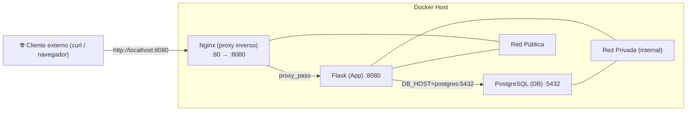

# Tutorial: Docker & Docker Compose con Flask, PostgreSQL y Nginx

En este tutorial aprenderás a:
- Crear una aplicación simple en Python con Flask.
- Containerizar la app usando **Docker**.
- Crear y administrar contenedores con **Docker Compose**.
- Usar **variables de entorno, secretos, configuraciones y volúmenes**.
- Integrar **PostgreSQL**
- Configurar **Nginx**

## 8. Configurar Nginx como Reverse Proxy

En producción no se expone Flask directamente. En su lugar usamos **Nginx** como proxy inverso y punto único de entrada.  

## 🔄 ¿Qué es un **Reverse Proxy**?

Un **reverse proxy** (proxy inverso) es un servidor que se ubica **delante de uno o varios servidores de aplicaciones** y actúa como intermediario entre los clientes externos (navegadores, APIs, etc.) y tus aplicaciones internas.  

En lugar de que el cliente se conecte directamente a Flask, el cliente siempre se conecta a **Nginx** (el reverse proxy).  

---

## ⚙️ Funciones principales de un Reverse Proxy

1. **Punto único de entrada**  
   - Todo el tráfico entra por Nginx, que decide a qué servicio interno redirigirlo.  
   - Ejemplo: `http://miapp.com` → Nginx → Flask en `flask:8080`.

2. **Seguridad y aislamiento**  
   - Evita exponer directamente tu aplicación o base de datos a internet.  
   - Solo Nginx está publicado en la red pública.

3. **Balanceo de carga**  
   - Si tuvieras varias réplicas de Flask, Nginx podría repartir tráfico entre ellas (round robin, least connections, etc.).

4. **TLS/HTTPS**  
   - Nginx puede gestionar certificados SSL/TLS (Let’s Encrypt, etc.), cifrando la comunicación externa.  
   - Así Flask no necesita manejar certificados directamente.

5. **Caché y compresión**  
   - Puede cachear respuestas estáticas o comprimirlas antes de enviarlas al cliente.

---

## Ejemplo en tu tutorial

En tu proyecto:

- **Cliente externo** → hace petición a `http://localhost:8080`.  
- **Nginx (reverse proxy)** → escucha en el puerto `8080` (público).  
- **Flask** → corre en `flask:8080`, pero **no está expuesto al exterior**, solo dentro de la red de Docker.  
- **Nginx** recibe la petición y la redirige a Flask con `proxy_pass http://myapp;`.  

Esto asegura que Flask y PostgreSQL queden detrás de Nginx y **no sean accesibles directamente** desde internet.  


### Crear archivo de configuración Nginx

En el nivel raíz del proyecto, crea un archivo `nginx.conf`:

```nginx
user  nginx;
worker_processes  auto;

error_log  /var/log/nginx/error.log notice;
pid        /var/run/nginx.pid;

events {
    worker_connections 1024;
}

http {
    upstream myapp {
        # flask service name from compose file
        server flask:8080;
    }

    server {
        listen 8080;

        location / {
            proxy_pass http://myapp;
        }
    }
}
```

### Actualizar `compose.yaml`

Referenciamos nuestra configuración nginx.conf:

```yaml
configs:
  # código existente
  nginx_config:
    file: ./nginx.conf
```

Agregamos el servicio nginx:

```yaml
configs:
  # código existente
  nginx:
    image: nginx:1.26.1-alpine
    ports:
      - "8080:8080"   # expone solo Nginx
    configs:
      - source: nginx_config
        target: /etc/nginx/nginx.conf
    networks:
      - public
```

Para entornos de producción necesitamos reducir la superficie de ataque. Como ahora ya tenemos definido red pública y privada, podemos comentar los puertos de flask y postgres y el único expuesto al exterior debe ser nginx.

```yaml
configs:
  # código existente
  flask:
    # código existente
    # ports:
      #- "7070:8080"
  # código existente
  postgres:
  # código existente
    # ports:
      #- "5432:5432"
```

Ahora es necesario un health check de Flask para validar que está funcionando y listo para recibir tráfico.

```yaml
configs:
  # código existente
  flask:
    # código existente
    # ports:
      #- "7070:8080"
    healthcheck:
      test: ["CMD", "curl", "-f", "http://localhost:8080/about"]
      interval: 5s
      retries: 5
      start_period: 15s
      timeout: 5s
```

> ¿Qué significa cada parámetro?

- **test**: comando que se ejecuta dentro del contenedor para verificar que esté saludable.  
  Aquí se usa `curl -f http://localhost:8080/about` → si la app Flask responde con código **200–299**, el health check pasa.

- **interval: 5s**: cada **5 segundos** se ejecuta el test.

- **retries: 5**: si falla **5 veces seguidas**, Docker marca el contenedor como **unhealthy**.

- **start_period: 15s**: tiempo de gracia inicial (**15 segundos**) para que el contenedor arranque antes de comenzar a chequear la salud. Útil si Flask demora un poco en iniciar.

- **timeout: 5s**: el test puede tardar como máximo **5 segundos**; si pasa ese tiempo sin respuesta, se considera fallo.

Ahora necesitamos agregar esta configuración para nginx:

```yaml
configs:
  # código existente
  nginx:
    # código existente
    depends_on:
      flask:
        condition: service_healthy
        restart: true
```

y también necesitamos instalar curl vía Dockerfile

```bash
# codigo existente
RUN pip install -r requirements.txt
RUN apk add --no-cache curl
# codigo existente

```

RUN apk add --no-cache curl

### Verificar redes
- **Nginx**: está en `public`.  
- **Flask**: está en `public` (para que Nginx lo vea) y `private` (para ver PostgreSQL).  
- **PostgreSQL**: está solo en `private` (no accesible desde fuera).  

### Probar
Levanta todo:
```bash
docker compose up -d --build
```

Verifica:
```bash
curl http://localhost:8080/about
```
Deberías ver la respuesta de Flask pasando a través de Nginx.

### Diagramas: 



### 📖 Lectura del diagrama

- **Cliente externo** accede solo a **Nginx** en `localhost:8080`.  
- **Nginx** (en red **pública**) reenvía tráfico a **Flask**.  
- **Flask** pertenece a **dos redes**:  
  - **Pública** → para que Nginx lo alcance.  
  - **Privada** → para comunicarse con **PostgreSQL**.  
- **PostgreSQL** está únicamente en la **red privada** → no se expone al exterior.

# 🔍 Guía de Validación de Redes y Puertos en Docker Compose

En esta guía validamos la conectividad entre contenedores (Nginx, Flask y PostgreSQL) en redes **pública** y **privada**.

---

## 1. Entrar al contenedor de Nginx
Abrimos una shell dentro de Nginx:

```bash
docker exec -it <nginx-container-id> sh
```

---

## 2. Validar acceso de Nginx → Flask
Probar si Nginx puede llegar al servicio Flask en el puerto `8080`:

```bash
nc -vz flask 8080
```

✅ **Resultado esperado**:
```
flask (172.18.0.2:8080) open
```
Nginx puede comunicarse con Flask porque ambos están en la **red pública**.

### 🔎 Desglose de parámetros

- **nc** → *netcat*, herramienta para probar conexiones TCP/UDP.  
- **-v** → *verbose*, muestra más detalles del intento de conexión.  
- **-z** → *zero-I/O mode*, solo verifica si el puerto está abierto, sin enviar datos.  
- **flask** → hostname del servicio en Docker Compose (se resuelve por DNS interno de Docker).  
- **8080** → puerto al que queremos conectarnos dentro del contenedor Flask.  

---

## 3. Validar acceso de Nginx → PostgreSQL
Intentar conexión al servicio Postgres en el puerto `5432`:

```bash
nc -vz postgres 5432
```

❌ **Resultado esperado**:
```
nc: bad address 'postgres'
```
Nginx **no puede ver PostgreSQL**, porque Nginx no pertenece a la **red privada**.

---

## 4. Verificar resolución DNS de Flask
Consultar el DNS interno de Docker para el servicio `flask`:

```bash
nslookup flask
```

✅ **Resultado esperado**:
```
Name: flask
Address: 172.18.0.2
```
El servicio `flask` se resuelve correctamente en la red pública.

### 🔎 Desglose de parámetros (`nslookup flask`)

- **nslookup** → herramienta para consultar el DNS y verificar cómo se resuelve un nombre de host.  
- **flask** → hostname del servicio definido en Docker Compose.  
   - Docker usa un **DNS interno (127.0.0.11)** para resolver estos nombres de servicio.  
   - En este caso, `flask` se resuelve a la IP interna del contenedor dentro de la red pública (ejemplo: `172.18.0.2`).  

---

## 5. Verificar resolución DNS de PostgreSQL
Consultar el DNS interno para `postgres`:

```bash
nslookup postgres
```

❌ **Resultado esperado**:
```
** server can't find postgres: NXDOMAIN
```
Nginx **no puede resolver Postgres**, ya que está fuera de su red.

---

## ✅ Conclusiones de la validación

- **Nginx → Flask**: ✔️ Accesible (red pública).  
- **Nginx → Postgres**: ❌ No accesible (Postgres solo en red privada).  
- **Flask → Postgres**: ✔️ Accesible (Flask pertenece a red pública y privada).  

👉 Esto confirma el **aislamiento de redes**:  
- Solo **Nginx** es expuesto al exterior.  
- **Flask** actúa como intermediario.  
- **Postgres** permanece seguro en la red privada.  
