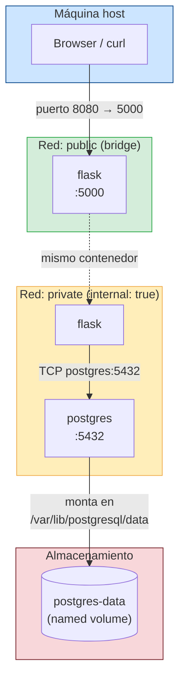

# Guía: Docker Compose + PostgreSQL con Flask

**Duración estimada:** 60–90 min  
**Nivel:** Intermedio  
**Prerrequisito:** Haber completado `laboratorio_docker_01.md` (imagen `flask-docker-app:1.0` construida y publicada en Docker Hub)

---

## Objetivos de aprendizaje

- Migrar de `docker run` a Docker Compose
- Integrar un servicio PostgreSQL en el stack
- Gestionar credenciales con Docker secrets
- Aislar servicios con redes internas
- Conectar Flask a PostgreSQL con `psycopg` y connection pooling
- Implementar endpoints CRUD contra la base de datos

---

## Requisitos del laboratorio

- Docker y Docker Compose instalados
- Imagen `flask-docker-app:1.0` construida localmente (del lab anterior)
- Editor de texto (vim, VS Code, etc.)

---

## Estructura del proyecto

Al finalizar este laboratorio tu directorio quedará así:

```
flask-docker-app/
├── app.py
├── requirements.txt
├── Dockerfile
├── .dockerignore
├── .env.dev          ← nuevo
├── pg_password.txt   ← nuevo (en .gitignore)
└── compose.yaml      ← nuevo
```

---

## 1. Preparar el proyecto base

Entra al directorio del lab anterior:

```bash
cd flask-docker-app
```

---

## 2. Actualizar dependencias

Agrega el driver de PostgreSQL a `requirements.txt`:

```bash
vim requirements.txt
```

Contenido actualizado:

```
Flask==2.3.3
gunicorn==21.2.0
psycopg[binary,pool]==3.2.1
```

---

## 3. Crear archivos de configuración y secretos

### Archivo de variables de entorno (.env.dev)

```bash
vim .env.dev
```

Contenido:

```env
DB_PASSWORD=devops123
```

> **Importante:** Agrega `.env.dev` y `pg_password.txt` a tu `.gitignore` para no exponer credenciales.

### Archivo de secreto para PostgreSQL (pg_password.txt)

```bash
vim pg_password.txt
```

Contenido:

```
devops123
```

### Actualizar .gitignore

```bash
echo ".env.dev" >> .gitignore
echo "pg_password.txt" >> .gitignore
```

---

## 3.1 ¿Por qué dos archivos con la misma contraseña?

`pg_password.txt` y `.env.dev` contienen el mismo valor pero los lee un consumidor distinto:

| Archivo | Lo lee | Para qué |
|---|---|---|
| `pg_password.txt` | **PostgreSQL** vía `POSTGRES_PASSWORD_FILE` | Inicializar la contraseña del usuario en la DB |
| `.env.dev` | **Flask** vía `os.environ.get('DB_PASSWORD')` | Autenticarse contra la DB como cliente |

Son dos lados del mismo handshake: PostgreSQL establece su contraseña con el secreto; Flask usa esa misma contraseña para conectarse.

### Forma A — env_file + secret (la de este lab)

Dos archivos, cada servicio lee del suyo:

```
pg_password.txt  →  secret  →  postgres (POSTGRES_PASSWORD_FILE)
.env.dev         →  env_file →  flask   (DB_PASSWORD env var)
```

`compose.yaml`:
```yaml
services:
  flask:
    env_file:
      - .env.dev              # Flask lee DB_PASSWORD desde aquí
    secrets:
      - pg_password           # no necesario en flask con esta forma

  postgres:
    environment:
      - POSTGRES_PASSWORD_FILE=/run/secrets/pg_password
    secrets:
      - pg_password           # Postgres lee la contraseña del archivo montado

secrets:
  pg_password:
    file: ./pg_password.txt
```

`app.py` lee la variable de entorno:
```python
db_password = os.environ.get('DB_PASSWORD')
```

**Cuándo usarla:** entornos de desarrollo donde ya usas `env_file` para otras variables. Más simple de entender.

---

### Forma B — solo secret (recomendada en producción)

Un solo archivo `pg_password.txt`, ambos servicios lo consumen como secreto:

```
pg_password.txt  →  secret  →  postgres (POSTGRES_PASSWORD_FILE)
                 →  secret  →  flask    (lee el archivo montado)
```

`compose.yaml`:
```yaml
services:
  flask:
    secrets:
      - pg_password           # secreto montado en /run/secrets/pg_password

  postgres:
    environment:
      - POSTGRES_PASSWORD_FILE=/run/secrets/pg_password
    secrets:
      - pg_password

secrets:
  pg_password:
    file: ./pg_password.txt
```

`app.py` lee directamente del archivo del secreto:
```python
db_password = open('/run/secrets/pg_password').read().strip()
```

**Cuándo usarla:** producción o cuando quieres una sola fuente de verdad. Elimina `.env.dev` y no hay riesgo de que los dos archivos queden desincronizados.

---

### Comparativa

| Aspecto | Forma A (env_file + secret) | Forma B (solo secret) |
|---|---|---|
| Archivos de credenciales | 2 (`pg_password.txt` + `.env.dev`) | 1 (`pg_password.txt`) |
| Riesgo de desincronización | Sí (si cambias una y no la otra) | No |
| Flask lee desde | Variable de entorno | Archivo montado |
| Postgres lee desde | Archivo secreto | Archivo secreto |
| Recomendado para | Desarrollo | Producción |

> Este lab implementa la **Forma A** para mostrar ambos mecanismos (`env_file` y `secrets`) como conceptos separados. En un proyecto real usa la **Forma B**.

---

## 4. Crear compose.yaml

```bash
vim compose.yaml
```

Contenido:

```yaml
services:
  flask:
    image: flask-docker-app:latest
    build:
      context: .
      dockerfile: Dockerfile
    ports:
      - "8080:5000"
    env_file:
      - .env.dev
    environment:
      - APP_VERSION=2.0.0
      - DB_HOST=postgres
      - DB_DATABASE=mydb
      - DB_USER=myuser
    networks:
      - public
      - private
    depends_on:
      postgres:
        condition: service_healthy

  postgres:
    image: postgres:16.3
    restart: always
    ports:
      - "5432:5432"
    environment:
      - POSTGRES_USER=myuser
      - POSTGRES_DB=mydb
      - POSTGRES_PASSWORD_FILE=/run/secrets/pg_password
    secrets:
      - pg_password
    volumes:
      - postgres-data:/var/lib/postgresql/data
    networks:
      - private
    healthcheck:
      test: ["CMD-SHELL", "pg_isready -U myuser -d mydb"]
      interval: 5s
      timeout: 5s
      retries: 5

secrets:
  pg_password:
    file: ./pg_password.txt

volumes:
  postgres-data:

networks:
  public:
  private:
    internal: true
```

**Puntos clave del compose.yaml:**

| Configuración | Propósito |
|---|---|
| `depends_on` con `condition: service_healthy` | Flask espera que Postgres esté listo antes de arrancar |
| `networks: private` en postgres | Postgres solo accesible desde servicios internos, no desde el host |
| `POSTGRES_PASSWORD_FILE` | Postgres lee la contraseña del secreto montado, no de una variable de entorno |
| `postgres-data` volume | Datos persistentes; sobreviven a `docker compose down` |

---

## 5. Conceptos: Redes en Docker Compose

### ¿Qué es una red en Docker Compose?

Por defecto, Docker Compose crea una sola red compartida donde todos los servicios pueden comunicarse entre sí. Sin embargo, exponer todos los servicios al mundo exterior es un riesgo de seguridad. Para este stack definimos **dos redes con responsabilidades distintas**:

| Red | `internal` | Quién pertenece | Propósito |
|---|---|---|---|
| `public` | `false` (default) | `flask` | Permite que el host acceda al contenedor via port mapping |
| `private` | `true` | `flask`, `postgres` | Comunicación interna entre servicios; sin salida a internet ni al host |

### Red pública (`public`)

- Es una red bridge normal de Docker.
- El contenedor `flask` está conectado a ella y tiene el port mapping `8080:5000`, lo que permite que el navegador o `curl` desde el host lleguen a la app.
- Si `postgres` estuviera en esta red, cualquiera podría conectarse al puerto 5432 desde fuera.

### Red privada (`private` con `internal: true`)

- `internal: true` le dice a Docker que **no cree una ruta de salida** hacia el exterior (ni al host, ni a internet).
- Solo los contenedores conectados a esta red pueden hablar entre sí.
- `postgres` vive únicamente en esta red: es invisible desde fuera del stack.
- `flask` también está conectado a ella, por eso puede resolver el hostname `postgres` y abrir conexiones a la base de datos.

### Diagrama de arquitectura



**Flujo de una petición `POST /items`:**
1. `curl` en el host golpea `localhost:8080` → Docker redirige al puerto `5000` del contenedor `flask` (red `public`).
2. `flask` procesa la petición y necesita guardar en DB → resuelve el hostname `postgres` dentro de la red `private`.
3. `postgres` recibe la query, escribe en disco → los datos se guardan en el volumen `postgres-data`.
4. El host **nunca** puede tocar directamente el puerto 5432 de `postgres` porque no hay ruta (red `private` con `internal: true`).

---

## 6. Conceptos: Volúmenes en Docker Compose

### ¿Por qué se necesitan volúmenes?

Los contenedores son **efímeros**: cuando se eliminan, todo lo que escribieron en su sistema de archivos interno desaparece. Para una base de datos esto es inaceptable.

Un **volumen** es un directorio gestionado por Docker que existe **fuera del ciclo de vida del contenedor**. Los datos persisten aunque el contenedor se destruya y se recree.

### Tipos de montaje en Docker

| Tipo | Sintaxis en compose | Dónde vive | Uso típico |
|---|---|---|---|
| **Named volume** | `postgres-data:/var/lib/postgresql/data` | Gestionado por Docker (`/var/lib/docker/volumes/`) | Persistencia de DB, datos de producción |
| **Bind mount** | `./config.yml:/config.yml` | Directorio real del host | Desarrollo, inyectar archivos de config |
| **tmpfs** | `tmpfs: /tmp` | RAM del host | Datos temporales sensibles, caché |

En este lab usamos un **named volume** para PostgreSQL:

```yaml
volumes:
  postgres-data:          # Docker crea y gestiona este volumen

services:
  postgres:
    volumes:
      - postgres-data:/var/lib/postgresql/data   # monta el volumen en el path de datos de PG
```

### Comportamiento de `docker compose down`

```bash
docker compose down        # elimina contenedores — el volumen postgres-data SOBREVIVE
docker compose down -v     # elimina contenedores Y el volumen — datos PERDIDOS
docker compose up -d       # recrea contenedores — postgres-data se monta de nuevo con los datos
```

### Comandos útiles para volúmenes

```bash
# Listar volúmenes en el sistema
docker volume ls

# Ver detalles de un volumen (ubicación en disco, tamaño)
docker volume inspect flask-docker-app_postgres-data

# Eliminar volúmenes no usados
docker volume prune
```

> El nombre del volumen en el host sigue el patrón `<directorio_proyecto>_<nombre_volumen>`, por ejemplo `flask-docker-app_postgres-data`.

---

## 7. Actualizar app.py con integración PostgreSQL

```bash
vim app.py
```

Contenido completo:

```python
from flask import Flask, jsonify, render_template_string, request
import os
from psycopg_pool import ConnectionPool

def db_connect():
    url = (
        f"host={os.environ.get('DB_HOST')} "
        f"dbname={os.environ.get('DB_DATABASE')} "
        f"user={os.environ.get('DB_USER')} "
        f"password={os.environ.get('DB_PASSWORD')}"
    )
    pool = ConnectionPool(url)
    pool.wait()
    return pool

pool = db_connect()

app = Flask(__name__)

@app.route('/')
def home():
    html = '''
    <!DOCTYPE html>
    <html>
    <head>
        <title>Flask Docker App</title>
        <style>
            body { font-family: Arial, sans-serif; margin: 50px; }
            .container { max-width: 600px; margin: 0 auto; }
            h1 { color: #2196F3; }
        </style>
    </head>
    <body>
        <div class="container">
            <h1>Flask + PostgreSQL</h1>
            <p>Stack Flask + PostgreSQL corriendo con Docker Compose.</p>
            <ul>
                <li><a href="/api/health">Estado de la API</a></li>
                <li><a href="/items">Listar items</a></li>
            </ul>
        </div>
    </body>
    </html>
    '''
    return render_template_string(html)

@app.route('/api/health')
def health():
    return jsonify({"status": "healthy", "version": os.environ.get("APP_VERSION")})

def save_item(priority, task):
    with pool.connection() as conn:
        with conn.cursor() as cur:
            cur.execute(
                'INSERT INTO item (priority, task) VALUES (%s, %s)',
                (priority, task)
            )
            conn.commit()

def get_items():
    with pool.connection() as conn:
        with conn.cursor() as cur:
            cur.execute('SELECT item_id, priority, task FROM item')
            return [{'id': r[0], 'priority': r[1], 'task': r[2]} for r in cur]

@app.route('/items', methods=['GET', 'POST'])
def items():
    if request.method == 'POST':
        body = request.get_json()
        save_item(body['priority'], body['task'])
        return {'message': 'item saved!'}, 201
    return get_items(), 200

if __name__ == '__main__':
    app.run(host='0.0.0.0', port=5000, debug=True)
```

---

## 8. Levantar el stack

### Construir y levantar en modo detached

```bash
docker compose up --build -d
```

### Verificar que ambos contenedores están corriendo

```bash
docker compose ps
```

Debes ver `flask` y `postgres` con estado `running`.

### Ver logs en tiempo real

```bash
docker compose logs -f
```

---

## 9. Configurar la base de datos

Entra al contenedor de PostgreSQL y crea la tabla:

```bash
docker compose exec postgres psql -U myuser -d mydb
```

Dentro de `psql`, ejecuta:

```sql
CREATE TABLE item (
  item_id serial PRIMARY KEY,
  priority varchar(256),
  task varchar(256)
);
```

Crea el usuario de aplicación y otorga permisos:

```sql
CREATE USER myapp WITH PASSWORD 'devops123';
GRANT ALL PRIVILEGES ON DATABASE mydb TO myapp;
GRANT ALL PRIVILEGES ON ALL TABLES IN SCHEMA public TO myapp;
GRANT ALL PRIVILEGES ON ALL SEQUENCES IN SCHEMA public TO myapp;
```

Sal de `psql`:

```sql
\q
```

---

## 10. Probar los endpoints

### Insertar items

```bash
curl -H "Content-Type: application/json" \
     -d '{"priority":"high","task":"doctor appointment"}' \
     localhost:8080/items
```

```bash
curl -H "Content-Type: application/json" \
     -d '{"priority":"low","task":"buy dinner"}' \
     localhost:8080/items
```

### Listar items

```bash
curl localhost:8080/items
```

Respuesta esperada:

```json
[
  {"id": 1, "priority": "high", "task": "doctor appointment"},
  {"id": 2, "priority": "low",  "task": "buy dinner"}
]
```

### Verificar estado

```bash
curl localhost:8080/api/health
```

---

## 11. Persistencia de datos

Detén el stack y vuélvelo a levantar para verificar que los datos persisten en el volumen:

```bash
docker compose down
docker compose up -d
curl localhost:8080/items   # los items deben seguir ahí
```

> `docker compose down` detiene y elimina contenedores pero **no** el volumen `postgres-data`. Para eliminar datos usa `docker compose down -v`.

---

## 12. Comandos útiles de Docker Compose

```bash
# Levantar stack (reconstruyendo imágenes)
docker compose up --build -d

# Ver estado de servicios
docker compose ps

# Ver logs de un servicio
docker compose logs flask
docker compose logs postgres

# Ejecutar comando en un servicio
docker compose exec postgres psql -U myuser -d mydb

# Detener stack (conserva volúmenes)
docker compose down

# Detener stack y eliminar volúmenes
docker compose down -v

# Reconstruir solo la imagen Flask
docker compose build flask
```

---

## Checklist de éxito

- [ ] `compose.yaml` creado con servicios `flask` y `postgres`
- [ ] Secreto `pg_password.txt` configurado correctamente
- [ ] Stack levantado con `docker compose up --build -d`
- [ ] Ambos contenedores en estado `running`
- [ ] Tabla `item` creada en PostgreSQL
- [ ] Inserción de items via `POST /items` exitosa
- [ ] Listado de items via `GET /items` retorna datos correctos
- [ ] Datos persisten tras `docker compose down` y nuevo `up`

---

## Consideraciones de seguridad

- Nunca pongas contraseñas en `environment` directamente; usa `secrets` o `env_file` (fuera de git)
- La red `private` con `internal: true` bloquea acceso externo a PostgreSQL
- Usa `POSTGRES_PASSWORD_FILE` en lugar de `POSTGRES_PASSWORD` para no exponer la contraseña en variables de entorno del proceso
- Agrega `pg_password.txt` y `.env.dev` al `.gitignore`

---

## Troubleshooting

### Error: bind source path does not exist: `.../pg_password.txt`

```
Error response from daemon: invalid mount config for type "bind":
bind source path does not exist: .../pg_password.txt
```

**Causa:** `pg_password.txt` está en `.gitignore` y no se versiona. Hay que crearlo manualmente en cada máquina o entorno nuevo.

**Solución:**
```bash
echo "devops123" > pg_password.txt
docker compose up -d
```

---

### Error: port is already allocated (8080)

```
Bind for 0.0.0.0:8080 failed: port is already allocated
```

**Causa:** otro proceso o contenedor ya ocupa el puerto 8080 en el host.

**Identificar qué ocupa el puerto:**
```bash
lsof -i :8080
```

**Opción A — matar el proceso:**
```bash
kill -9 <PID>
docker compose up -d
```

**Opción B — eliminar un contenedor Docker anterior que usa ese puerto:**
```bash
docker ps -a                  # identificar el contenedor
docker rm -f <nombre>
docker compose up -d
```

**Opción C — cambiar el puerto en `compose.yaml`:**
```yaml
ports:
  - "8081:5000"
```
```bash
docker compose up -d
curl localhost:8081/api/health
```

---

### Flask arranca pero no conecta a PostgreSQL

```
psycopg.OperationalError: connection refused
```

**Causa:** Flask intentó conectarse antes de que Postgres estuviera listo (el `healthcheck` aún no pasó).

**Verificar estado de los contenedores:**
```bash
docker compose ps
docker compose logs postgres
```

**Solución:** espera a que `postgres` esté `healthy` y reinicia Flask:
```bash
docker compose restart flask
```

Si el problema persiste, verifica que las variables de entorno `DB_HOST`, `DB_USER`, `DB_PASSWORD` lleguen correctamente al contenedor:
```bash
docker compose exec flask env | grep DB_
```

---

### Datos no persisten tras `docker compose down`

**Causa:** se usó `docker compose down -v`, que elimina los volúmenes junto con los contenedores.

**Solución:** usar siempre `docker compose down` sin `-v` para conservar datos:
```bash
docker compose down      # conserva postgres-data
docker compose up -d
```

Para ver qué volúmenes existen:
```bash
docker volume ls | grep postgres
```

---

¡Felicidades! Tienes un stack Flask + PostgreSQL completamente orquestado con Docker Compose, con secretos, redes aisladas y persistencia de datos.
