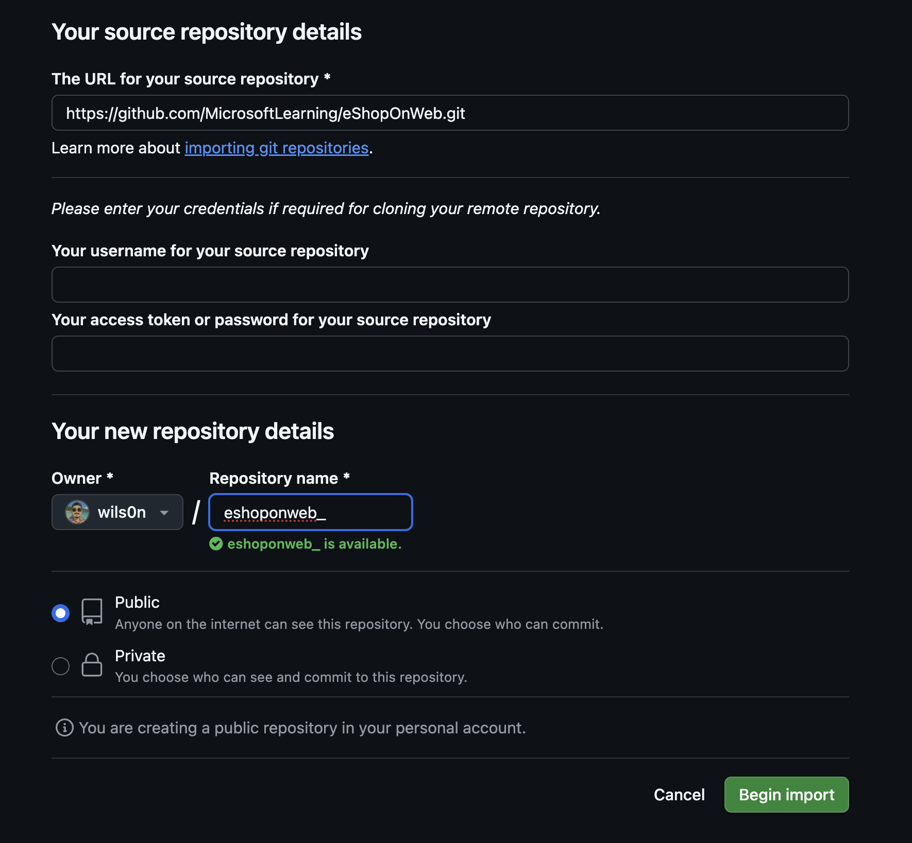
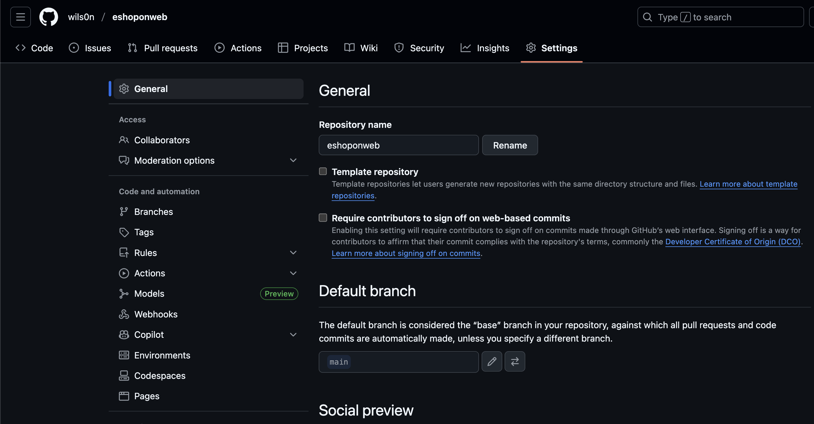
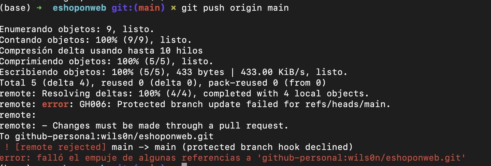
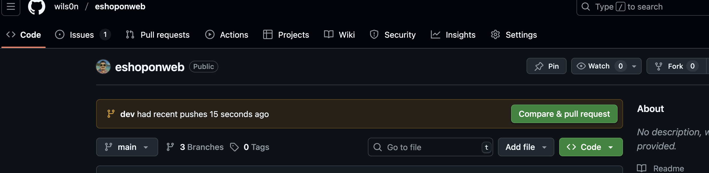
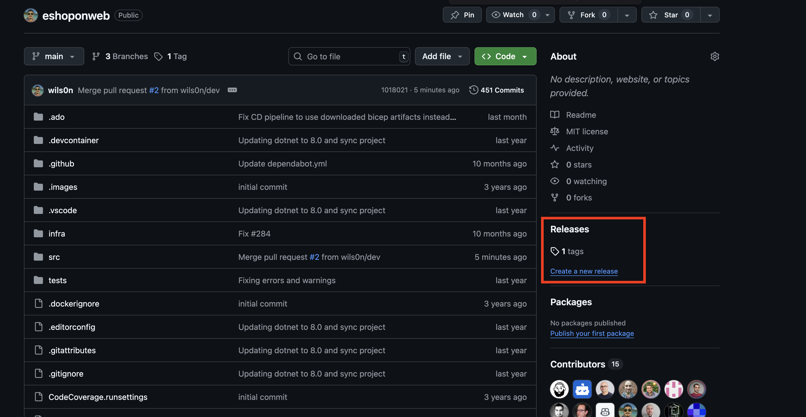
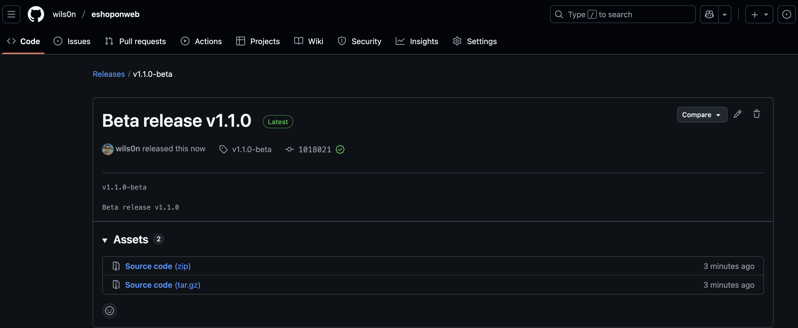

# Lab: Control de versiones con Git en **GitHub**

**Duración estimada:** 45--60 min\
**Nivel:** Principiante--Intermedio\
**Contexto:** Realizarás clonación, commits, exploración de
historial, trabajo con ramas, **pull requests**, **branch protection
rules** y **tags**. Usaremos comandos de **Git** en terminal.

---

## Objetivos de aprendizaje

Al finalizar, podrás:

- Clonar un repositorio existente desde GitHub.
- Guardar trabajo local con **commits** y **staging**.
- Revisar historial y comparar cambios.
- Trabajar con ramas desde terminal.
- Crear **Pull Requests (PRs)** con políticas de protección (revisiones requeridas).
- Aplicar **tags** y crear un **release**.

---

## Requisitos del laboratorio

- Navegador compatible (Chrome/Firefox/Safari/Microsoft Edge).
- Cuenta de **GitHub** (gratuita u organización).
- **Git** instalado.
- Terminal (zsh, bash, PowerShell, etc.).

---

## Repositorio de práctica

Usaremos **eShopOnWeb**

- URL de origen: `https://github.com/MicrosoftLearning/eShopOnWeb.git`

> Puedes **importar** el repo a tu usuario/organización en GitHub (crea
> tu propia copia administrable) o **forkear**.

---

## Ejercicio 0: Configurar prerrequisitos

### Tarea 1: Configurar Git

1.  Abre una **terminal**.
2.  Configura tu helper de credenciales y tu identidad:

    - **Windows** (Git Credential Manager):

      ```bash
      git config --global credential.helper manager-core
      git config --global user.name "Tu Nombre"
      git config --global user.email tu-email@example.com
      ```

    - **macOS** (Keychain) o Linux (GCM si instalado):

      ```bash
      git config --global credential.helper osxkeychain   # macOS
      git config --global user.name "Tu Nombre"
      git config --global user.email tu-email@example.com
      # Linux con GCM (si lo usas):
      # git config --global credential.helper manager-core
      ```

3.  Verifica la configuración:

    ```bash
    git config --list --show-origin
    ```

### Tarea 2: Crear repositorio en **GitHub** por importación

1.  Entra a **github.com** con tu cuenta.
2.  En la esquina superior derecha, haz clic en **+** → **Import
    repository**.
3.  En **Old repository's clone URL**, pega:
    `https://github.com/MicrosoftLearning/eShopOnWeb.git`.
4.  En **Owner**, elige tu usuario u organización.\
5.  En **Repository Name**, escribe: `eshoponweb` (o similar).\
6.  Mantén **Public/Private** según prefieras y pulsa **Begin import**.
7.  Al terminar, verás tu **nuevo repo** `owner/eshoponweb`.

> Estructura relevante del repo: `.github/` (workflows),
> `.devcontainer/`, `infra/` (Bicep/ARM), `src/` (.NET 8 Web).



### Tarea 3: Establecer `main` como rama por defecto (si aplica)

- GitHub crea `main` por defecto; si no, ve a **Settings** →
  **Branches** → **Default branch** → **main**.



## Ejercicio 1: Clonar un repositorio existente

### Tarea 1: Clonar con Git

1.  En GitHub, abre tu repo `owner/eshoponweb` y haz clic en **Code** →
    pestaña **HTTPS** → **Copy** (URL de clonación).

2.  En la terminal, navega a la carpeta donde quieres clonar el repositorio:

    ```bash
    # Crear directorio Git si no existe
    mkdir -p ~/Git
    cd ~/Git
    ```

3.  Clona el repositorio:

    ```bash
    git clone https://github.com/TU_USUARIO/eshoponweb.git
    ```

4.  Navega al directorio del repositorio:

    ```bash
    cd eshoponweb
    ```

5.  Verifica el estado del repositorio:

    ```bash
    git status
    git branch -a
    ```

---

## Ejercicio 2: Guardar trabajo con commits

### Conceptos

- **Working Directory** → **Staging Area (Index)** → **Commit local**.
- Un commit tiene: cambios, referencia(s) padre y un **mensaje
  claro**.

### Tarea 1: Primer commit

1.  Abre el archivo `src/Web/Program.cs` con tu editor favorito:

    ```bash
    # Puedes usar nano, vim, code, etc.
    nano src/Web/Program.cs
    # o si tienes VS Code instalado:
    code src/Web/Program.cs
    ```

2.  En la **primera línea**, agrega un comentario:

    ```csharp
    // My first change
    ```

3.  Guarda el archivo y cierra el editor.

4.  Verifica los cambios:

    ```bash
    git status
    git diff src/Web/Program.cs
    ```

5.  Añade el archivo al staging area y realiza el commit:

    ```bash
    git add src/Web/Program.cs
    git commit -m "feat(web): My commit"
    ```

6.  Sube los cambios al repositorio remoto:

    ```bash
    git push origin main
    ```

### Tarea 2: Revisar commits en GitHub

1.  Ve al repo en GitHub → pestaña **Commits** (o **History** en la
    vista de archivos).
2.  Verifica que tu commit esté arriba.

### Tarea 3: Staging selectivo

1.  Edita `src/Web/Program.cs` y cambia el comentario a:

    ```csharp
    // My second change
    ```

2.  Edita `src/Web/Constants.cs` y agrega:

    ```csharp
    // My third change
    ```

3.  Verifica los cambios en ambos archivos:

    ```bash
    git status
    git diff src/Web/Program.cs
    git diff src/Web/Constants.cs
    ```

4.  Añade solo `Program.cs` al staging area:

    ```bash
    git add src/Web/Program.cs
    ```

5.  Verifica que solo `Program.cs` está en staging:

    ```bash
    git status
    ```

6.  Realiza el commit de los cambios staged:

    ```bash
    git commit -m "chore(web): Added comments"
    ```

7.  Sube los cambios:

    ```bash
    git push origin main
    ```

    Observa que `Constants.cs` sigue sin commitear (cambio pendiente).

8.  Puedes ver las diferencias usando:

    ```bash
    git diff src/Web/Constants.cs
    ```

---

## Ejercicio 3: Revisar historial

### Tarea 1: Comparar archivos y explorar historial

1.  Verifica los cambios pendientes en `Constants.cs`:

    ```bash
    git diff src/Web/Constants.cs
    ```

2.  Explora el historial de commits:

    ```bash
    # Ver log con formato compacto
    git log --oneline

    # Ver log con más detalles
    git log --graph --pretty=format:'%h -%d %s (%cr) <%an>' --abbrev-commit

    # Ver cambios en un commit específico
    git show <commit-hash>
    ```

3.  Para ver el estado del repositorio en un commit específico:

    ```bash
    # Ver archivos en un commit específico
    git ls-tree -r <commit-hash>

    # Ver el contenido de un archivo en un commit específico
    git show <commit-hash>:src/Web/Program.cs
    ```

4.  Compara diferencias entre commits:

    ```bash
    # Diferencias entre los últimos 2 commits
    git diff HEAD~1 HEAD

    # Diferencias entre commits específicos
    git diff <commit-hash1> <commit-hash2>
    ```

5.  En GitHub, abre **Commits** y entra a un commit para ver **Browse
    files** (estado del repo en ese punto) o **Changes** para ver el
    patch.

> Recuerda que la línea temporal no siempre es estrictamente cronológica
> por **merges**; piensa en **deltas** entre commits.

---

## Ejercicio 4: Trabajar con ramas y Pull Requests

### Tarea 1: Crear una nueva rama local

1.  Verifica en qué rama estás actualmente:

    ```bash
    git branch
    git status
    ```

2.  Crea y cambia a una nueva rama llamada `dev`:

    ```bash
    git checkout -b dev
    ```

    O alternativamente (Git 2.23+):

    ```bash
    git switch -c dev
    ```

3.  Verifica que estás en la rama `dev`:

    ```bash
    git branch
    ```

### Tarea 2: Publicar y gestionar ramas

1.  Publica la rama `dev` en GitHub:

    ```bash
    git push -u origin dev
    ```

    El flag `-u` establece `origin/dev` como rama upstream para futuros push/pull.

2.  Verifica las ramas locales y remotas:

    ```bash
    # Ramas locales
    git branch

    # Ramas remotas
    git branch -r

    # Todas las ramas
    git branch -a
    ```

3.  En GitHub, ve a **Branches** (pestaña del repo) y verifica que
    exista `dev`.

### Tarea 3: Definir **Branch Protection Rules** (políticas sobre `main`)

1.  En GitHub, entra a **Settings** → **Branches** → **Add rule**.
2.  Configura la regla para `Branch name pattern`: `main`.
3.  Activa:
    - ✅ **Require a pull request before merging**
    - ✅ **Do not allow bypassing the above settings** (Esto evita que los administradores (incluyéndote a ti) puedan saltarse las protecciones.)
    - (Opcional) **Require approvals** → **1**
    - (Opcional) **Dismiss stale pull request approvals**
    - (Opcional) **Require linear history**
    - (Opcional) **Require status checks to pass** (si deseas, agrega
      checks de Actions más adelante)
4.  Guarda con **Create** / **Save changes**.

> GitHub no exige "issue vinculado" de forma nativa. Simularemos el
> control con una **Issue** y el texto **`Closes #<número>`** en el PR
> para enlazar trazabilidad.

### Tarea 4: Probar la política de `main` (bloqueo de commits directos)

1.  Cambia a la rama main:

    ```bash
    git checkout main
    ```

2.  Intenta editar un archivo directamente en `main`:

    ```bash
    echo "// Testing main branch policy" >> src/Web/Program.cs
    git add src/Web/Program.cs
    git commit -m "feat(web): Testing direct commit to main"
    git push origin main
    ```

3.  Si la política está correctamente configurada, el push será **rechazado**.



4.  Deshaz los cambios locales:

    ```bash
    git reset --hard HEAD~1
    ```

### Tarea 5: Crear una **Issue**, hacer cambio en `dev` y abrir PR

1.  En GitHub, pestaña **Issues** → **New issue**.
    - **Title:** `Testing my first PR`\
    - **Submit new issue** (anota el número, p. ej. `#1`).
2.  Cambia a rama **dev**:

    ```bash
    git checkout dev
    ```

    Edita `src/Web/Program.cs` y agrega:

    ```csharp
    // Testing my first PR
    ```

    Realiza **Commit** en la rama `dev`:

    ```bash
    git add src/Web/Program.cs
    git commit -m "feat(web): test my first PR - Closes #1"
    git push origin dev
    ```

3.  GitHub mostrará un banner "Compare & pull request". Clic en **Create
    pull request**.



4.  En la **descripción del PR**, escribe `Closes #1` para **vincular**
    la Issue.
5.  Crea el PR contra `main`.
6.  En la pestaña **Files changed**, revisa el diff. Añade comentarios
    si deseas.
7.  En la pestaña **Conversation**, **Approve** (si eres revisor) y
    luego **Merge**.

    - **Merge method:** _Create a merge commit_ (equivalente a "Merge
      no fast-forward").
    - Activa "**Delete branch**" tras el merge.

8.  Actualiza tu repositorio local tras el merge:

    ```bash
    git checkout main
    git pull origin main
    ```

    También puedes eliminar la rama local `dev`:

    ```bash
    git branch -d dev
    ```

> Al hacer merge, la Issue `#1` se cierra automáticamente por el
> `Closes #1`.

---

## Ejercicio 5: Aplicar **tags** y crear un **release**

### Tarea 1: Crear tag `v1.1.0-beta`

1.  Asegúrate de estar en la rama `main` y con los últimos cambios:

    ```bash
    git checkout main
    git pull origin main
    ```

2.  Crea el tag localmente:

    ```bash
    git tag -a v1.1.0-beta -m "Beta release v1.1.0"
    ```

3.  Sube el tag al repositorio remoto:

    ```bash
    git push origin v1.1.0-beta
    ```

4.  En GitHub, ve a **Releases** → **Create a new release**.



5.  En **Choose a tag**, selecciona `v1.1.0-beta` (que ya existe).

6.  **Release title:** `Beta release v1.1.0`.

7.  (Opcional) Marca como **pre-release**.

8.  Clic en **Publish release**.



> Alternativamente, puedes crear el tag directamente desde GitHub:

    ```bash
    # Ver todos los tags
    git tag

    # Ver información del tag
    git show v1.1.0-beta
    ```

> Esto crea un **tag** y un **release** asociado al último commit de
> `main`.

---

## (Opcional) Ejercicio 6: Quitar temporalmente la protección de `main`

Si vas a continuar con otros labs que requieren commits directos a
`main`: 1. **Settings** → **Branches** → regla de `main` → **Edit**. 2.
Desactiva **Require a pull request before merging** y **Require
approvals**.\
3. **Save changes**.

---

## Comandos útiles de Git (referencia rápida)

```bash
# Ver configuración
git config --list --show-origin
git config --global user.name "Tu Nombre"
git config --global user.email "tu-email@example.com"

# Clonar repositorio
git clone https://github.com/usuario/repo.git
cd repo

# Verificar estado
git status
git branch
git branch -a                # ver todas las ramas (locales y remotas)

# Cambiar/crear rama
git checkout -b dev          # crear y moverse
git checkout main            # volver a main
git switch -c dev            # alternativa moderna para crear rama

# Staging/commit
git add archivo.txt          # agregar archivo específico
git add .                    # agregar todos los cambios
# Commits con Conventional Commits
git commit -m "feat(web): descripción breve del cambio"
git commit -m "fix(api): corrige error en endpoint"
git commit -m "chore: actualiza dependencias"
git commit -am "refactor(core): mejora estructura de datos"

# Sincronizar
git pull                     # traer cambios del remoto
git push                     # subir cambios
git push -u origin dev       # publicar rama por 1ª vez

# Historial y diferencias
git log --oneline            # historial compacto
git log --graph --pretty=format:'%h -%d %s (%cr) <%an>' --abbrev-commit
git diff                     # diferencias no staged
git diff --staged            # diferencias staged
git show <commit-hash>       # ver commit específico

# Tags
git tag                      # listar tags
git tag -a v1.1.0-beta -m "mensaje"  # crear tag anotado
git push origin v1.1.0-beta # subir tag
git show v1.1.0-beta        # ver información del tag

# Gestión de ramas
git branch -d dev            # eliminar rama local
git push origin --delete dev # eliminar rama remota
```

---

## Criterios de éxito (Checklist)

- [ ] Repo importado a **GitHub**.
- [ ] Clonación local exitosa usando **Git**.
- [ ] Al menos **2 commits** en `main` (uno con **staging
      selectivo**).
- [ ] Historial revisado con comandos Git y en GitHub.
- [ ] Rama `dev` creada, publicada y PR creado.
- [ ] **Branch protection** en `main` con **1 aprobación** requerida.
- [ ] PR aprobado, merge realizado y rama `dev` eliminada.
- [ ] **Tag** `v1.1.0-beta` y **release** publicado.

---

## Extensiones y extras (opcional)

- **GitHub CLI** (`gh`): Herramienta de línea de comandos para gestionar PRs/Issues:

  ```bash
  # Instalar GitHub CLI (macOS)
  brew install gh

  # Autenticarse
  gh auth login

  # Crear PR desde línea de comandos
  gh pr create --title "Mi PR" --body "Closes #1"

  # Ver PRs
  gh pr list
  ```

- **Codeowners**: añade `CODEOWNERS` para requerir aprobaciones de
  equipos/usuarios específicos.
- **Plantilla de PR**: agrega `.github/pull_request_template.md` con
  una casilla "Issue: Closes #...".
- **Checks**: integra **GitHub Actions** (linting/tests) y marca
  **Required status checks** en la regla de branch.

---

## Solución de problemas frecuentes

- **403 al hacer push**: revisa que el remoto sea
  `https://github.com/<owner>/<repo>.git` y que el helper de
  credenciales esté guardando el token correcto. Puedes verificar con:
  ```bash
  git remote -v
  git config --list | grep credential
  ```
- **No aparece "Compare & pull request"**: crea el PR manualmente:
  **Pull requests** → **New pull request** (base: `main`, compare:
  `dev`) o usa GitHub CLI:
  ```bash
  gh pr create --base main --head dev
  ```
- **No puedo commitear en `main`**: es lo esperado si la protección
  está activa; usa una rama y PR.
- **El tag no aparece**: si lo creaste localmente, recuerda
  `git push origin <tag>` o usa la UI de **Releases**.
- **Error "divergent branches"**: sincroniza antes de hacer push:
  ```bash
  git pull origin main
  git push origin main
  ```
- **Conflictos de merge**: resuelve manualmente y luego:
  ```bash
  git add archivo-resuelto.txt
  git commit -m "fix: Resolve merge conflict"
  ```
