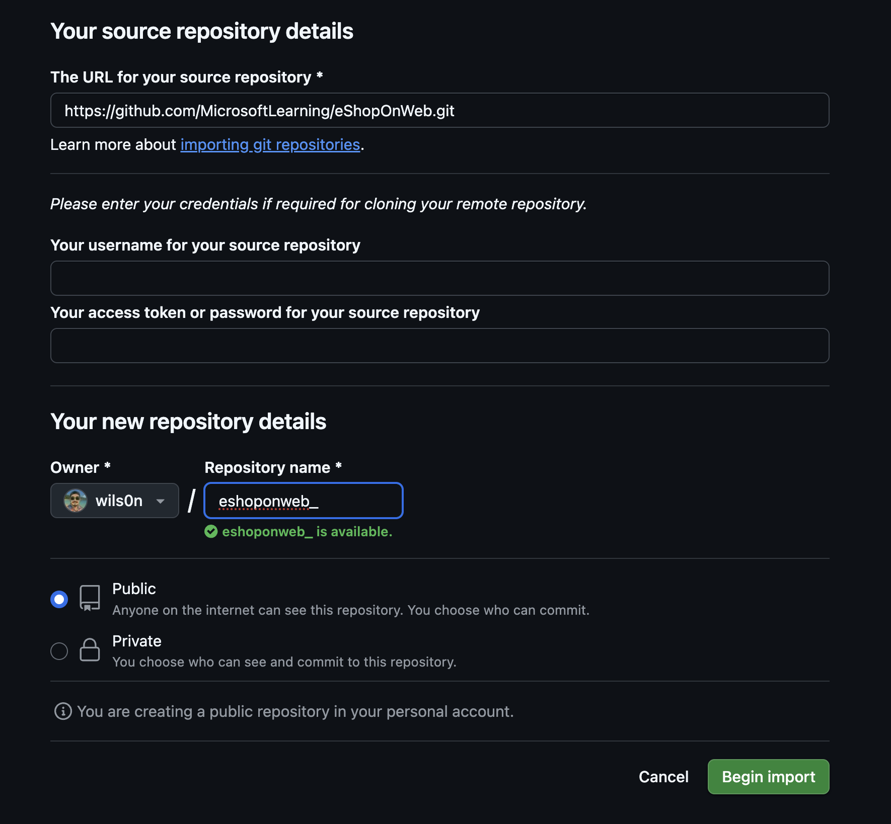

# Lab: Control de versiones con Git en **GitHub**

**Duración estimada:** 45--60 min\
**Nivel:** Principiante--Intermedio\
**Contexto:** Realizarás clonación, commits, exploración de
historial, trabajo con ramas, **pull requests**, **branch protection
rules** y **tags**. Usaremos **VS Code** y **Git**.

---

## Objetivos de aprendizaje

Al finalizar, podrás:

- Clonar un repositorio existente desde GitHub.
- Guardar trabajo local con **commits** y **staging**.
- Revisar historial y comparar cambios.
- Trabajar con ramas desde VS Code.
- Crear **Pull Requests (PRs)** con políticas de protección (revisiones requeridas).
- Aplicar **tags** y crear un **release**.

---

## Requisitos del laboratorio

- Navegador compatible (Chrome/Firefox/Safari/Microsoft Edge).
- Cuenta de **GitHub** (gratuita u organización).
- **Git ** instalado.

---

## Repositorio de práctica

Usaremos **eShopOnWeb**

- URL de origen: `https://github.com/MicrosoftLearning/eShopOnWeb.git`

> Puedes **importar** el repo a tu usuario/organización en GitHub (crea
> tu propia copia administrable) o **forkear**.

---

## Ejercicio 0: Configurar prerrequisitos

### Tarea 1: Configurar Git y VS Code

1.  Abre **VS Code**.
2.  Abre **Terminal** → **New Terminal**.
3.  (Opcional) Cambia el shell a PowerShell/Bash según prefieras.
4.  Configura tu helper de credenciales y tu identidad:

    - **Windows** (Git Credential Manager):

      ```bash
      git config --global credential.helper manager-core
      git config --global user.name "Tu Nombre"
      git config --global user.email tu-email@example.com
      ```

    - **macOS** (Keychain) o Linux (GCM si instalado):

      ```bash
      git config --global credential.helper osxkeychain   # macOS
      git config --global user.name "Tu Nombre"
      git config --global user.email tu-email@example.com
      # Linux con GCM (si lo usas):
      # git config --global credential.helper manager-core
      ```

### Tarea 2: Crear repositorio en **GitHub** por importación

1.  Entra a **github.com** con tu cuenta.
2.  En la esquina superior derecha, haz clic en **+** → **Import
    repository**.
3.  En **Old repository's clone URL**, pega:
    `https://github.com/MicrosoftLearning/eShopOnWeb.git`.
4.  En **Owner**, elige tu usuario u organización.\
5.  En **Repository Name**, escribe: `eshoponweb` (o similar).\
6.  Mantén **Public/Private** según prefieras y pulsa **Begin import**.
7.  Al terminar, verás tu **nuevo repo** `owner/eshoponweb`.

> Estructura relevante del repo: `.github/` (workflows),
> `.devcontainer/`, `infra/` (Bicep/ARM), `src/` (.NET 8 Web).



### Tarea 3: Establecer `main` como rama por defecto (si aplica)

- GitHub crea `main` por defecto; si no, ve a **Settings** →
  **Branches** → **Default branch** → **main**.


## Ejercicio 1: Clonar un repositorio existente

### Tarea 1: Clonar con VS Code

1.  En GitHub, abre tu repo `owner/eshoponweb` y haz clic en **Code** →
    pestaña **HTTPS** → **Copy** (URL de clonación).
2.  En VS Code, abre **Command Palette** (`Ctrl+Shift+P` o `F1`) y
    ejecuta **Git: Clone**.


3.  Pega la URL y elige una carpeta local (por ejemplo `C:\Git` en
    Windows o `~/Git` en macOS/Linux).
4.  Cuando termine, VS Code te ofrecerá **Open**; acepta para abrir la
    carpeta del repo.

> Si el editor muestra advertencias de carga/SDK, ignóralas: **no**
> necesitas compilar para este lab.

---

## Ejercicio 2: Guardar trabajo con commits

### Conceptos

- **Working Directory** → **Staging Area (Index)** → **Commit local**.
- Un commit tiene: cambios, referencia(s) padre y un **mensaje
  claro**.

### Tarea 1: Primer commit

1.  En el Explorador de VS Code, abre `src/Web/Program.cs`.

2.  En la **primera línea**, agrega un comentario:

    ```csharp
    // My first change
    ```

3.  Guarda (`Ctrl+S`).

4.  Abre la vista **Source Control** (icono de Git). Verás el archivo
    modificado.


5.  En el cuadro de mensaje, escribe: `My commit` y presiona
    `Ctrl+Enter` para **commit**.

    - Si pide auto-stage, elige **Always**.

6.  Sincroniza (icono ↕ en la barra inferior) para hacer **push** a
    `origin/main`.

### Tarea 2: Revisar commits en GitHub

1.  Ve al repo en GitHub → pestaña **Commits** (o **History** en la
    vista de archivos).
2.  Verifica que tu commit esté arriba.

### Tarea 3: Staging selectivo

1.  Edita `src/Web/Program.cs` y cambia el comentario a:

    ```csharp
    // My second change
    ```

2.  Abre `src/Web/Constants.cs` y agrega:

    ```csharp
    // My third change
    ```

3.  En **Source Control**, **stage** solo `Program.cs` (clic en el ícono
    `+`).

4.  Escribe mensaje: `Added comments` → **Commit** de **Staged**.


5.  Haz **push** para sincronizar. Observa que `Constants.cs` sigue sin
    commitear (cambio pendiente).

> Sugerencia: usa la vista **diff** de VS Code para comparar lado a
> lado.

---

## Ejercicio 3: Revisar historial

### Tarea 1: Comparar archivos y explorar historial

1.  En VS Code, selecciona `Constants.cs` en **Source Control** para
    abrir el **diff**.


2.  En GitHub, abre **Commits** y entra a un commit para ver **Browse
    files** (estado del repo en ese punto) o **Changes** para ver el
    patch.

> Recuerda que la línea temporal no siempre es estrictamente cronológica
> por **merges**; piensa en **deltas** entre commits.

---

## Ejercicio 4: Trabajar con ramas y Pull Requests

### Tarea 1: Crear una nueva rama local

1.  En VS Code (barra inferior), haz clic en `main` → **Create new
    branch...**.


2.  Base: **main**.\
3.  Nombre: `dev` y presiona **Enter** (cambia automáticamente a `dev`).

### Tarea 2: Publicar y gestionar ramas

1.  En VS Code, haz **Publish Branch** para subir `dev` a GitHub.
2.  En GitHub, ve a **Branches** (pestaña del repo) y verifica que
    exista `dev`.

### Tarea 3: Definir **Branch Protection Rules** (políticas sobre `main`)

1.  En GitHub, entra a **Settings** → **Branches** → **Add rule**.
2.  Configura la regla para `Branch name pattern`: `main`.
3.  Activa:
    - ✅ **Require a pull request before merging**
    - ✅ **Require approvals** → **1** (como estás solo, luego te
      autoapruebas)
    - (Opcional) **Dismiss stale pull request approvals**
    - (Opcional) **Require linear history**
    - (Opcional) **Require status checks to pass** (si deseas, agrega
      checks de Actions más adelante)
4.  Guarda con **Create** / **Save changes**.

> GitHub no exige "issue vinculado" de forma nativa. Simularemos el
> control con una **Issue** y el texto **`Closes #<número>`** en el PR
> para enlazar trazabilidad.

### Tarea 4: Probar la política de `main` (bloqueo de commits directos)

1.  En GitHub, con la rama **main** seleccionada en la vista de
    archivos, edita `src/Web/Program.cs` en el editor web.

2.  Agrega:

    ```csharp
    // Testing main branch policy
    ```

3.  Intenta **Commit changes** directamente a `main`.\

4.  Observa el **bloqueo** y cancela.

### Tarea 5: Crear una **Issue**, hacer cambio en `dev` y abrir PR

1.  En GitHub, pestaña **Issues** → **New issue**.
    - **Title:** `Testing my first PR`\
    - **Submit new issue** (anota el número, p. ej. `#1`).
2.  Cambia a rama **dev** en el repo (GitHub o local).

    - En GitHub (editor web) o en VS Code, edita `src/Web/Program.cs`
      y agrega:

      ```csharp
      // Testing my first PR
      ```

    - Realiza **Commit** en la rama `dev` (si es local, haz **push**).

3.  GitHub mostrará un banner "Compare & pull request". Clic en **Create
    pull request**.
4.  En la **descripción del PR**, escribe `Closes #1` para **vincular**
    la Issue.
5.  Crea el PR contra `main`.
6.  En la pestaña **Files changed**, revisa el diff. Añade comentarios
    si deseas.
7.  En la pestaña **Conversation**, **Approve** (si eres revisor) y
    luego **Merge**.
    - **Merge method:** _Create a merge commit_ (equivalente a "Merge
      no fast-forward").
    - Activa "**Delete branch**" tras el merge.

> Al hacer merge, la Issue `#1` se cierra automáticamente por el
> `Closes #1`.

---

## Ejercicio 5: Aplicar **tags** y crear un **release**

### Tarea 1: Crear tag `v1.1.0-beta`

1.  En GitHub, ve a **Releases** → **Draft a new release**.
2.  En **Choose a tag**, escribe `v1.1.0-beta` y selecciona **Create new
    tag** apuntando a `main`.
3.  **Release title:** `Beta release v1.1.0`.
4.  (Opcional) Marca como **pre-release**.
5.  Clic en **Publish release**.

> Esto crea un **tag** y un **release** asociado al último commit de
> `main`.

---

## (Opcional) Ejercicio 6: Quitar temporalmente la protección de `main`

Si vas a continuar con otros labs que requieren commits directos a
`main`: 1. **Settings** → **Branches** → regla de `main` → **Edit**. 2.
Desactiva **Require a pull request before merging** y **Require
approvals**.\
3. **Save changes**.

---

## Comandos útiles de Git (referencia rápida)

```bash
# Ver configuración
git config --list --show-origin

# Cambiar/crear rama
git checkout -b dev        # crear y moverse
git checkout main          # volver a main

# Sincronizar
git pull                   # traer cambios
git push -u origin dev     # publicar rama por 1ª vez

# Staging/commit
git status
git add path/al/archivo
git commit -m "mensaje"

# Tags
git tag v1.1.0-beta        # crea tag local
git push origin v1.1.0-beta
```

---

## Criterios de éxito (Checklist)

- [ ] Repo importado a **GitHub**.
- [ ] Clonación local exitosa en **VS Code**.
- [ ] Al menos **2 commits** en `main` (uno con **staging
      selectivo**).
- [ ] Historial revisado en GitHub.
- [ ] Rama `dev` creada, publicada y PR creado.
- [ ] **Branch protection** en `main` con **1 aprobación** requerida.
- [ ] PR aprobado, merge realizado y rama `dev` eliminada.
- [ ] **Tag** `v1.1.0-beta` y **release** publicado.

---

## Extensiones y extras (opcional)

- **GitHub Pull Requests and Issues** (extensión VS Code) para
  gestionar PRs/Issues desde el editor.
- **Codeowners**: añade `CODEOWNERS` para requerir aprobaciones de
  equipos/usuarios específicos.
- **Plantilla de PR**: agrega `.github/pull_request_template.md` con
  una casilla "Issue: Closes #...".
- **Checks**: integra **GitHub Actions** (linting/tests) y marca
  **Required status checks** en la regla de branch.

---

## Solución de problemas frecuentes

- **403 al hacer push**: revisa que el remoto sea
  `https://github.com/<owner>/<repo>.git` y que el helper de
  credenciales esté guardando el token correcto.
- **No aparece "Compare & pull request"**: crea el PR manualmente:
  **Pull requests** → **New pull request** (base: `main`, compare:
  `dev`).
- **No puedo commitear en `main`**: es lo esperado si la protección
  está activa; usa una rama y PR.
- **El tag no aparece**: si lo creaste localmente, recuerda
  `git push origin <tag>` o usa la UI de **Releases**.
