# Laboratorio 9: GitHub Actions - CI/CD con Python

**Duración estimada:** 90–120 min  
**Nivel:** Intermedio  
**Contexto:** En este laboratorio aprenderás a implementar CI/CD con GitHub Actions, desde conceptos básicos hasta workflows complejos con múltiples jobs, artefactos y automatización.

---

## Objetivos de aprendizaje

- Entender la arquitectura y componentes de GitHub Actions (Workflows, Jobs, Steps, Actions, Runners)
- Crear workflows de CI/CD para aplicaciones Python
- Implementar jobs paralelos y secuenciales
- Gestionar artefactos y outputs entre jobs
- Configurar cache para optimizar tiempos de ejecución
- Aplicar buenas prácticas de seguridad y organización

---

## Requisitos

- Cuenta de GitHub con repositorio
- Conocimientos básicos de Git y GitHub
- Familiaridad con Python y pytest
- Editor de texto o IDE configurado

---

## Estructura del proyecto

```
github_actions_demo/
├── .github/
│   └── workflows/
│       └── devops.yml          # Workflow principal de CI/CD
├── hello.py                    # Aplicación Python simple
├── tests/
│   └── test_hello.py          # Tests unitarios
├── requirements.txt            # Dependencias Python
├── README.md                   # Documentación del proyecto
└── laboratorio_github_actions.md  # Esta guía
```

---

## Parte 1: Conceptos Fundamentales de GitHub Actions

### 1.1 ¿Qué es GitHub Actions?

**GitHub Actions** es una plataforma de CI/CD (Integración Continua/Despliegue Continuo) integrada en GitHub que permite automatizar tareas de desarrollo, testing, building y deployment directamente desde tu repositorio.

**Ventajas principales:**
- ✅ **Integración nativa**: No requiere servicios externos
- ✅ **Marketplace**: Miles de acciones pre-construidas
- ✅ **Gratuito**: 2000 minutos/mes para repositorios públicos
- ✅ **Multi-plataforma**: Windows, macOS, Linux
- ✅ **Matrices**: Ejecutar en múltiples versiones simultáneamente

### 1.2 Componentes de GitHub Actions

#### **Workflow (Flujo de trabajo)**
Un **workflow** es un proceso automatizado definido en un archivo YAML que se ejecuta cuando se dispara por eventos específicos (push, pull request, etc.).

```yaml
# Ejemplo básico de workflow
name: Mi Workflow
on: [push, pull_request]
jobs:
  test:
    runs-on: ubuntu-latest
    steps:
      - uses: actions/checkout@v4
```

#### **Job (Trabajo)**
Un **job** es un conjunto de pasos que se ejecutan en el mismo runner. Los jobs pueden ejecutarse en paralelo o secuencialmente.

```yaml
jobs:
  test:        # Job 1: Ejecuta tests
    runs-on: ubuntu-latest
    steps: [...]
  
  build:       # Job 2: Construye la aplicación
    needs: test  # Espera a que termine 'test'
    runs-on: ubuntu-latest
    steps: [...]
```

#### **Step (Paso)**
Un **step** es una tarea individual dentro de un job. Puede ser una acción (action) o un comando de shell.

```yaml
steps:
  - name: Checkout code
    uses: actions/checkout@v4    # Action pre-construida
  
  - name: Run tests
    run: pytest                 # Comando de shell
```

#### **Action (Acción)**
Una **action** es una unidad reutilizable de código que realiza una tarea específica. Pueden ser oficiales de GitHub o de la comunidad.

```yaml
- uses: actions/checkout@v4      # Action oficial
- uses: actions/setup-python@v5  # Action oficial
- uses: user/custom-action@v1    # Action de la comunidad
```

#### **Runner (Ejecutor)**
Un **runner** es un servidor que ejecuta los workflows. Pueden ser:
- **GitHub-hosted**: Servidores gestionados por GitHub (ubuntu-latest, windows-latest, macos-latest)
- **Self-hosted**: Servidores propios que registras en GitHub

---

## Parte 2: Análisis del Workflow Actual

### 2.1 Estructura del archivo `devops.yml`

Vamos a analizar cada sección del workflow que hemos creado:

```yaml
name: CI básico Python + Bash
run-name: "CI disparado por ${{ github.actor }}"

on:
  push:
    branches: [ main ]
  pull_request:
```

**Explicación:**
- `name`: Nombre descriptivo del workflow
- `run-name`: Nombre dinámico para cada ejecución (incluye el usuario que lo disparó)
- `on`: Eventos que disparan el workflow
  - `push` en rama `main`: Se ejecuta al hacer push a main
  - `pull_request`: Se ejecuta al crear/actualizar un PR

### 2.2 Job 1: Test (Validación)

```yaml
test:
  runs-on: ubuntu-latest
  steps:
    # STEP 1: Checkout
    - name: Checkout
      uses: actions/checkout@v4

    # STEP 2: Setup Python
    - name: Setup Python
      uses: actions/setup-python@v5
      with:
        python-version: "3.11"

    # STEP 3: Cache
    - name: Cache pip
      uses: actions/cache@v4
      with:
        path: ~/.cache/pip
        key: pip-${{ runner.os }}-${{ hashFiles('requirements.txt') }}
        restore-keys: pip-${{ runner.os }}-

    # STEP 4: Install dependencies
    - name: Install deps
      run: |
        python -m pip install --upgrade pip
        pip install -r requirements.txt

    # STEP 5: Run tests
    - name: Run tests
      run: |
        export PYTHONPATH="${PYTHONPATH}:$(pwd)"
        pytest -q

    # STEP 6: Create build tag
    - name: Compute build tag
      id: meta
      run: |
        TS=$(date +%Y%m%d-%H%M%S)
        echo "tag=${TS}-${GITHUB_SHA::7}" >> "$GITHUB_OUTPUT"

    # STEP 7: Save artifact
    - name: Save artifact (sample log)
      run: |
        echo "Build tag: ${{ steps.meta.outputs.tag }}" > build-info.txt
    - name: Upload build info artifact
      uses: actions/upload-artifact@v4
      with:
        name: build-info
        path: build-info.txt
```

**Conceptos clave:**

#### **Checkout Action**
```yaml
- uses: actions/checkout@v4
```
- Descarga el código del repositorio al runner
- Es el primer paso en casi todos los workflows
- Versión `@v4` es la más reciente y estable

#### **Setup Python Action**
```yaml
- uses: actions/setup-python@v5
  with:
    python-version: "3.11"
```
- Instala una versión específica de Python
- Configura automáticamente el PATH
- Soporta múltiples versiones simultáneas

#### **Cache Action**
```yaml
- uses: actions/cache@v4
  with:
    path: ~/.cache/pip
    key: pip-${{ runner.os }}-${{ hashFiles('requirements.txt') }}
    restore-keys: pip-${{ runner.os }}-
```
- **¿Por qué usar cache?** Acelera builds subsecuentes guardando dependencias
- **`path`**: Directorio a cachear
- **`key`**: Clave única basada en OS y hash del archivo requirements.txt
- **`restore-keys`**: Claves de respaldo si no encuentra el cache exacto

#### **Variables de entorno y outputs**
```yaml
- name: Compute build tag
  id: meta                    # ID del step para referenciarlo
  run: |
    TS=$(date +%Y%m%d-%H%M%S)
    echo "tag=${TS}-${GITHUB_SHA::7}" >> "$GITHUB_OUTPUT"
```
- **`id`**: Permite referenciar el step desde otros steps
- **`$GITHUB_OUTPUT`**: Archivo especial para outputs del step
- **`$GITHUB_SHA`**: Hash del commit actual (variable predefinida)

#### **Upload Artifact Action**
```yaml
- uses: actions/upload-artifact@v4
  with:
    name: build-info
    path: build-info.txt
```
- Guarda archivos para usar en otros jobs o descargar
- Los artefactos persisten por 90 días
- Se pueden descargar desde la interfaz de GitHub

### 2.3 Job 2: Package (Empaquetado)

```yaml
package:
  needs: test              # Dependencia: espera a que termine 'test'
  runs-on: ubuntu-latest
  steps:
    - name: Checkout
      uses: actions/checkout@v4

    - name: Read tag from previous job
      run: echo "TAG = ${{ needs.test.outputs.meta_tag }}"
      env:
        TAG: ${{ needs.test.outputs.build_tag }}

    - name: Create zip
      run: |
        mkdir -p dist
        cp hello.py dist/
        zip -r "dist/app-${{ needs.test.outputs.build_tag }}.zip" dist

    - name: Upload package
      uses: actions/upload-artifact@v4
      with:
        name: app-zip
        path: dist/*.zip
```

**Conceptos clave:**

#### **Dependencias entre jobs**
```yaml
package:
  needs: test
```
- **`needs`**: Define dependencias entre jobs
- El job `package` solo se ejecuta si `test` termina exitosamente
- Permite crear pipelines secuenciales

#### **Acceso a outputs de otros jobs**
```yaml
${{ needs.test.outputs.build_tag }}
```
- **`needs.<job>.outputs.<name>`**: Accede a outputs de jobs anteriores
- Requiere que el job anterior defina outputs (ver sección 3.1)

### 2.4 Job 3: Docs (Documentación)

```yaml
docs:
  runs-on: ubuntu-latest
  steps:
    - name: Echo info (Bash)
      run: |
        echo "Repo: $GITHUB_REPOSITORY"
        echo "Evento: $GITHUB_EVENT_NAME"
        echo "Runner: $RUNNER_OS"
```

**Variables predefinidas de GitHub:**
- **`$GITHUB_REPOSITORY`**: Nombre del repositorio (usuario/repo)
- **`$GITHUB_EVENT_NAME`**: Tipo de evento (push, pull_request, etc.)
- **`$RUNNER_OS`**: Sistema operativo del runner (Linux, Windows, macOS)

---

## Parte 3: Configuración Avanzada

### 3.1 Outputs de Jobs

Para que un job pueda pasar datos a otros jobs, debe definir outputs:

```yaml
jobs:
  test:
    runs-on: ubuntu-latest
    outputs:                    # Define outputs del job
      build_tag: ${{ steps.meta.outputs.tag }}
      test_status: ${{ steps.test.outputs.status }}
    steps:
      - name: Compute build tag
        id: meta
        run: |
          echo "tag=20241201-143022-abc1234" >> "$GITHUB_OUTPUT"
      
      - name: Run tests
        id: test
        run: |
          pytest -q
          echo "status=success" >> "$GITHUB_OUTPUT"
```

### 3.2 Matrices (Matrix Strategy)

Ejecutar el mismo job en múltiples configuraciones:

```yaml
jobs:
  test:
    runs-on: ubuntu-latest
    strategy:
      matrix:
        python-version: ["3.9", "3.10", "3.11"]
        os: [ubuntu-latest, windows-latest, macos-latest]
    steps:
      - uses: actions/checkout@v4
      - uses: actions/setup-python@v5
        with:
          python-version: ${{ matrix.python-version }}
      - name: Test on ${{ matrix.os }} with Python ${{ matrix.python-version }}
        run: pytest
```

### 3.3 Condiciones (if)

Ejecutar steps o jobs condicionalmente:

```yaml
jobs:
  deploy:
    if: github.ref == 'refs/heads/main'  # Solo en rama main
    runs-on: ubuntu-latest
    steps:
      - name: Deploy to production
        if: github.event_name == 'push'   # Solo en push, no en PR
        run: echo "Deploying..."
```

### 3.4 Secrets y Variables de Entorno

#### **Secrets (Datos sensibles)**
```yaml
steps:
  - name: Deploy
    env:
      API_KEY: ${{ secrets.API_KEY }}
      DATABASE_URL: ${{ secrets.DATABASE_URL }}
    run: |
      echo "Deploying with API key: ${API_KEY:0:8}..."
```

#### **Variables de repositorio (No sensibles)**
```yaml
steps:
  - name: Build
    env:
      APP_VERSION: ${{ vars.APP_VERSION }}
      ENVIRONMENT: ${{ vars.ENVIRONMENT }}
    run: |
      echo "Building version $APP_VERSION for $ENVIRONMENT"
```

---

## Parte 4: Flujo de Ejecución

### 4.1 Diagrama de Arquitectura

```mermaid
graph TB
    subgraph "GitHub Repository"
        Code[📁 Código Python<br/>hello.py, tests/]
        Workflow[⚙️ Workflow<br/>.github/workflows/devops.yml]
    end
    
    subgraph "GitHub Actions"
        Trigger[🎯 Trigger<br/>push/PR]
        Runner1[🖥️ Runner 1<br/>ubuntu-latest]
        Runner2[🖥️ Runner 2<br/>ubuntu-latest]
        Runner3[🖥️ Runner 3<br/>ubuntu-latest]
    end
    
    subgraph "Jobs"
        TestJob[🧪 Job: test<br/>- Checkout<br/>- Setup Python<br/>- Cache<br/>- Install deps<br/>- Run tests<br/>- Create tag<br/>- Upload artifact]
        PackageJob[📦 Job: package<br/>- Checkout<br/>- Read tag<br/>- Create zip<br/>- Upload package]
        DocsJob[📚 Job: docs<br/>- Echo info]
    end
    
    subgraph "Artifacts"
        BuildInfo[📄 build-info.txt]
        AppZip[🗜️ app-*.zip]
    end
    
    Code --> Trigger
    Workflow --> Trigger
    Trigger --> Runner1
    Trigger --> Runner2
    Trigger --> Runner3
    
    Runner1 --> TestJob
    Runner2 --> PackageJob
    Runner3 --> DocsJob
    
    TestJob --> BuildInfo
    PackageJob --> AppZip
    
    TestJob -.->|needs: test| PackageJob
    
    style Trigger fill:#e1f5ff
    style TestJob fill:#e8f5e9
    style PackageJob fill:#fff3e0
    style DocsJob fill:#f3e5f5
```



### 4.2 Secuencia de Ejecución

```mermaid
sequenceDiagram
    participant Dev as 👨‍💻 Developer
    participant GH as 🐙 GitHub
    participant R1 as 🖥️ Runner 1<br/>(test)
    participant R2 as 🖥️ Runner 2<br/>(package)
    participant R3 as 🖥️ Runner 3<br/>(docs)
    
    Dev->>GH: git push origin main
    Note over Dev,GH: Evento: push
    
    GH->>R1: Iniciar job 'test'
    GH->>R2: Iniciar job 'package' (en espera)
    GH->>R3: Iniciar job 'docs'
    
    Note over R1: Ejecutando en paralelo
    R1->>R1: Checkout code
    R1->>R1: Setup Python 3.11
    R1->>R1: Cache pip dependencies
    R1->>R1: Install requirements.txt
    R1->>R1: Run pytest
    R1->>R1: Create build tag
    R1->>R1: Upload build-info.txt
    
    Note over R3: Ejecutando en paralelo
    R3->>R3: Echo repository info
    
    R1-->>GH: ✅ Job 'test' completado
    Note over R2: Ahora puede ejecutar
    GH->>R2: Iniciar job 'package'
    
    R2->>R2: Checkout code
    R2->>R2: Read tag from test job
    R2->>R2: Create app-*.zip
    R2->>R2: Upload package artifact
    
    R2-->>GH: ✅ Job 'package' completado
    R3-->>GH: ✅ Job 'docs' completado
    
    GH-->>Dev: ✅ Workflow completado
    Note over Dev,GH: Todos los jobs exitosos
```



---

## Parte 5: Pruebas y Validación

### 5.1 Ejecutar el Workflow

1. **Hacer un commit y push:**
```bash
git add .
git commit -m "feat: add GitHub Actions workflow"
git push origin main
```

2. **Verificar en GitHub:**
   - Ve a tu repositorio en GitHub
   - Haz clic en la pestaña "Actions"
   - Verás el workflow ejecutándose

### 5.2 Interpretar los Resultados

#### **Estado de los Jobs:**
- ✅ **Verde**: Job exitoso
- ❌ **Rojo**: Job falló
- 🟡 **Amarillo**: Job en progreso
- ⚪ **Gris**: Job cancelado o en espera

#### **Logs detallados:**
```bash
# Cada step muestra:
✓ Checkout code (2s)
✓ Setup Python (15s)
✓ Cache pip (1s)
✓ Install deps (45s)
✓ Run tests (3s)
✓ Compute build tag (1s)
✓ Save artifact (1s)
✓ Upload build info artifact (2s)
```

### 5.3 Descargar Artefactos

1. Ve a la ejecución del workflow
2. Haz clic en "Artifacts" al final de la página
3. Descarga `build-info` o `app-zip`

---

## Parte 6: Mejoras y Optimizaciones

### 6.1 Workflow Mejorado

```yaml
name: CI/CD Pipeline Avanzado
run-name: "Pipeline ejecutado por ${{ github.actor }} en ${{ github.ref_name }}"

on:
  push:
    branches: [ main, develop ]
  pull_request:
    branches: [ main ]
  workflow_dispatch:  # Permite ejecución manual

env:
  PYTHON_VERSION: "3.11"
  NODE_VERSION: "18"

jobs:
  # Job de validación con matriz
  test:
    runs-on: ubuntu-latest
    strategy:
      matrix:
        python-version: ["3.9", "3.10", "3.11"]
    outputs:
      build_tag: ${{ steps.meta.outputs.tag }}
      test_results: ${{ steps.test.outputs.results }}
    
    steps:
      - name: Checkout
        uses: actions/checkout@v4
      
      - name: Setup Python ${{ matrix.python-version }}
        uses: actions/setup-python@v5
        with:
          python-version: ${{ matrix.python-version }}
      
      - name: Cache pip
        uses: actions/cache@v4
        with:
          path: ~/.cache/pip
          key: pip-${{ runner.os }}-${{ matrix.python-version }}-${{ hashFiles('requirements.txt') }}
          restore-keys: |
            pip-${{ runner.os }}-${{ matrix.python-version }}-
            pip-${{ runner.os }}-
      
      - name: Install dependencies
        run: |
          python -m pip install --upgrade pip
          pip install -r requirements.txt
          pip install pytest-cov  # Para coverage
      
      - name: Run tests with coverage
        id: test
        run: |
          export PYTHONPATH="${PYTHONPATH}:$(pwd)"
          pytest --cov=hello --cov-report=xml --cov-report=html
          echo "results=success" >> "$GITHUB_OUTPUT"
      
      - name: Upload coverage reports
        uses: actions/upload-artifact@v4
        with:
          name: coverage-report-py${{ matrix.python-version }}
          path: htmlcov/
      
      - name: Compute build tag
        id: meta
        run: |
          TS=$(date +%Y%m%d-%H%M%S)
          echo "tag=${TS}-${GITHUB_SHA::7}" >> "$GITHUB_OUTPUT"
      
      - name: Save build info
        run: |
          echo "Build tag: ${{ steps.meta.outputs.tag }}" > build-info.txt
          echo "Python version: ${{ matrix.python-version }}" >> build-info.txt
          echo "Commit: ${{ github.sha }}" >> build-info.txt
          echo "Branch: ${{ github.ref_name }}" >> build-info.txt
      
      - name: Upload build info
        uses: actions/upload-artifact@v4
        with:
          name: build-info-py${{ matrix.python-version }}
          path: build-info.txt

  # Job de calidad de código
  lint:
    runs-on: ubuntu-latest
    steps:
      - name: Checkout
        uses: actions/checkout@v4
      
      - name: Setup Python
        uses: actions/setup-python@v5
        with:
          python-version: ${{ env.PYTHON_VERSION }}
      
      - name: Install linting tools
        run: |
          pip install flake8 black isort
      
      - name: Run flake8
        run: flake8 hello.py tests/
      
      - name: Run black check
        run: black --check hello.py tests/
      
      - name: Run isort check
        run: isort --check-only hello.py tests/

  # Job de empaquetado
  package:
    needs: [test, lint]  # Espera a que ambos terminen
    runs-on: ubuntu-latest
    if: github.ref == 'refs/heads/main'  # Solo en main
    
    steps:
      - name: Checkout
        uses: actions/checkout@v4
      
      - name: Setup Python
        uses: actions/setup-python@v5
        with:
          python-version: ${{ env.PYTHON_VERSION }}
      
      - name: Create package
        run: |
          mkdir -p dist
          cp hello.py dist/
          cp requirements.txt dist/
          cp README.md dist/
          zip -r "dist/app-${{ needs.test.outputs.build_tag }}.zip" dist/
      
      - name: Upload package
        uses: actions/upload-artifact@v4
        with:
          name: app-package
          path: dist/*.zip
          retention-days: 30

  # Job de deployment (ejemplo)
  deploy:
    needs: [test, lint, package]
    runs-on: ubuntu-latest
    if: github.ref == 'refs/heads/main'
    environment: production  # Requiere aprobación manual
    
    steps:
      - name: Checkout
        uses: actions/checkout@v4
      
      - name: Download package
        uses: actions/download-artifact@v4
        with:
          name: app-package
          path: dist/
      
      - name: Deploy to production
        run: |
          echo "Deploying version ${{ needs.test.outputs.build_tag }}"
          # Aquí irían los comandos reales de deployment
          # Por ejemplo: scp, kubectl, docker push, etc.
```

### 6.2 Mejoras Implementadas

#### **Matriz de Testing**
- Prueba en múltiples versiones de Python
- Identifica problemas de compatibilidad

#### **Job de Linting**
- Verifica calidad de código
- Ejecuta en paralelo con tests

#### **Condiciones Avanzadas**
- `if: github.ref == 'refs/heads/main'`: Solo en rama main
- `environment: production`: Requiere aprobación manual

#### **Mejor Gestión de Artefactos**
- Nombres únicos por versión de Python
- Retención personalizada (30 días)

---

## Parte 7: Buenas Prácticas

### 7.1 Seguridad

#### **Secrets Management**
```yaml
steps:
  - name: Deploy
    env:
      API_KEY: ${{ secrets.API_KEY }}
      DATABASE_URL: ${{ secrets.DATABASE_URL }}
    run: |
      # Nunca imprimas secrets en logs
      echo "Deploying with API key: ${API_KEY:0:8}..."
```

#### **Principio de Menor Privilegio**
```yaml
permissions:
  contents: read      # Solo lectura del repositorio
  packages: write     # Solo para subir paquetes
  # No permisos de admin
```

### 7.2 Performance

#### **Cache Estratégico**
```yaml
- name: Cache pip
  uses: actions/cache@v4
  with:
    path: ~/.cache/pip
    key: pip-${{ runner.os }}-${{ hashFiles('requirements.txt') }}
    restore-keys: |
      pip-${{ runner.os }}-
      pip-
```

#### **Jobs Paralelos**
```yaml
jobs:
  test:
    runs-on: ubuntu-latest
  lint:
    runs-on: ubuntu-latest
  security:
    runs-on: ubuntu-latest
  # Los 3 se ejecutan en paralelo
```

### 7.3 Mantenibilidad

#### **Reutilización de Workflows**
```yaml
# .github/workflows/test.yml
name: Test
on:
  workflow_call:
    inputs:
      python-version:
        required: true
        type: string
jobs:
  test:
    runs-on: ubuntu-latest
    steps:
      - uses: actions/setup-python@v5
        with:
          python-version: ${{ inputs.python-version }}
```

```yaml
# .github/workflows/ci.yml
name: CI
on: [push]
jobs:
  test:
    uses: ./.github/workflows/test.yml
    with:
      python-version: "3.11"
```

#### **Nombres Descriptivos**
```yaml
- name: Install Python dependencies and run tests
  run: |
    pip install -r requirements.txt
    pytest
```

---

## Parte 8: Troubleshooting

### 8.1 Problemas Comunes

#### **Error: ModuleNotFoundError**
```bash
ERROR: ModuleNotFoundError: No module named 'hello'
```
**Solución:**
```yaml
- name: Run tests
  run: |
    export PYTHONPATH="${PYTHONPATH}:$(pwd)"
    pytest -q
```

#### **Error: Cache Miss**
```bash
Cache not found for input keys: pip-ubuntu-latest-abc123
```
**Solución:** Verificar que el archivo `requirements.txt` existe y tiene contenido.

#### **Error: Permission Denied**
```bash
Error: Resource not accessible by integration
```
**Solución:** Verificar permisos del token o usar `permissions:` en el workflow.

### 8.2 Debugging

#### **Habilitar Debug Logs**
```yaml
- name: Debug info
  run: |
    echo "Runner OS: $RUNNER_OS"
    echo "Python version: $(python --version)"
    echo "Working directory: $(pwd)"
    echo "Files: $(ls -la)"
```

#### **Logs Detallados**
```yaml
- name: Run tests
  run: |
    pytest -v --tb=short
```

---

## Parte 9: Integración con Herramientas Externas

### 9.1 Notificaciones

#### **Slack**
```yaml
- name: Notify Slack
  if: always()  # Siempre ejecutar, éxito o fallo
  uses: 8398a7/action-slack@v3
  with:
    status: ${{ job.status }}
    channel: '#devops'
    webhook_url: ${{ secrets.SLACK_WEBHOOK }}
```

#### **Email**
```yaml
- name: Send email
  if: failure()
  uses: dawidd6/action-send-mail@v3
  with:
    server_address: smtp.gmail.com
    server_port: 587
    username: ${{ secrets.EMAIL_USERNAME }}
    password: ${{ secrets.EMAIL_PASSWORD }}
    subject: "Build failed: ${{ github.repository }}"
    body: "Build failed in ${{ github.ref }}"
```

### 9.2 Deployment

#### **Docker Hub**
```yaml
- name: Build and push Docker image
  uses: docker/build-push-action@v5
  with:
    context: .
    push: true
    tags: |
      ${{ secrets.DOCKER_USERNAME }}/app:latest
      ${{ secrets.DOCKER_USERNAME }}/app:${{ github.sha }}
```

#### **AWS S3**
```yaml
- name: Deploy to S3
  uses: aws-actions/configure-aws-credentials@v4
  with:
    aws-access-key-id: ${{ secrets.AWS_ACCESS_KEY_ID }}
    aws-secret-access-key: ${{ secrets.AWS_SECRET_ACCESS_KEY }}
    aws-region: us-east-1

- name: Upload to S3
  run: |
    aws s3 sync dist/ s3://${{ secrets.S3_BUCKET }}/app/
```

---

## Checklist de Éxito

- [ ] Workflow se ejecuta correctamente en push y PR
- [ ] Tests pasan en múltiples versiones de Python
- [ ] Cache funciona y acelera builds subsecuentes
- [ ] Artefactos se generan y pueden descargarse
- [ ] Jobs se ejecutan en el orden correcto (dependencias)
- [ ] Logs son claros y útiles para debugging
- [ ] Secrets se manejan de forma segura
- [ ] Workflow es mantenible y bien documentado

---

## Entregables

1. **Repositorio GitHub** con:
   - Workflow funcional (`.github/workflows/devops.yml`)
   - Código Python con tests
   - README con instrucciones

2. **Capturas de pantalla:**
   - Ejecución exitosa del workflow
   - Logs de cada job
   - Artefactos generados
   - Matriz de testing (si se implementa)

3. **Evidencias de funcionamiento:**
   - Historial de ejecuciones en GitHub Actions
   - Artefactos descargables
   - Tests pasando en múltiples configuraciones

---

## Recursos Adicionales

- [Documentación oficial de GitHub Actions](https://docs.github.com/en/actions)
- [Marketplace de Actions](https://github.com/marketplace?type=actions)
- [GitHub Actions Examples](https://github.com/actions/starter-workflows)
- [Best Practices for GitHub Actions](https://docs.github.com/en/actions/learn-github-actions/best-practices-for-github-actions)

---

📘 **Autor:**  
Wilson Julca Mejía  
Curso: *DevOps y GitHub Actions – CI/CD con Python*  
Universidad de Ingeniería y Tecnología (UTEC)
