# Laboratorio 9.1: Extendiendo CI/CD - Publicación a Docker Hub

**Duración estimada:** 60–90 min  
**Nivel:** Intermedio  
**Contexto:** Este laboratorio es la continuación del **Laboratorio 9: Guía de Introducción a GitHub Actions**. Ahora que dominas los conceptos fundamentales de workflows, jobs y artefactos, aprenderás a extender tu pipeline CI/CD para construir y publicar imágenes Docker automáticamente en Docker Hub.

---

## Objetivos de aprendizaje

- Extender el workflow existente con un nuevo job de Docker
- Construir imágenes Docker dentro del pipeline CI/CD
- Automatizar la publicación de imágenes en Docker Hub
- Configurar credenciales seguras con GitHub Secrets
- Aplicar tagging semántico a las imágenes Docker
- Entender la integración entre jobs (test → package → docker)

---

## Requisitos previos

✅ **Completar el Laboratorio 9: Guía de Introducción** (o tener conocimientos equivalentes)  
✅ Cuenta en Docker Hub ([https://hub.docker.com/](https://hub.docker.com/))  
✅ Repositorio en GitHub con workflow funcional  
✅ Código fuente Python (`hello.py`) con tests  
✅ Familiaridad con Docker y contenedores  

---

## Contexto: ¿Dónde estamos?

En el laboratorio anterior implementamos un workflow con tres jobs:

```yaml
jobs:
  test:      # ✅ Ejecuta tests, genera artefactos, crea build tag
  package:   # ✅ Empaqueta la aplicación en ZIP
  docs:      # ✅ Genera documentación
```

**Ahora vamos a agregar:**
```yaml
jobs:
  test:      # ✅ Ya existe
  package:   # ✅ Ya existe
  docs:      # ✅ Ya existe
  docker:    # 🆕 Nuevo job: Build & Push a Docker Hub
```

---

## Estructura del proyecto actualizada

```
github_actions_demo/
├── .github/
│   └── workflows/
│       └── devops.yml              # Workflow existente (vamos a extenderlo)
├── hello.py                        # Aplicación Python existente
├── tests/
│   └── test_hello.py              # Tests existentes
├── requirements.txt                # Dependencias existentes
├── Dockerfile                      # 🆕 Nuevo: Dockerfile para la app
└── README.md
```

---

## Parte 1: Preparación del Dockerfile

### 1.1 Crear el Dockerfile

Primero, vamos a crear un Dockerfile optimizado para nuestra aplicación Python:

**Archivo: `Dockerfile`**

```dockerfile
# Imagen base ligera de Python 3.11
FROM python:3.11-slim

# Metadata de la imagen
LABEL maintainer="tu-email@ejemplo.com"
LABEL description="GitHub Actions Demo - Python CI/CD"

# Establecer directorio de trabajo
WORKDIR /app

# Copiar requirements.txt primero (para aprovechar cache de Docker)
COPY requirements.txt .

# Instalar dependencias
RUN pip install --no-cache-dir -r requirements.txt

# Copiar el código fuente
COPY hello.py .

# Variables de entorno
ENV PYTHONUNBUFFERED=1

# Comando por defecto (puedes cambiarlo según tu app)
CMD ["python", "hello.py"]
```

**Conceptos clave del Dockerfile:**

- **`FROM python:3.11-slim`**: Imagen base ligera (reduce tamaño)
- **`WORKDIR /app`**: Establece el directorio de trabajo dentro del contenedor
- **`COPY requirements.txt .`**: Se copia primero para aprovechar el cache de Docker
- **`--no-cache-dir`**: No guarda cache de pip (reduce tamaño de imagen)
- **`ENV PYTHONUNBUFFERED=1`**: Evita buffering de salida (mejor para logs)

### 1.2 Probar el Dockerfile localmente

Antes de integrar con GitHub Actions, prueba localmente:

```bash
# Construir la imagen
docker build -t github-actions-demo:local .

# Verificar que se creó
docker images | grep github-actions-demo

# Ejecutar el contenedor
docker run --rm github-actions-demo:local

# Ver logs (si tu app es un servidor)
docker run --rm -p 5000:5000 github-actions-demo:local
```

---

## Parte 2: Configuración de Docker Hub

### 2.1 Crear un Access Token en Docker Hub

**¿Por qué usar Access Token en lugar de contraseña?**
- ✅ Mayor seguridad (puedes revocar tokens sin cambiar contraseña)
- ✅ Permisos granulares
- ✅ Mejor práctica recomendada por Docker

**Pasos para crear el token:**

1. Ingresa a [Docker Hub](https://hub.docker.com/)
2. Ve a **Account Settings → Security**
3. Haz clic en **New Access Token**
4. Dale un nombre descriptivo: `github-actions-ci`
5. Selecciona permisos: **Read, Write, Delete**
6. Copia el token (solo se muestra una vez)

### 2.2 Configurar GitHub Secrets

Los **secrets** permiten almacenar información sensible de forma segura en GitHub.

**Pasos:**

1. Ve a tu repositorio en GitHub
2. **Settings → Secrets and variables → Actions**
3. Haz clic en **New repository secret**
4. Crea estos dos secrets:

**Secret 1:**
- **Name**: `DOCKERHUB_USERNAME`
- **Value**: Tu usuario de Docker Hub (ej: `wilsonjulca`)

**Secret 2:**
- **Name**: `DOCKERHUB_TOKEN`
- **Value**: El token que copiaste en el paso anterior

**¿Cómo funcionan los secrets?**
```yaml
# En el workflow, se accede así:
${{ secrets.DOCKERHUB_USERNAME }}  # No se expone en logs
${{ secrets.DOCKERHUB_TOKEN }}     # GitHub lo oculta automáticamente
```

---

## Parte 3: Extender el Workflow con Docker Job

### 3.1 Actualizar el archivo `devops.yml`

Vamos a agregar un nuevo job llamado `docker` a nuestro workflow existente:

**Archivo: `.github/workflows/devops.yml`**

```yaml
name: CI/CD Pipeline con Docker
run-name: "Pipeline ejecutado por ${{ github.actor }} en ${{ github.ref_name }}"

on:
  push:
    branches: [ main ]
  pull_request:
    branches: [ main ]

env:
  PYTHON_VERSION: "3.11"

jobs:
  # ========================================
  # JOB 1: TEST (ya existe del lab anterior)
  # ========================================
  test:
    runs-on: ubuntu-latest
    outputs:
      build_tag: ${{ steps.meta.outputs.tag }}
    steps:
      - name: Checkout
        uses: actions/checkout@v4

      - name: Setup Python
        uses: actions/setup-python@v5
        with:
          python-version: ${{ env.PYTHON_VERSION }}

      - name: Cache pip
        uses: actions/cache@v4
        with:
          path: ~/.cache/pip
          key: pip-${{ runner.os }}-${{ hashFiles('requirements.txt') }}
          restore-keys: pip-${{ runner.os }}-

      - name: Install dependencies
        run: |
          python -m pip install --upgrade pip
          pip install -r requirements.txt

      - name: Run tests
        run: |
          export PYTHONPATH="${PYTHONPATH}:$(pwd)"
          pytest -q

      - name: Compute build tag
        id: meta
        run: |
          TS=$(date +%Y%m%d-%H%M%S)
          echo "tag=${TS}-${GITHUB_SHA::7}" >> "$GITHUB_OUTPUT"

      - name: Save build info
        run: |
          echo "Build tag: ${{ steps.meta.outputs.tag }}" > build-info.txt
          echo "Commit: ${{ github.sha }}" >> build-info.txt
          echo "Branch: ${{ github.ref_name }}" >> build-info.txt

      - name: Upload build info artifact
        uses: actions/upload-artifact@v4
        with:
          name: build-info
          path: build-info.txt

  # ========================================
  # JOB 2: PACKAGE (ya existe del lab anterior)
  # ========================================
  package:
    needs: test
    runs-on: ubuntu-latest
    steps:
      - name: Checkout
        uses: actions/checkout@v4

      - name: Read tag from previous job
        run: echo "TAG = ${{ needs.test.outputs.build_tag }}"

      - name: Create zip package
        run: |
          mkdir -p dist
          cp hello.py dist/
          cp requirements.txt dist/
          zip -r "dist/app-${{ needs.test.outputs.build_tag }}.zip" dist/

      - name: Upload package
        uses: actions/upload-artifact@v4
        with:
          name: app-zip
          path: dist/*.zip

  # ========================================
  # JOB 3: DOCS (ya existe del lab anterior)
  # ========================================
  docs:
    runs-on: ubuntu-latest
    steps:
      - name: Echo repository info
        run: |
          echo "Repositorio: $GITHUB_REPOSITORY"
          echo "Evento: $GITHUB_EVENT_NAME"
          echo "Runner OS: $RUNNER_OS"
          echo "Actor: $GITHUB_ACTOR"

  # ========================================
  # JOB 4: DOCKER (🆕 NUEVO)
  # ========================================
  docker:
    needs: test  # Espera a que test termine exitosamente
    runs-on: ubuntu-latest
    if: github.event_name == 'push' && github.ref == 'refs/heads/main'  # Solo en push a main
    
    steps:
      # STEP 1: Checkout del código
      - name: Checkout code
        uses: actions/checkout@v4

      # STEP 2: Setup Docker Buildx (mejora el build de imágenes)
      - name: Set up Docker Buildx
        uses: docker/setup-buildx-action@v3

      # STEP 3: Login a Docker Hub
      - name: Login to Docker Hub
        uses: docker/login-action@v3
        with:
          username: ${{ secrets.DOCKERHUB_USERNAME }}
          password: ${{ secrets.DOCKERHUB_TOKEN }}

      # STEP 4: Extraer metadata para tags
      - name: Extract metadata (tags, labels)
        id: meta
        uses: docker/metadata-action@v5
        with:
          images: ${{ secrets.DOCKERHUB_USERNAME }}/github-actions-demo
          tags: |
            type=ref,event=branch
            type=sha,prefix={{branch}}-
            type=raw,value=latest,enable={{is_default_branch}}
            type=raw,value=${{ needs.test.outputs.build_tag }}

      # STEP 5: Build y Push de la imagen Docker
      - name: Build and push Docker image
        uses: docker/build-push-action@v5
        with:
          context: .
          file: ./Dockerfile
          push: true
          tags: ${{ steps.meta.outputs.tags }}
          labels: ${{ steps.meta.outputs.labels }}
          cache-from: type=registry,ref=${{ secrets.DOCKERHUB_USERNAME }}/github-actions-demo:buildcache
          cache-to: type=registry,ref=${{ secrets.DOCKERHUB_USERNAME }}/github-actions-demo:buildcache,mode=max

      # STEP 6: Generar resumen del build
      - name: Image summary
        run: |
          echo "## 🐳 Docker Build Exitoso" >> $GITHUB_STEP_SUMMARY
          echo "" >> $GITHUB_STEP_SUMMARY
          echo "**Imagen publicada:**" >> $GITHUB_STEP_SUMMARY
          echo '```' >> $GITHUB_STEP_SUMMARY
          echo "${{ secrets.DOCKERHUB_USERNAME }}/github-actions-demo:latest" >> $GITHUB_STEP_SUMMARY
          echo "${{ secrets.DOCKERHUB_USERNAME }}/github-actions-demo:${{ needs.test.outputs.build_tag }}" >> $GITHUB_STEP_SUMMARY
          echo '```' >> $GITHUB_STEP_SUMMARY
          echo "" >> $GITHUB_STEP_SUMMARY
          echo "**Pull de la imagen:**" >> $GITHUB_STEP_SUMMARY
          echo '```bash' >> $GITHUB_STEP_SUMMARY
          echo "docker pull ${{ secrets.DOCKERHUB_USERNAME }}/github-actions-demo:latest" >> $GITHUB_STEP_SUMMARY
          echo '```' >> $GITHUB_STEP_SUMMARY
```

### 3.2 Explicación detallada del Job Docker

#### **Dependencia y Condición**
```yaml
docker:
  needs: test  # Espera a que test termine
  if: github.event_name == 'push' && github.ref == 'refs/heads/main'
```
- **`needs: test`**: Solo se ejecuta si el job `test` es exitoso
- **`if`**: Solo en push a main (no en PRs ni otras ramas)

#### **Docker Buildx**
```yaml
- name: Set up Docker Buildx
  uses: docker/setup-buildx-action@v3
```
- **¿Qué es Buildx?** Extensión de Docker para builds avanzados
- **Ventajas:**
  - Build en paralelo (más rápido)
  - Soporte multi-plataforma (amd64, arm64)
  - Cache mejorado

#### **Login a Docker Hub**
```yaml
- name: Login to Docker Hub
  uses: docker/login-action@v3
  with:
    username: ${{ secrets.DOCKERHUB_USERNAME }}
    password: ${{ secrets.DOCKERHUB_TOKEN }}
```
- **Action oficial de Docker** para login seguro
- Usa los secrets configurados anteriormente
- Los credentials no se exponen en logs

#### **Metadata Action (Tagging)**
```yaml
- name: Extract metadata (tags, labels)
  id: meta
  uses: docker/metadata-action@v5
  with:
    images: ${{ secrets.DOCKERHUB_USERNAME }}/github-actions-demo
    tags: |
      type=ref,event=branch          # Ej: main
      type=sha,prefix={{branch}}-    # Ej: main-abc1234
      type=raw,value=latest          # Tag: latest
      type=raw,value=${{ needs.test.outputs.build_tag }}  # Ej: 20241215-143022-abc1234
```

**¿Qué tags se generan?**
Para un push a `main` con commit `abc1234` a las `14:30:22` del `2024-12-15`:
- `wilsonjulca/github-actions-demo:main`
- `wilsonjulca/github-actions-demo:main-abc1234`
- `wilsonjulca/github-actions-demo:latest`
- `wilsonjulca/github-actions-demo:20241215-143022-abc1234`

#### **Build and Push**
```yaml
- name: Build and push Docker image
  uses: docker/build-push-action@v5
  with:
    context: .                      # Contexto del build (raíz del repo)
    file: ./Dockerfile              # Ruta al Dockerfile
    push: true                      # Publicar en Docker Hub
    tags: ${{ steps.meta.outputs.tags }}      # Tags generados
    labels: ${{ steps.meta.outputs.labels }}  # Labels de metadata
    cache-from: type=registry,ref=...         # Cache de registry
    cache-to: type=registry,ref=...           # Guardar cache
```

**Cache de Docker:**
- **`cache-from`**: Lee cache de builds anteriores (acelera builds)
- **`cache-to`**: Guarda cache para futuros builds
- **`mode=max`**: Guarda todas las capas (máxima velocidad)

#### **GitHub Step Summary**
```yaml
- name: Image summary
  run: |
    echo "## 🐳 Docker Build Exitoso" >> $GITHUB_STEP_SUMMARY
```
- **`$GITHUB_STEP_SUMMARY`**: Archivo especial para mostrar resumen en la UI de GitHub
- Se muestra al final de la ejecución del workflow
- Soporta Markdown

---

## Parte 4: Diagrama del Flujo Completo

```mermaid
graph TB
    subgraph "GitHub Repository"
        Code[📁 Código Python<br/>hello.py, tests/]
        Docker[🐳 Dockerfile]
        Workflow[⚙️ Workflow<br/>.github/workflows/devops.yml]
    end
    
    subgraph "GitHub Actions"
        Trigger[🎯 Trigger<br/>push to main]
        Runner1[🖥️ Runner 1]
        Runner2[🖥️ Runner 2]
        Runner3[🖥️ Runner 3]
        Runner4[🖥️ Runner 4]
    end
    
    subgraph "Jobs"
        TestJob[🧪 Job: test<br/>- Run tests<br/>- Create build tag<br/>- Upload artifacts]
        PackageJob[📦 Job: package<br/>- Create ZIP<br/>- Upload artifact]
        DocsJob[📚 Job: docs<br/>- Echo info]
        DockerJob[🐳 Job: docker<br/>- Build image<br/>- Push to Docker Hub]
    end
    
    subgraph "Outputs"
        Artifacts[📦 Artifacts<br/>build-info.txt<br/>app-*.zip]
        DockerHub[🐋 Docker Hub<br/>user/github-actions-demo:latest<br/>user/github-actions-demo:tag]
    end
    
    Code --> Trigger
    Docker --> Trigger
    Workflow --> Trigger
    
    Trigger --> Runner1
    Trigger --> Runner2
    Trigger --> Runner3
    Trigger --> Runner4
    
    Runner1 --> TestJob
    Runner2 --> PackageJob
    Runner3 --> DocsJob
    Runner4 --> DockerJob
    
    TestJob --> Artifacts
    PackageJob --> Artifacts
    TestJob -.->|needs: test| PackageJob
    TestJob -.->|needs: test| DockerJob
    DockerJob --> DockerHub
    
    style Trigger fill:#e1f5ff
    style TestJob fill:#e8f5e9
    style PackageJob fill:#fff3e0
    style DocsJob fill:#f3e5f5
    style DockerJob fill:#e3f2fd
    style DockerHub fill:#b3e5fc
```



---

## Parte 5: Probar el Workflow Completo

### 5.1 Ejecutar el Pipeline

### 5.1 Ejecutar el Pipeline

1. **Crear el Dockerfile:**
```bash
# En la raíz de tu proyecto
cat > Dockerfile << 'EOF'
FROM python:3.11-slim
LABEL maintainer="tu-email@ejemplo.com"
WORKDIR /app
COPY requirements.txt .
RUN pip install --no-cache-dir -r requirements.txt
COPY hello.py .
ENV PYTHONUNBUFFERED=1
CMD ["python", "hello.py"]
EOF
```

2. **Actualizar el workflow:**
```bash
# Copia el workflow completo del Paso 3.1 a .github/workflows/devops.yml
```

3. **Hacer commit y push:**
```bash
git add Dockerfile .github/workflows/devops.yml
git commit -m "feat: add Docker build and push to workflow"
git push origin main
```

### 5.2 Verificar la Ejecución

1. **En GitHub:**
   - Ve a la pestaña **Actions**
   - Deberías ver el workflow ejecutándose
   - Verifica que los 4 jobs se ejecuten

2. **Orden de ejecución esperado:**
```
1. test (inmediato) ✅
2. docs (inmediato, paralelo con test) ✅
3. package (espera a test) ✅
4. docker (espera a test, solo en push a main) ✅
```

3. **Logs a revisar:**
```
Job: docker
  ✓ Checkout code (2s)
  ✓ Set up Docker Buildx (3s)
  ✓ Login to Docker Hub (1s)
  ✓ Extract metadata (1s)
  ✓ Build and push Docker image (45s-120s)
  ✓ Image summary (1s)
```

### 5.3 Verificar en Docker Hub

1. Ve a [Docker Hub](https://hub.docker.com/)
2. Ingresa a tu perfil
3. Deberías ver el repositorio: `tu-usuario/github-actions-demo`
4. Verifica los tags:
   - `latest`
   - `main`
   - `main-abc1234` (hash del commit)
   - `20241215-143022-abc1234` (timestamp + hash)

### 5.4 Probar la Imagen Localmente

```bash
# Pull de la imagen
docker pull <tu-usuario>/github-actions-demo:latest

# Verificar que se descargó
docker images | grep github-actions-demo

# Ejecutar el contenedor
docker run --rm <tu-usuario>/github-actions-demo:latest

# Ver información de la imagen
docker inspect <tu-usuario>/github-actions-demo:latest
```

---

## Parte 6: Optimizaciones Avanzadas

### 6.1 Multi-Stage Build (Reducir tamaño)

**Dockerfile optimizado:**

```dockerfile
# Stage 1: Builder
FROM python:3.11-slim AS builder
WORKDIR /app
COPY requirements.txt .
RUN pip install --no-cache-dir --user -r requirements.txt

# Stage 2: Runtime
FROM python:3.11-slim
WORKDIR /app

# Copiar solo las dependencias instaladas
COPY --from=builder /root/.local /root/.local
COPY hello.py .

# Asegurar que los scripts en .local están en PATH
ENV PATH=/root/.local/bin:$PATH
ENV PYTHONUNBUFFERED=1

CMD ["python", "hello.py"]
```

**Ventajas:**
- ✅ Imagen final más pequeña (no incluye pip ni herramientas de build)
- ✅ Mejor seguridad (menos superficie de ataque)
- ✅ Builds más rápidos con cache

### 6.2 Build Multi-Plataforma

Agregar soporte para ARM64 (Apple Silicon, Raspberry Pi):

```yaml
- name: Build and push Docker image
  uses: docker/build-push-action@v5
  with:
    context: .
    file: ./Dockerfile
    platforms: linux/amd64,linux/arm64  # 🆕 Multi-plataforma
    push: true
    tags: ${{ steps.meta.outputs.tags }}
    labels: ${{ steps.meta.outputs.labels }}
```

### 6.3 Escaneo de Vulnerabilidades

Agregar un step para escanear la imagen:

```yaml
- name: Run Trivy vulnerability scanner
  uses: aquasecurity/trivy-action@master
  with:
    image-ref: ${{ secrets.DOCKERHUB_USERNAME }}/github-actions-demo:latest
    format: 'sarif'
    output: 'trivy-results.sarif'

- name: Upload Trivy results to GitHub Security
  uses: github/codeql-action/upload-sarif@v3
  with:
    sarif_file: 'trivy-results.sarif'
```

### 6.4 Notificaciones de Slack

Notificar cuando la imagen se publique:

```yaml
- name: Notify Slack
  if: success()
  uses: 8398a7/action-slack@v3
  with:
    status: ${{ job.status }}
    text: '🐳 Nueva imagen Docker publicada: `${{ secrets.DOCKERHUB_USERNAME }}/github-actions-demo:latest`'
    webhook_url: ${{ secrets.SLACK_WEBHOOK }}
```

---

## Parte 7: Troubleshooting

### 7.1 Problemas Comunes

#### **Error: Login Failed**
```
Error: Cannot perform an interactive login from a non TTY device
```
**Solución:**
- Verifica que los secrets `DOCKERHUB_USERNAME` y `DOCKERHUB_TOKEN` estén configurados
- Regenera el token en Docker Hub si es necesario

#### **Error: Build Failed - No space left**
```
Error: failed to solve: failed to copy: write /var/lib/docker/...
```
**Solución:**
- Limpia cache de Docker en el runner (automático en GitHub-hosted)
- Reduce tamaño de imagen usando multi-stage builds

#### **Error: Push Denied**
```
Error: denied: requested access to the resource is denied
```
**Solución:**
- Verifica que el token tenga permisos de **Write**
- Verifica que el nombre del repositorio sea correcto

#### **Warning: Platform Not Specified**
```
WARNING: No output specified for docker-container driver. Build result will only remain in the build cache.
```
**Solución:**
- Agregar `push: true` en build-push-action

### 7.2 Debugging

#### **Ver logs detallados del build:**
```yaml
- name: Build and push Docker image
  uses: docker/build-push-action@v5
  with:
    context: .
    push: true
    tags: ${{ steps.meta.outputs.tags }}
    # 🆕 Agregar logs detallados
    build-args: |
      BUILDKIT_PROGRESS=plain
```

#### **Inspeccionar la imagen sin hacer push:**
```yaml
- name: Build Docker image (no push)
  uses: docker/build-push-action@v5
  with:
    context: .
    load: true  # Carga la imagen en el runner
    tags: test-image:latest

- name: Inspect image
  run: |
    docker images
    docker history test-image:latest
    docker run --rm test-image:latest python --version
```

---

## Parte 8: Workflow Completo Comentado

<details>
<summary>📄 Ver workflow completo con todos los comentarios</summary>

```yaml
name: CI/CD Pipeline con Docker
run-name: "Pipeline ejecutado por ${{ github.actor }} en ${{ github.ref_name }}"

on:
  push:
    branches: [ main ]
  pull_request:
    branches: [ main ]

env:
  PYTHON_VERSION: "3.11"
  DOCKER_IMAGE_NAME: github-actions-demo

jobs:
  # ========================================
  # JOB 1: TEST
  # Ejecuta tests y genera build tag
  # ========================================
  test:
    runs-on: ubuntu-latest
    outputs:
      build_tag: ${{ steps.meta.outputs.tag }}
    
    steps:
      - name: Checkout
        uses: actions/checkout@v4

      - name: Setup Python
        uses: actions/setup-python@v5
        with:
          python-version: ${{ env.PYTHON_VERSION }}

      - name: Cache pip dependencies
        uses: actions/cache@v4
        with:
          path: ~/.cache/pip
          key: pip-${{ runner.os }}-${{ hashFiles('requirements.txt') }}
          restore-keys: pip-${{ runner.os }}-

      - name: Install dependencies
        run: |
          python -m pip install --upgrade pip
          pip install -r requirements.txt

      - name: Run tests
        run: |
          export PYTHONPATH="${PYTHONPATH}:$(pwd)"
          pytest -q

      - name: Compute build tag
        id: meta
        run: |
          TS=$(date +%Y%m%d-%H%M%S)
          echo "tag=${TS}-${GITHUB_SHA::7}" >> "$GITHUB_OUTPUT"

      - name: Save build info
        run: |
          echo "Build tag: ${{ steps.meta.outputs.tag }}" > build-info.txt
          echo "Commit: ${{ github.sha }}" >> build-info.txt
          echo "Branch: ${{ github.ref_name }}" >> build-info.txt

      - name: Upload build info artifact
        uses: actions/upload-artifact@v4
        with:
          name: build-info
          path: build-info.txt

  # ========================================
  # JOB 2: PACKAGE
  # Empaqueta la aplicación en ZIP
  # ========================================
  package:
    needs: test
    runs-on: ubuntu-latest
    
    steps:
      - name: Checkout
        uses: actions/checkout@v4

      - name: Read tag from previous job
        run: echo "Build tag = ${{ needs.test.outputs.build_tag }}"

      - name: Create zip package
        run: |
          mkdir -p dist
          cp hello.py dist/
          cp requirements.txt dist/
          zip -r "dist/app-${{ needs.test.outputs.build_tag }}.zip" dist/

      - name: Upload package
        uses: actions/upload-artifact@v4
        with:
          name: app-zip
          path: dist/*.zip

  # ========================================
  # JOB 3: DOCS
  # Genera documentación del build
  # ========================================
  docs:
    runs-on: ubuntu-latest
    
    steps:
      - name: Echo repository info
        run: |
          echo "Repositorio: $GITHUB_REPOSITORY"
          echo "Evento: $GITHUB_EVENT_NAME"
          echo "Runner OS: $RUNNER_OS"
          echo "Actor: $GITHUB_ACTOR"

  # ========================================
  # JOB 4: DOCKER
  # Build y push de imagen Docker a Docker Hub
  # Solo se ejecuta en push a main
  # ========================================
  docker:
    needs: test
    runs-on: ubuntu-latest
    # Condición: Solo en push a main (no en PRs)
    if: github.event_name == 'push' && github.ref == 'refs/heads/main'
    
    steps:
      # STEP 1: Descargar código
      - name: Checkout code
        uses: actions/checkout@v4

      # STEP 2: Configurar Docker Buildx (builds optimizados)
      - name: Set up Docker Buildx
        uses: docker/setup-buildx-action@v3

      # STEP 3: Login a Docker Hub con secrets
      - name: Login to Docker Hub
        uses: docker/login-action@v3
        with:
          username: ${{ secrets.DOCKERHUB_USERNAME }}
          password: ${{ secrets.DOCKERHUB_TOKEN }}

      # STEP 4: Generar tags y labels para la imagen
      - name: Extract metadata (tags, labels)
        id: meta
        uses: docker/metadata-action@v5
        with:
          images: ${{ secrets.DOCKERHUB_USERNAME }}/${{ env.DOCKER_IMAGE_NAME }}
          tags: |
            type=ref,event=branch
            type=sha,prefix={{branch}}-
            type=raw,value=latest,enable={{is_default_branch}}
            type=raw,value=${{ needs.test.outputs.build_tag }}

      # STEP 5: Build y push de la imagen
      - name: Build and push Docker image
        uses: docker/build-push-action@v5
        with:
          context: .
          file: ./Dockerfile
          push: true
          tags: ${{ steps.meta.outputs.tags }}
          labels: ${{ steps.meta.outputs.labels }}
          # Cache para acelerar builds futuros
          cache-from: type=registry,ref=${{ secrets.DOCKERHUB_USERNAME }}/${{ env.DOCKER_IMAGE_NAME }}:buildcache
          cache-to: type=registry,ref=${{ secrets.DOCKERHUB_USERNAME }}/${{ env.DOCKER_IMAGE_NAME }}:buildcache,mode=max

      # STEP 6: Generar resumen en GitHub
      - name: Image summary
        run: |
          echo "## 🐳 Docker Build Exitoso" >> $GITHUB_STEP_SUMMARY
          echo "" >> $GITHUB_STEP_SUMMARY
          echo "**Imagen publicada:**" >> $GITHUB_STEP_SUMMARY
          echo '```' >> $GITHUB_STEP_SUMMARY
          echo "${{ secrets.DOCKERHUB_USERNAME }}/${{ env.DOCKER_IMAGE_NAME }}:latest" >> $GITHUB_STEP_SUMMARY
          echo "${{ secrets.DOCKERHUB_USERNAME }}/${{ env.DOCKER_IMAGE_NAME }}:${{ needs.test.outputs.build_tag }}" >> $GITHUB_STEP_SUMMARY
          echo '```' >> $GITHUB_STEP_SUMMARY
          echo "" >> $GITHUB_STEP_SUMMARY
          echo "**Pull de la imagen:**" >> $GITHUB_STEP_SUMMARY
          echo '```bash' >> $GITHUB_STEP_SUMMARY
          echo "docker pull ${{ secrets.DOCKERHUB_USERNAME }}/${{ env.DOCKER_IMAGE_NAME }}:latest" >> $GITHUB_STEP_SUMMARY
          echo '```' >> $GITHUB_STEP_SUMMARY
```

</details>

---

## Buenas Prácticas

### ✅ DO (Hacer)

1. **Usar Access Tokens** en lugar de contraseñas
2. **Versionar tags** (latest + timestamp + commit hash)
3. **Cachear builds** para acelerar ejecuciones
4. **Multi-stage builds** para reducir tamaño
5. **Escanear vulnerabilidades** antes de producción
6. **Usar condiciones** (`if`) para controlar cuándo ejecutar
7. **Documentar en $GITHUB_STEP_SUMMARY**

### ❌ DON'T (No hacer)

1. **No hardcodear credenciales** en el workflow
2. **No hacer push** en Pull Requests (solo en main)
3. **No usar tag `latest`** exclusivamente (ambiguo)
4. **No ignorar warnings** de seguridad
5. **No hacer builds** sin tests previos
6. **No exponer secrets** en logs o echo

---

## Recursos Útiles

- [Docker Build Push Action](https://github.com/docker/build-push-action)
- [Docker Metadata Action](https://github.com/docker/metadata-action)
- [Docker Hub Documentation](https://docs.docker.com/docker-hub/)
- [GitHub Actions Secrets](https://docs.github.com/en/actions/security-guides/encrypted-secrets)
- [Best Practices for Docker](https://docs.docker.com/develop/dev-best-practices/)

---

## Checklist de Éxito

- [ ] Dockerfile creado y probado localmente
- [ ] Access Token de Docker Hub generado
- [ ] Secrets configurados en GitHub (`DOCKERHUB_USERNAME`, `DOCKERHUB_TOKEN`)
- [ ] Workflow actualizado con job `docker`
- [ ] Pipeline ejecuta correctamente (test → docker)
- [ ] Imagen publicada en Docker Hub con múltiples tags
- [ ] Imagen puede descargarse y ejecutarse localmente
- [ ] Step Summary muestra información correcta
- [ ] Solo se ejecuta en push a main (no en PRs)

---

## Entregables

1. **Repositorio GitHub actualizado:**
   - Dockerfile en la raíz
   - Workflow extendido (`.github/workflows/devops.yml`)

2. **Evidencias:**
   - Screenshot de ejecución exitosa del workflow
   - Screenshot de Docker Hub mostrando la imagen
   - Screenshot del Step Summary
   - Comando de pull funcionando

3. **Documento de reflexión:**
   - ¿Qué ventajas tiene automatizar la publicación de imágenes?
   - ¿Cómo mejorarías el workflow para producción?
   - ¿Qué otros registros de contenedores podrías usar? (ECR, GCR, ACR)

---

📘 **Autor:**  
Wilson Julca Mejía  
Curso: *DevOps y GitHub Actions – CI/CD con Python y Docker*  
Universidad de Ingeniería y Tecnología (UTEC)

---

🎉 **¡Felicitaciones!** Has completado el laboratorio 9.1. Ahora tienes un pipeline CI/CD completo que:
- ✅ Ejecuta tests automáticamente
- ✅ Genera artefactos
- ✅ Construye imágenes Docker
- ✅ Publica en Docker Hub con múltiples tags
- ✅ Mantiene cache para builds rápidos

**Próximos pasos sugeridos:**
- Agregar escaneo de vulnerabilidades (Trivy, Snyk)
- Implementar deployment automático a Kubernetes
- Configurar notificaciones (Slack, Discord)
- Explorar GitHub Container Registry (ghcr.io)