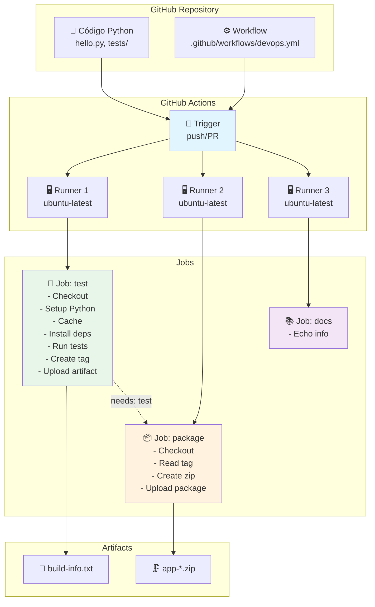
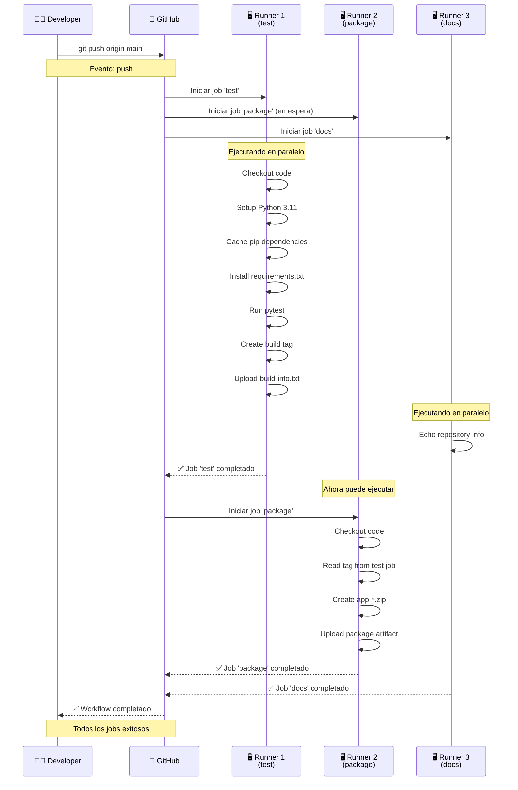

# Laboratorio: GitHub Actions - CI/CD con Python

**Duración estimada:** 90–120 min  
**Nivel:** Intermedio  
**Contexto:** En este laboratorio aprenderás a implementar CI/CD con GitHub Actions, desde los conceptos fundamentales hasta un pipeline completo que ejecuta tests, empaqueta la aplicación y genera artefactos automáticamente.

---

## Objetivos de aprendizaje

- Entender la arquitectura y componentes de GitHub Actions (Workflows, Jobs, Steps, Actions, Runners)
- Crear workflows de CI/CD para aplicaciones Python
- Implementar jobs paralelos y secuenciales
- Gestionar artefactos y outputs entre jobs
- Configurar cache para optimizar tiempos de ejecución
- Aplicar buenas prácticas de seguridad y organización

---

## Requisitos

- Cuenta de GitHub con repositorio
- Conocimientos básicos de Git y GitHub
- Familiaridad con Python y pytest
- Editor de texto o IDE configurado

---

## Estructura del proyecto

```
github_actions_demo/
├── .github/
│   └── workflows/
│       └── devops.yml          # Workflow principal de CI/CD
├── hello.py                    # Aplicación Python simple
├── tests/
│   └── test_hello.py          # Tests unitarios
├── requirements.txt            # Dependencias Python
└── README.md                   # Documentación del proyecto
```

---

## Código fuente del proyecto

### `hello.py`

```python
def greet(name: str) -> str:
    return f"Hello, {name}!"


def add(a: int, b: int) -> int:
    return a + b


def is_even(n: int) -> bool:
    return n % 2 == 0


if __name__ == "__main__":
    print(greet("GitHub Actions"))
    print(f"2 + 3 = {add(2, 3)}")
    print(f"4 is even: {is_even(4)}")
```

### `tests/test_hello.py`

```python
from hello import greet, add, is_even


def test_greet():
    assert greet("World") == "Hello, World!"
    assert greet("GitHub Actions") == "Hello, GitHub Actions!"


def test_add():
    assert add(2, 3) == 5
    assert add(-1, 1) == 0
    assert add(0, 0) == 0


def test_is_even():
    assert is_even(4) is True
    assert is_even(3) is False
    assert is_even(0) is True
```

### `requirements.txt`

```
pytest==7.4.3
pytest-cov==4.1.0
```

---

## Parte 1: Conceptos Fundamentales de GitHub Actions

### 1.1 ¿Qué es GitHub Actions?

**GitHub Actions** es una plataforma de CI/CD (Integración Continua/Despliegue Continuo) integrada en GitHub que permite automatizar tareas de desarrollo, testing, building y deployment directamente desde tu repositorio.

**Ventajas principales:**
- ✅ **Integración nativa**: No requiere servicios externos
- ✅ **Marketplace**: Miles de acciones pre-construidas
- ✅ **Gratuito**: 2000 minutos/mes para repositorios públicos
- ✅ **Multi-plataforma**: Windows, macOS, Linux
- ✅ **Matrices**: Ejecutar en múltiples versiones simultáneamente

### 1.2 Componentes de GitHub Actions

#### **Workflow (Flujo de trabajo)**
Un **workflow** es un proceso automatizado definido en un archivo YAML que se ejecuta cuando se dispara por eventos específicos (push, pull request, etc.).

```yaml
# Ejemplo básico de workflow
name: Mi Workflow
on: [push, pull_request]
jobs:
  test:
    runs-on: ubuntu-latest
    steps:
      - uses: actions/checkout@v4
```

#### **Job (Trabajo)**
Un **job** es un conjunto de pasos que se ejecutan en el mismo runner. Los jobs pueden ejecutarse en paralelo o secuencialmente.

```yaml
jobs:
  test:        # Job 1: Ejecuta tests
    runs-on: ubuntu-latest
    steps: [...]
  
  build:       # Job 2: Construye la aplicación
    needs: test  # Espera a que termine 'test'
    runs-on: ubuntu-latest
    steps: [...]
```

#### **Step (Paso)**
Un **step** es una tarea individual dentro de un job. Puede ser una acción (action) o un comando de shell.

```yaml
steps:
  - name: Checkout code
    uses: actions/checkout@v4    # Action pre-construida
  
  - name: Run tests
    run: pytest                 # Comando de shell
```

#### **Action (Acción)**
Una **action** es una unidad reutilizable de código que realiza una tarea específica. Pueden ser oficiales de GitHub o de la comunidad.

```yaml
- uses: actions/checkout@v4      # Action oficial
- uses: actions/setup-python@v5  # Action oficial
- uses: user/custom-action@v1    # Action de la comunidad
```

#### **Runner (Ejecutor)**
Un **runner** es un servidor que ejecuta los workflows. Pueden ser:
- **GitHub-hosted**: Servidores gestionados por GitHub (ubuntu-latest, windows-latest, macos-latest)
- **Self-hosted**: Servidores propios que registras en GitHub

---

## Parte 2: Análisis del Workflow

### 2.1 Estructura del archivo `devops.yml`

```yaml
name: CI básico Python + Bash
run-name: "CI disparado por ${{ github.actor }}"

on:
  push:
    branches: [ main ]
  pull_request:
    types:
      - opened
      - synchronize

jobs:       # ← todos los jobs van anidados aquí
  test:
    ...
  package:
    ...
  docs:
    ...
```

> ⚠️ **Error común:** Los jobs deben estar anidados bajo la clave `jobs:`. Si escribes `test:` al mismo nivel que `on:`, el workflow es inválido y GitHub lo rechazará.

**Explicación:**
- `name`: Nombre descriptivo del workflow
- `run-name`: Nombre dinámico para cada ejecución (incluye el usuario que lo disparó)
- `on`: Eventos que disparan el workflow
  - `push` en rama `main`: Se ejecuta al hacer push a main
  - `pull_request` con `types: [opened, synchronize]`: Se ejecuta al abrir el PR y en cada push posterior — omitir `types` dispara en todos los eventos de PR (opened, closed, reopened, etc.)

### 2.2 Job 1: Test (Validación)

Un job tiene esta anatomía — `runs-on`, `outputs` y `steps` son hermanos al mismo nivel:

```yaml
test:
  runs-on: ubuntu-latest        # ← nivel 1: dónde corre

  outputs:                      # ← nivel 1: qué expone al exterior
    build_tag: ${{ steps.meta.outputs.tag }}

  steps:                        # ← nivel 1: qué hace (lista de pasos)
    - name: ...
    - name: ...
```

> ⚠️ `outputs:` y `steps:` son hermanos — `steps:` **nunca** va dentro de `outputs:`.

Job completo:

```yaml
test:
  runs-on: ubuntu-latest

  outputs:
    build_tag: ${{ steps.meta.outputs.tag }}

  steps:
    # STEP 1: Checkout
    - name: Checkout
      uses: actions/checkout@v4

    # STEP 2: Setup Python
    - name: Setup Python
      uses: actions/setup-python@v5
      with:
        python-version: "3.11"

    # STEP 3: Cache
    - name: Cache pip
      uses: actions/cache@v4
      with:
        path: ~/.cache/pip
        key: pip-${{ runner.os }}-${{ hashFiles('requirements.txt') }}
        restore-keys: pip-${{ runner.os }}-

    # STEP 4: Install dependencies
    - name: Install deps
      run: |
        python -m pip install --upgrade pip
        pip install -r requirements.txt

    # STEP 5: Run tests
    - name: Run tests
      run: |
        export PYTHONPATH="${PYTHONPATH}:$(pwd)"
        pytest -q

    # STEP 6: Create build tag  ← el step que alimenta outputs.build_tag
    - name: Compute build tag
      id: meta
      run: |
        TS=$(date +%Y%m%d-%H%M%S)
        echo "tag=${TS}-${GITHUB_SHA::7}" >> "$GITHUB_OUTPUT"

    # STEP 7: Save artifact
    - name: Save artifact (sample log)
      run: |
        echo "Build tag: ${{ steps.meta.outputs.tag }}" > build-info.txt
    - name: Upload build info artifact
      uses: actions/upload-artifact@v4
      with:
        name: build-info
        path: build-info.txt
```

**Conceptos clave:**

#### **Checkout Action**
```yaml
- uses: actions/checkout@v4
```
- Descarga el código del repositorio al runner
- Es el primer paso en casi todos los workflows
- Versión `@v4` es la más reciente y estable

#### **Setup Python Action**
```yaml
- uses: actions/setup-python@v5
  with:
    python-version: "3.11"
```
- Instala una versión específica de Python
- Configura automáticamente el PATH
- Soporta múltiples versiones simultáneas

#### **Cache Action**
```yaml
- uses: actions/cache@v4
  with:
    path: ~/.cache/pip
    key: pip-${{ runner.os }}-${{ hashFiles('requirements.txt') }}
    restore-keys: pip-${{ runner.os }}-
```
- **¿Por qué usar cache?** Acelera builds subsecuentes guardando dependencias
- **`path`**: Directorio a cachear
- **`key`**: Clave única basada en OS y hash del archivo requirements.txt
- **`restore-keys`**: Claves de respaldo si no encuentra el cache exacto

#### **Variables de entorno y outputs**
```yaml
- name: Compute build tag
  id: meta                    # ID del step para referenciarlo
  run: |
    TS=$(date +%Y%m%d-%H%M%S)
    echo "tag=${TS}-${GITHUB_SHA::7}" >> "$GITHUB_OUTPUT"
```
- **`id`**: Permite referenciar el step desde otros steps
- **`$GITHUB_OUTPUT`**: Archivo especial para outputs del step
- **`$GITHUB_SHA`**: Hash del commit actual (variable predefinida)

#### **Upload Artifact Action**
```yaml
- uses: actions/upload-artifact@v4
  with:
    name: build-info
    path: build-info.txt
```
- Guarda archivos para usar en otros jobs o descargar
- Los artefactos persisten por 90 días
- Se pueden descargar desde la interfaz de GitHub

### 2.3 Job 2: Package (Empaquetado)

```yaml
package:
  needs: test              # Dependencia: espera a que termine 'test'
  runs-on: ubuntu-latest
  steps:
    - name: Checkout
      uses: actions/checkout@v4

    - name: Read tag from previous job
      run: echo "TAG = ${{ needs.test.outputs.build_tag }}"
      env:
        TAG: ${{ needs.test.outputs.build_tag }}

    - name: Create zip
      run: |
        mkdir -p dist
        cp hello.py dist/
        zip -r "app-${{ needs.test.outputs.build_tag }}.zip" dist
        mv "app-${{ needs.test.outputs.build_tag }}.zip" dist/

    - name: Upload package
      uses: actions/upload-artifact@v4
      with:
        name: app-zip
        path: dist/*.zip
```

**Conceptos clave:**

#### **Dependencias entre jobs**
```yaml
package:
  needs: test
```
- **`needs`**: Define dependencias entre jobs
- El job `package` solo se ejecuta si `test` termina exitosamente
- Permite crear pipelines secuenciales

#### **Acceso a outputs de otros jobs**
```yaml
${{ needs.test.outputs.build_tag }}
```
- **`needs.<job>.outputs.<name>`**: Accede a outputs de jobs anteriores
- Requiere que el job anterior defina outputs (ver sección 3.1)

> ⚠️ **Error común:** Si el job `test` no declara el bloque `outputs:`, el valor de `needs.test.outputs.build_tag` siempre será vacío — sin error visible, simplemente el ZIP se llama `app-.zip`. Ver sección 3.1 para la declaración correcta.

### 2.4 Job 3: Docs (Documentación)

```yaml
docs:
  runs-on: ubuntu-latest
  needs: [test, package]
  steps:
    - name: Echo info (Bash)
      run: |
        echo "Repo: $GITHUB_REPOSITORY"
        echo "Evento: $GITHUB_EVENT_NAME"
        echo "Runner: $RUNNER_OS"
```

**Variables predefinidas de GitHub:**
- **`$GITHUB_REPOSITORY`**: Nombre del repositorio (usuario/repo)
- **`$GITHUB_EVENT_NAME`**: Tipo de evento (push, pull_request, etc.)
- **`$RUNNER_OS`**: Sistema operativo del runner (Linux, Windows, macOS)

---

## Parte 3: Configuración Avanzada

### 3.1 Outputs de Jobs

Para que un job pueda pasar datos a otros jobs hay **dos requisitos que deben cumplirse juntos**:

1. El step escribe el valor en `$GITHUB_OUTPUT` usando `id:`
2. El job declara `outputs:` que apunta a ese step

Si falta cualquiera de los dos, el valor llega vacío al job siguiente sin ningún error visible.

**Cómo se conectan:**

```
step (id: meta)                    job (outputs:)             job siguiente
────────────────                   ──────────────             ─────────────
echo "tag=abc" >>                  outputs:                   ${{ needs.test
  $GITHUB_OUTPUT        ────►        build_tag:      ────►         .outputs
                                       ${{ steps              .build_tag }}
                                         .meta
                                         .outputs.tag }}
```

**Código completo:**

```yaml
jobs:
  test:
    runs-on: ubuntu-latest

    outputs:                              # paso 2: el job expone el valor
      build_tag: ${{ steps.meta.outputs.tag }}

    steps:                                # outputs y steps son HERMANOS
      - name: Compute build tag
        id: meta                          # paso 1: el step tiene id
        run: |
          TS=$(date +%Y%m%d-%H%M%S)
          echo "tag=${TS}-${GITHUB_SHA::7}" >> "$GITHUB_OUTPUT"
```

> ⚠️ `steps:` no va dentro de `outputs:`. El bloque `outputs:` solo contiene pares `nombre: ${{ steps.<id>.outputs.<key> }}` — nada más.

### 3.2 Matrices (Matrix Strategy)

Ejecutar el mismo job en múltiples configuraciones:

```yaml
jobs:
  test:
    runs-on: ubuntu-latest
    strategy:
      matrix:
        python-version: ["3.9", "3.10", "3.11"]
        os: [ubuntu-latest, windows-latest, macos-latest]
    steps:
      - uses: actions/checkout@v4
      - uses: actions/setup-python@v5
        with:
          python-version: ${{ matrix.python-version }}
      - name: Test on ${{ matrix.os }} with Python ${{ matrix.python-version }}
        run: pytest
```

### 3.3 Condiciones (if)

Ejecutar steps o jobs condicionalmente:

```yaml
jobs:
  deploy:
    needs: docs
    if: github.ref == 'refs/heads/main'  # Solo en rama main
    runs-on: ubuntu-latest
    steps:
      - name: Deploy to production
        run: echo "Deploying..."
        # if: github.event_name == 'push'   # Solo en push, no en PR
        #run: echo "Deploying..."
```

### 3.4 Secrets y Variables de Entorno

#### **Secrets (Datos sensibles)**
```yaml
steps:
  - name: Deploy
    env:
      API_KEY: ${{ secrets.API_KEY }}
      DATABASE_URL: ${{ secrets.DATABASE_URL }}
    run: |
      echo "Deploying with API key: ${API_KEY:0:8}..."
```

#### **Variables de repositorio (No sensibles)**
```yaml
steps:
  - name: Build
    env:
      APP_VERSION: ${{ vars.APP_VERSION }}
      ENVIRONMENT: ${{ vars.ENVIRONMENT }}
    run: |
      echo "Building version $APP_VERSION for $ENVIRONMENT"
```

---

## Parte 4: Flujo de Ejecución

### 4.1 Diagrama de Arquitectura



### 4.2 Secuencia de Ejecución



---

## Parte 5: Pruebas y Validación

### 5.1 Ejecutar el Workflow

1. **Hacer un commit y push:**
```bash
git add .
git commit -m "feat: add GitHub Actions workflow"
git push origin main
```

2. **Verificar en GitHub:**
   - Ve a tu repositorio en GitHub
   - Haz clic en la pestaña "Actions"
   - Verás el workflow ejecutándose

### 5.2 Orden de ejecución esperado

```
1. test (inmediato)                    ✅
2. docs (inmediato, paralelo con test) ✅
3. package (espera a test)             ✅
```

### 5.3 Interpretar los Resultados

#### **Estado de los Jobs:**
- ✅ **Verde**: Job exitoso
- ❌ **Rojo**: Job falló
- 🟡 **Amarillo**: Job en progreso
- ⚪ **Gris**: Job cancelado o en espera

#### **Logs detallados:**
```
✓ Checkout code (2s)
✓ Setup Python (15s)
✓ Cache pip (1s)
✓ Install deps (45s)
✓ Run tests (3s)
✓ Compute build tag (1s)
✓ Save artifact (1s)
✓ Upload build info artifact (2s)
```

### 5.4 Descargar Artefactos

1. Ve a la ejecución del workflow
2. Haz clic en "Artifacts" al final de la página
3. Descarga `build-info` o `app-zip`

---

## Parte 6: Mejoras y Optimizaciones

### 6.1 Workflow con Matriz de Testing

```yaml
name: CI/CD Pipeline Avanzado
run-name: "Pipeline ejecutado por ${{ github.actor }} en ${{ github.ref_name }}"

on:
  push:
    branches: [ main, develop ]
  pull_request:
    branches: [ main ]
  workflow_dispatch:  # Permite ejecución manual

env:
  PYTHON_VERSION: "3.11"

jobs:
  test:
    runs-on: ubuntu-latest
    strategy:
      matrix:
        python-version: ["3.9", "3.10", "3.11"]
    outputs:
      build_tag: ${{ steps.meta.outputs.tag }}
    
    steps:
      - name: Checkout
        uses: actions/checkout@v4
      
      - name: Setup Python ${{ matrix.python-version }}
        uses: actions/setup-python@v5
        with:
          python-version: ${{ matrix.python-version }}
      
      - name: Cache pip
        uses: actions/cache@v4
        with:
          path: ~/.cache/pip
          key: pip-${{ runner.os }}-${{ matrix.python-version }}-${{ hashFiles('requirements.txt') }}
          restore-keys: |
            pip-${{ runner.os }}-${{ matrix.python-version }}-
            pip-${{ runner.os }}-
      
      - name: Install dependencies
        run: |
          python -m pip install --upgrade pip
          pip install -r requirements.txt
          pip install pytest-cov
      
      - name: Run tests with coverage
        run: |
          export PYTHONPATH="${PYTHONPATH}:$(pwd)"
          pytest --cov=hello --cov-report=xml --cov-report=html
      
      - name: Upload coverage reports
        uses: actions/upload-artifact@v4
        with:
          name: coverage-report-py${{ matrix.python-version }}
          path: htmlcov/
      
      - name: Compute build tag
        id: meta
        run: |
          TS=$(date +%Y%m%d-%H%M%S)
          echo "tag=${TS}-${GITHUB_SHA::7}" >> "$GITHUB_OUTPUT"

  lint:
    runs-on: ubuntu-latest
    steps:
      - name: Checkout
        uses: actions/checkout@v4
      
      - name: Setup Python
        uses: actions/setup-python@v5
        with:
          python-version: ${{ env.PYTHON_VERSION }}
      
      - name: Install linting tools
        run: pip install flake8 black isort
      
      - name: Run flake8
        run: flake8 hello.py tests/
      
      - name: Run black check
        run: black --check hello.py tests/
      
      - name: Run isort check
        run: isort --check-only hello.py tests/

  package:
    needs: [test, lint]
    runs-on: ubuntu-latest
    if: github.ref == 'refs/heads/main'
    steps:
      - name: Checkout
        uses: actions/checkout@v4
      
      - name: Create package
        run: |
          mkdir -p dist
          cp hello.py dist/
          cp requirements.txt dist/
          zip -r "dist/app-${{ needs.test.outputs.build_tag }}.zip" dist/
      
      - name: Upload package
        uses: actions/upload-artifact@v4
        with:
          name: app-package
          path: dist/*.zip
          retention-days: 30
```

### 6.2 Mejoras Implementadas

#### **Matriz de Testing**
- Prueba en múltiples versiones de Python
- Identifica problemas de compatibilidad

#### **Job de Linting**
- Verifica calidad de código con flake8, black e isort
- Ejecuta en paralelo con tests

#### **Condiciones Avanzadas**
- `if: github.ref == 'refs/heads/main'`: Solo en rama main
- `workflow_dispatch`: Permite ejecución manual desde la UI

---

## Parte 7: Buenas Prácticas

### 7.1 Seguridad

#### **Secrets Management**
```yaml
steps:
  - name: Deploy
    env:
      API_KEY: ${{ secrets.API_KEY }}
      DATABASE_URL: ${{ secrets.DATABASE_URL }}
    run: |
      # Nunca imprimas secrets en logs
      echo "Deploying with API key: ${API_KEY:0:8}..."
```

#### **Principio de Menor Privilegio**
```yaml
permissions:
  contents: read      # Solo lectura del repositorio
  packages: write     # Solo para subir paquetes
```

### 7.2 Performance

#### **Cache Estratégico**
```yaml
- name: Cache pip
  uses: actions/cache@v4
  with:
    path: ~/.cache/pip
    key: pip-${{ runner.os }}-${{ hashFiles('requirements.txt') }}
    restore-keys: |
      pip-${{ runner.os }}-
      pip-
```

#### **Jobs Paralelos**
```yaml
jobs:
  test:
    runs-on: ubuntu-latest
  lint:
    runs-on: ubuntu-latest
  security:
    runs-on: ubuntu-latest
  # Los 3 se ejecutan en paralelo
```

### 7.3 Mantenibilidad

#### **Reutilización de Workflows**
```yaml
# .github/workflows/test.yml
name: Test
on:
  workflow_call:
    inputs:
      python-version:
        required: true
        type: string
jobs:
  test:
    runs-on: ubuntu-latest
    steps:
      - uses: actions/setup-python@v5
        with:
          python-version: ${{ inputs.python-version }}
```

```yaml
# .github/workflows/ci.yml
name: CI
on: [push]
jobs:
  test:
    uses: ./.github/workflows/test.yml
    with:
      python-version: "3.11"
```

---

## Parte 8: Troubleshooting

### 8.1 Errores de Estructura YAML

#### **Falta la clave `jobs:`**
```yaml
# ❌ Incorrecto — GitHub rechaza el workflow
on:
  push:
    branches: [ main ]

test:           # ← al mismo nivel que "on", inválido
  runs-on: ubuntu-latest
```
```yaml
# ✅ Correcto
on:
  push:
    branches: [ main ]

jobs:
  test:         # ← anidado bajo "jobs:"
    runs-on: ubuntu-latest
```

#### **Job sin `outputs:` pero referenciado por otro job**
```yaml
# ❌ Incorrecto — build_tag siempre vacío
test:
  runs-on: ubuntu-latest
  steps:
    - id: meta
      run: echo "tag=abc123" >> "$GITHUB_OUTPUT"
# No hay "outputs:" → needs.test.outputs.build_tag = ""
```
```yaml
# ✅ Correcto
test:
  runs-on: ubuntu-latest
  outputs:
    build_tag: ${{ steps.meta.outputs.tag }}   # ← expone el valor
  steps:
    - id: meta
      run: echo "tag=abc123" >> "$GITHUB_OUTPUT"
```

#### **Job de deploy sin `needs`**
```yaml
# ❌ Incorrecto — deploy corre aunque los tests fallen
deploy:
  if: github.ref == 'refs/heads/main'
  runs-on: ubuntu-latest
```
```yaml
# ✅ Correcto
deploy:
  needs: test                                  # ← espera y depende de test
  if: github.ref == 'refs/heads/main'
  runs-on: ubuntu-latest
```

#### **`pull_request` con `types: opened`**
```yaml
# ❌ Solo corre cuando se abre el PR, no cuando haces push después
pull_request:
  types:
    - opened
```
```yaml
# ✅ Corre en open, push y reopen del PR
pull_request:
  types: [opened, synchronize, reopened]

# O simplemente omite "types" para el comportamiento por defecto:
pull_request:
```

---

### 8.2 Problemas Comunes

#### **Error: ModuleNotFoundError**
```bash
ERROR: ModuleNotFoundError: No module named 'hello'
```
**Solución:**
```yaml
- name: Run tests
  run: |
    export PYTHONPATH="${PYTHONPATH}:$(pwd)"
    pytest -q
```

#### **Error: Cache Miss**
```bash
Cache not found for input keys: pip-ubuntu-latest-abc123
```
**Solución:** Verificar que el archivo `requirements.txt` existe y tiene contenido.

#### **Error: Permission Denied**
```bash
Error: Resource not accessible by integration
```
**Solución:** Verificar permisos del token o usar `permissions:` en el workflow.

### 8.2 Debugging

```yaml
- name: Debug info
  run: |
    echo "Runner OS: $RUNNER_OS"
    echo "Python version: $(python --version)"
    echo "Working directory: $(pwd)"
    echo "Files: $(ls -la)"

- name: Run tests (verbose)
  run: pytest -v --tb=short
```

---

## Parte 9: Integración con Herramientas Externas

### 9.1 Notificaciones

#### **Slack**
```yaml
- name: Notify Slack
  if: always()  # Siempre ejecutar, éxito o fallo
  uses: 8398a7/action-slack@v3
  with:
    status: ${{ job.status }}
    channel: '#devops'
    webhook_url: ${{ secrets.SLACK_WEBHOOK }}
```

#### **Email**
```yaml
- name: Send email
  if: failure()
  uses: dawidd6/action-send-mail@v3
  with:
    server_address: smtp.gmail.com
    server_port: 587
    username: ${{ secrets.EMAIL_USERNAME }}
    password: ${{ secrets.EMAIL_PASSWORD }}
    subject: "Build failed: ${{ github.repository }}"
    body: "Build failed in ${{ github.ref }}"
```

### 9.2 Deployment

#### **AWS S3**
```yaml
- name: Deploy to S3
  uses: aws-actions/configure-aws-credentials@v4
  with:
    aws-access-key-id: ${{ secrets.AWS_ACCESS_KEY_ID }}
    aws-secret-access-key: ${{ secrets.AWS_SECRET_ACCESS_KEY }}
    aws-region: us-east-1

- name: Upload to S3
  run: |
    aws s3 sync dist/ s3://${{ secrets.S3_BUCKET }}/app/
```

---

## Checklist de Éxito

- [ ] Workflow se ejecuta correctamente en push y PR
- [ ] Tests pasan correctamente
- [ ] Cache funciona y acelera builds subsecuentes
- [ ] Artefactos se generan y pueden descargarse
- [ ] Jobs se ejecutan en el orden correcto (dependencias)
- [ ] Logs son claros y útiles para debugging
- [ ] Secrets se manejan de forma segura

---

## Entregables

1. **Repositorio GitHub** con:
   - Workflow funcional (`.github/workflows/devops.yml`)
   - Código Python con tests
   - README con instrucciones

2. **Capturas de pantalla:**
   - Ejecución exitosa del workflow
   - Logs de cada job
   - Artefactos generados

3. **Evidencias de funcionamiento:**
   - Historial de ejecuciones en GitHub Actions
   - Artefactos descargables
   - Tests pasando en múltiples configuraciones

---

## Recursos Adicionales

- [Documentación oficial de GitHub Actions](https://docs.github.com/en/actions)
- [Marketplace de Actions](https://github.com/marketplace?type=actions)
- [GitHub Actions Examples](https://github.com/actions/starter-workflows)
- [GitHub Actions Secrets](https://docs.github.com/en/actions/security-guides/encrypted-secrets)
- [Best Practices for GitHub Actions](https://docs.github.com/en/actions/learn-github-actions/best-practices-for-github-actions)

---

📘 **Autor:**  
Wilson Julca Mejía  
Curso: *DevOps y GitHub Actions – CI/CD con Python*  
Universidad de Ingeniería y Tecnología (UTEC)
