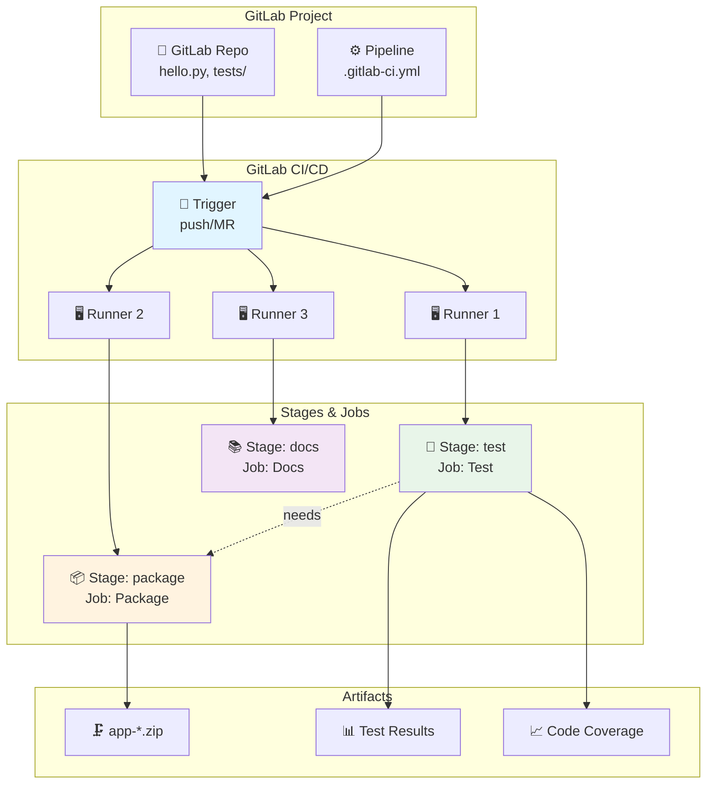

# Laboratorio 10: GitLab CI/CD con Python

**Duración estimada:** 90–120 min  
**Nivel:** Intermedio  
**Contexto:** En este laboratorio aprenderás a implementar CI/CD con GitLab CI/CD, desde conceptos básicos hasta pipelines con stages, jobs, artefactos y buenas prácticas.

---

## Objetivos de aprendizaje

- Entender la arquitectura y componentes de GitLab CI/CD (Pipelines, Stages, Jobs, Artifacts, Variables)
- Crear pipelines de CI/CD para aplicaciones Python
- Implementar stages y jobs paralelos y secuenciales
- Gestionar artefactos y outputs entre stages
- Configurar cache para optimizar tiempos de ejecución
- Aplicar buenas prácticas de seguridad y organización

---

## Requisitos

- Cuenta en GitLab ([https://gitlab.com/](https://gitlab.com/))
- Proyecto en GitLab
- Conocimientos básicos de Git y control de versiones
- Familiaridad con Python y pytest
- Editor de texto o IDE configurado

---

## Estructura del proyecto

```
gitlab_ci_demo/
├── .gitlab-ci.yml             # Pipeline principal de CI/CD
├── hello.py                   # Aplicación Python simple
├── tests/
│   └── test_hello.py         # Tests unitarios
├── requirements.txt           # Dependencias Python
├── README.md                  # Documentación del proyecto
└── laboratorio_gitlab_ci.md   # Esta guía
```

---

## Parte 1: Conceptos Fundamentales de GitLab CI/CD

### 1.1 ¿Qué es GitLab CI/CD?

**GitLab CI/CD** es un sistema de integración y entrega continua integrado en GitLab, que permite automatizar la construcción, prueba y despliegue de código mediante pipelines definidos como código.

**Ventajas principales:**
- ✅ Integración nativa: Repositorios, issues y CI/CD en una sola plataforma
- ✅ Multi-plataforma: Soporte para runners en Linux, Windows, macOS
- ✅ Gratuito: Minutos gratuitos en proyectos públicos y privados
- ✅ Extensible: Marketplace de templates y scripts
- ✅ Soporte YAML: Pipelines como código

### 1.2 Componentes de GitLab CI/CD

- **Pipeline:** Proceso completo de CI/CD definido en `.gitlab-ci.yml`
- **Stage:** Agrupación lógica de jobs, ejecutados secuencialmente
- **Job:** Colección de comandos que se ejecutan en un runner (en paralelo dentro del stage)
- **Runner:** Máquina que ejecuta los jobs (shared o specific)
- **Artifact:** Archivos generados por un job y usados por otros jobs o descargados
- **Cache:** Almacena archivos entre jobs para acelerar builds (ej. dependencias pip)
- **Variable:** Valores usados en el pipeline, definidos en el archivo o en la configuración del proyecto

---

## Parte 2: Crear tu primer Pipeline

### 2.1 Crear proyecto en GitLab

1. Ve a [https://gitlab.com/](https://gitlab.com/)
2. Haz clic en **New project**
3. Selecciona **Create blank project**
4. Nombra el proyecto: **gitlab-ci-demo**
5. Elige visibilidad: **Private** o **Public**

### 2.2 Subir archivos del proyecto

1. Sube los archivos: `hello.py`, `tests/test_hello.py`, `requirements.txt`, `README.md`, `.gitlab-ci.yml`
2. Puedes usar la interfaz web o hacer push desde tu máquina local

### 2.3 Ejemplo de archivos principales

#### hello.py

```python
"""
Aplicación Python simple para demostración de CI/CD
"""

def greet(name: str = "World") -> str:
    """Retorna un saludo personalizado"""
    return f"Hello, {name}!"

def add(a: int, b: int) -> int:
    """Suma dos números"""
    return a + b

def main():
    """Función principal"""
    print(greet())
    print(f"2 + 3 = {add(2, 3)}")

if __name__ == "__main__":
    main()
```

#### tests/test_hello.py

```python
"""
Tests unitarios para hello.py
"""
import pytest
from hello import greet, add

def test_greet_default():
    assert greet() == "Hello, World!"

def test_greet_custom():
    assert greet("DevOps") == "Hello, DevOps!"

def test_add():
    assert add(2, 3) == 5
    assert add(-1, 1) == 0
    assert add(0, 0) == 0
```

#### requirements.txt

```
pytest==7.4.3
pytest-cov==4.1.0
```

---

## Parte 3: Pipeline Básico

### 3.1 Crear el archivo `.gitlab-ci.yml`

```yaml
stages:
  - test
  - package
  - docs

default:
  image: python:3.11

variables:
  PIP_CACHE_DIR: "$CI_PROJECT_DIR/.cache/pip"
  PYTHON_VERSION: "3.11"

cache:
  key: "$CI_JOB_NAME"
  paths:
    - .cache/pip

before_script:
  - python --version
  - pip --version
  - pip install --upgrade pip
  - pip install -r requirements.txt

test:
  stage: test
  script:
    - export PYTHONPATH="$CI_PROJECT_DIR"
    - pytest tests/ -v --junitxml=test-results.xml --cov=. --cov-report=xml --cov-report=html
  artifacts:
    reports:
      junit: test-results.xml
    paths:
      - htmlcov/
      - coverage.xml
    expire_in: 1 week

package:
  stage: package
  needs: ["test"]
  script:
    - apt-get update && apt-get install -y zip
    - mkdir -p dist
    - cp hello.py dist/
    - cp requirements.txt dist/
    - cd dist && zip -r ../app-"$CI_COMMIT_SHORT_SHA".zip .
  artifacts:
    paths:
      - app-*.zip
    expire_in: 1 week

docs:
  stage: docs
  script:
    - |
      echo "Repository: $CI_PROJECT_PATH"
      echo "Branch: $CI_COMMIT_REF_NAME"
      echo "Commit: $CI_COMMIT_SHA"
      echo "Pipeline ID: $CI_PIPELINE_ID"
      echo "Runner: $CI_RUNNER_DESCRIPTION"
```

---

## Parte 4: Crear el Pipeline en GitLab

1. Sube el archivo `.gitlab-ci.yml` a la raíz del repositorio
2. Ve a **CI/CD → Pipelines** en GitLab
3. El pipeline se ejecutará automáticamente en cada push
4. Puedes ver los logs, artefactos y reportes desde la interfaz web

---

## Parte 5: Diagrama de Arquitectura



---

## Parte 6: Variables Predefinidas de GitLab CI/CD

| Variable | Descripción | Ejemplo |
|----------|-------------|---------|
| `$CI_PIPELINE_ID` | ID único del pipeline | `12345` |
| `$CI_COMMIT_SHA` | SHA del commit | `abc123...` |
| `$CI_COMMIT_REF_NAME` | Nombre de la rama | `main` |
| `$CI_PROJECT_PATH` | Namespace y nombre del repo | `usuario/gitlab-ci-demo` |
| `$CI_PROJECT_DIR` | Directorio de trabajo | `/builds/usuario/gitlab-ci-demo` |
| `$CI_JOB_NAME` | Nombre del job | `Test` |
| `$CI_RUNNER_DESCRIPTION` | Descripción del runner | `shared-runners-manager-1` |

---

## Parte 7: Pipeline Avanzado

### 7.1 Pipeline con Matrices (parallel)

```yaml
stages:
  - test

Test:
  stage: test
  parallel:
    matrix:
      - PYTHON_VERSION: "3.9"
      - PYTHON_VERSION: "3.10"
      - PYTHON_VERSION: "3.11"
  image: python:$PYTHON_VERSION
  script:
    - pip install -r requirements.txt
    - pytest tests/
```

### 7.2 Condiciones Avanzadas

```yaml
Deploy:
  stage: deploy
  script: echo "Deploying to production"
  only:
    - main
```

### 7.3 Múltiples Runners

```yaml
Test:
  stage: test
  tags:
    - linux
  script: pytest tests/

Build:
  stage: build
  tags:
    - windows
  script: echo "Build on Windows"
```

---

## Parte 8: Comparación GitHub Actions vs GitLab CI/CD

| Característica | GitHub Actions | GitLab CI/CD |
|----------------|----------------|--------------|
| **Workflow/Pipeline** | `name:` | `stages:` |
| **Job** | `jobs:` | `job:` |
| **Stage** | No nativo | `stages:` |
| **Step** | `steps:` | `script:` |
| **Runner** | `runs-on:` | `tags:`/runners |
| **Checkout** | `actions/checkout@v4` | `git clone` automático |
| **Cache** | `actions/cache@v4` | `cache:` |
| **Artifact** | `upload-artifact@v4` | `artifacts:` |
| **Variables** | `${{ github.sha }}` | `$CI_COMMIT_SHA` |
| **Outputs** | `$GITHUB_OUTPUT` | `artifacts`/`needs` |
| **Condiciones** | `if:` | `only:`/`except:` |

---

## Parte 9: Buenas Prácticas

### 9.1 Seguridad

Variables protegidas (Secrets):

1. Ve a **Settings → CI/CD → Variables** en tu proyecto
2. Agrega variables marcadas como **protected** o **masked**
3. Usa en el pipeline como `$SECRET_KEY`

```yaml
script:
  - echo "La clave secreta es $SECRET_KEY"
```

### 9.2 Performance

Cache estratégico:

```yaml
cache:
  key: "$CI_JOB_NAME"
  paths:
    - .cache/pip
```

Stages paralelos:

```yaml
stages:
  - test
  - lint
  - package

test:
  stage: test
  script: pytest tests/

lint:
  stage: lint
  script: flake8 hello.py

package:
  stage: package
  needs: [test, lint]
  script: zip -r app.zip hello.py
```

### 9.3 Mantenibilidad

Templates reutilizables (YAML anchors):

```yaml
.default-test: &default-test
  script:
    - pip install -r requirements.txt
    - pytest tests/

test-py39:
  stage: test
  image: python:3.9
  <<: *default-test

test-py310:
  stage: test
  image: python:3.10
  <<: *default-test
```

---

## Parte 10: Troubleshooting

### 10.1 Problemas Comunes

**Error: No runners**
```
This job is stuck because the project doesn't have any runners online assigned to it.
```
Solución:
- Habilita shared runners en Settings → CI/CD → Runners
- O registra un runner propio

**Error: YAML syntax error**
```
Found errors in your .gitlab-ci.yml:
```
Solución:
- Valida tu YAML con [YAML Validator](https://www.yamllint.com/)
- Verifica indentación (2 espacios)

**Error: Permission denied**
```
Permission denied (publickey)
```
Solución:
- Verifica tus claves SSH y permisos del repo

### 10.2 Debugging

Agrega prints y variables de entorno en los scripts:

```yaml
script:
  - echo "Pipeline: $CI_PIPELINE_ID"
  - echo "Branch: $CI_COMMIT_REF_NAME"
  - env
```

---

## Checklist de Éxito

- [ ] Pipeline se ejecuta correctamente en push y MR
- [ ] Tests pasan y se publican resultados
- [ ] Code coverage se publica correctamente
- [ ] Cache funciona y acelera builds subsecuentes
- [ ] Artifacts se generan y pueden descargarse
- [ ] Stages se ejecutan en el orden correcto
- [ ] Variables y artefactos funcionan entre jobs
- [ ] Logs son claros y útiles para debugging

---

## Entregables

1. **Proyecto GitLab** con:
   - Pipeline funcional (`.gitlab-ci.yml`)
   - Código Python con tests
   - README con instrucciones

2. **Capturas de pantalla:**
   - Ejecución exitosa del pipeline
   - Logs de cada stage/job
   - Test results publicados
   - Code coverage report
   - Artifacts generados

3. **Evidencias de funcionamiento:**
   - Historial de ejecuciones del pipeline
   - Artifacts descargables
   - Tests pasando en múltiples configuraciones

---

## Recursos Adicionales

- [Documentación oficial de GitLab CI/CD](https://docs.gitlab.com/ee/ci/)
- [YAML CI/CD Reference](https://docs.gitlab.com/ee/ci/yaml/)
- [GitLab CI/CD Templates](https://gitlab.com/gitlab-org/gitlab/-/tree/master/lib/gitlab/ci/templates)
- [Best Practices for GitLab CI/CD](https://docs.gitlab.com/ee/ci/best_practices.html)

---

📘 **Autor:**  
Wilson Julca Mejía  
Curso: *DevOps y GitLab CI/CD con Python*  
Universidad de Ingeniería y Tecnología (UTEC)
