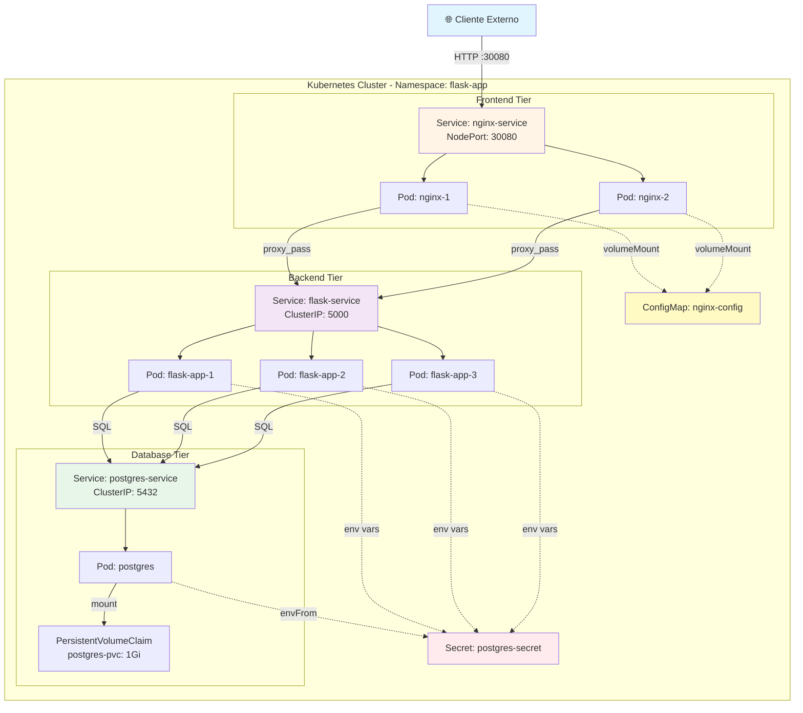

# Laboratorio 8.1: Kubernetes con Flask, PostgreSQL y Nginx

**Duración estimada:** 90–120 min  
**Nivel:** Intermedio-Avanzado  
**Contexto:** En este laboratorio aprenderás a desplegar una aplicación completa en Kubernetes, empezando con Flask simple, agregando PostgreSQL y finalmente configurando Nginx como reverse proxy.

---

## Objetivos de aprendizaje

- Crear y desplegar una aplicación Flask en Kubernetes usando Deployments y Services.
- Integrar PostgreSQL como base de datos con volúmenes persistentes.
- Configurar Nginx como reverse proxy usando ConfigMaps.
- Usar Secrets para gestionar credenciales de forma segura.
- Entender la comunicación entre servicios en Kubernetes.
- Aplicar buenas prácticas de networking y seguridad en Kubernetes.

---

## Requisitos

- Kubernetes funcionando (Minikube, Docker Desktop, o clúster remoto).
- `kubectl` configurado y conectado al clúster.
- Conocimientos básicos de Pods, Deployments y Services.
- Haber completado las guías previas de Kubernetes.

---

## Estructura del proyecto

```
flask-k8s-app/
├── app/
│   ├── app.py
│   └── requirements.txt
├── k8s/
│   ├── 01-namespace.yaml
│   ├── 02-flask-deployment.yaml
│   ├── 03-flask-service.yaml
│   ├── 04-postgres-secret.yaml
│   ├── 05-postgres-pvc.yaml
│   ├── 06-postgres-deployment.yaml
│   ├── 07-postgres-service.yaml
│   ├── 08-flask-deployment-db.yaml
│   ├── 09-nginx-configmap.yaml
│   ├── 10-nginx-deployment.yaml
│   └── 11-nginx-service.yaml
└── README.md
└── capturas/
```

---

## Parte 1: Flask Simple (sin base de datos)

### 1.1 Crear la aplicación Flask

Crea la carpeta del proyecto:

```bash
mkdir -p flask-k8s-app/app
cd flask-k8s-app
```

**Archivo:** `app/requirements.txt`

```txt
Flask==2.3.3
gunicorn==21.2.0
psycopg2-binary==2.9.9
```

**Archivo:** `app/app.py`

```python
from flask import Flask, jsonify
import os
import socket

app = Flask(__name__)

@app.route('/')
def home():
    return jsonify({
        "message": "Flask en Kubernetes",
        "version": "1.0.0",
        "hostname": socket.gethostname()
    })

@app.route('/health')
def health():
    return jsonify({"status": "healthy"}), 200

@app.route('/about')
def about():
    return jsonify({
        "app": "Flask K8s Demo",
        "version": "1.0.0",
        "environment": os.getenv("APP_ENV", "development")
    })

if __name__ == '__main__':
    port = int(os.getenv("PORT", "5000"))
    app.run(host='0.0.0.0', port=port)
```

### 1.2 Crear Dockerfile

**Archivo:** `app/Dockerfile`

```dockerfile
FROM python:3.11-slim

WORKDIR /app

COPY requirements.txt .
RUN pip install --no-cache-dir -r requirements.txt

COPY app.py .

EXPOSE 5000

RUN adduser --disabled-password --gecos '' appuser && \
    chown -R appuser:appuser /app
USER appuser

CMD ["gunicorn", "--bind", "0.0.0.0:5000", "--workers", "2", "app:app"]
```

### 1.3 Construir y subir la imagen

```bash
cd app
docker build -t flask-k8s-app:1.0 .

# Opcional: etiquetar y subir a Docker Hub
docker tag flask-k8s-app:1.0 TU_USUARIO/flask-k8s-app:1.0
docker push TU_USUARIO/flask-k8s-app:1.0

cd ..
```

> **Nota:** Si usas Minikube, puedes usar la imagen local con `minikube image load flask-k8s-app:1.0`

---

## Parte 2: Desplegar Flask en Kubernetes

### 2.1 Crear Namespace

Un **Namespace** es una forma de organizar y aislar recursos dentro de un clúster de Kubernetes. Permite separar aplicaciones, entornos (dev/staging/prod) o equipos, facilitando la gestión y aplicación de políticas de seguridad y cuotas de recursos.

Crea la carpeta para manifiestos:

```bash
mkdir -p k8s
```

**Archivo:** `k8s/01-namespace.yaml`

```yaml
apiVersion: v1
kind: Namespace
metadata:
  name: flask-app  # Nombre del namespace donde vivirán todos nuestros recursos
  labels:
    app: flask-demo
    environment: development  # Etiqueta para identificar el entorno
```

**¿Por qué usar Namespaces?**
- **Organización**: Agrupa recursos relacionados (Pods, Services, ConfigMaps, etc.)
- **Aislamiento lógico**: Separa aplicaciones o entornos
- **Gestión de acceso**: Permite aplicar políticas RBAC por namespace
- **Cuotas de recursos**: Limita CPU/memoria por namespace

Aplicar:

```bash
kubectl apply -f k8s/01-namespace.yaml

# Configurar el namespace como predeterminado para comandos futuros
kubectl config set-context --current --namespace=flask-app

# Verificar
kubectl get ns flask-app
```

### 2.2 Deployment de Flask

Un **Deployment** es el controlador principal en Kubernetes para gestionar aplicaciones stateless. Permite:
- Crear y mantener un número específico de réplicas (Pods) corriendo
- Actualizar la aplicación sin downtime (rolling updates)
- Revertir a versiones anteriores si algo falla
- Auto-recuperación: si un Pod falla, lo recrea automáticamente

**Archivo:** `k8s/02-flask-deployment.yaml`

```yaml
apiVersion: apps/v1
kind: Deployment
metadata:
  name: flask-app
  namespace: flask-app
  labels:
    app: flask
    tier: backend  # Etiqueta que identifica la capa de la aplicación
spec:
  replicas: 3  # Número de Pods (réplicas) que queremos ejecutar
  selector:
    matchLabels:  # Selector para identificar qué Pods gestiona este Deployment
      app: flask
      tier: backend
  template:  # Plantilla del Pod que se replicará
    metadata:
      labels:
        app: flask
        tier: backend
    spec:
      containers:
        - name: flask
          image: flask-k8s-app:1.0
          imagePullPolicy: IfNotPresent  # Usa imagen local si existe
          ports:
            - containerPort: 5000
              name: http
          env:
            - name: APP_ENV
              value: "development"
            - name: PORT
              value: "5000"
          livenessProbe:  # Verifica si el contenedor está vivo
            httpGet:
              path: /health
              port: 5000
            initialDelaySeconds: 10  # Espera 10s antes de la primera verificación
            periodSeconds: 5  # Verifica cada 5s
          readinessProbe:  # Verifica si el contenedor está listo para recibir tráfico
            httpGet:
              path: /health
              port: 5000
            initialDelaySeconds: 5
            periodSeconds: 3
          resources:  # Límites de recursos para cada contenedor
            requests:  # Recursos mínimos garantizados
              memory: "128Mi"
              cpu: "100m"
            limits:  # Recursos máximos permitidos
              memory: "256Mi"
              cpu: "200m"
```

**Conceptos clave:**
- **replicas**: Número de copias del Pod (alta disponibilidad y balanceo de carga)
- **selector**: Etiquetas que vinculan el Deployment con sus Pods
- **livenessProbe**: Si falla, Kubernetes reinicia el contenedor
- **readinessProbe**: Si falla, Kubernetes no envía tráfico a ese Pod
- **resources**: Previene que un contenedor consuma todos los recursos del nodo

Aplicar:

```bash
kubectl apply -f k8s/02-flask-deployment.yaml

# Ver el progreso (-w = watch, actualiza en tiempo real)
kubectl get pods -w

# Verificar el Deployment
kubectl get deployment flask-app
kubectl describe deployment flask-app
```

### 2.3 Service para Flask (ClusterIP)

Un **Service** es un punto de acceso estable (DNS y IP virtual) para un conjunto de Pods. Los Pods son efímeros y sus IPs cambian constantemente, pero el Service proporciona una IP y nombre DNS fijo.

**¿Por qué necesitamos un Service?**
- Los Pods tienen IPs que cambian al recrearse
- El Service balancea el tráfico entre todas las réplicas automáticamente
- Proporciona descubrimiento de servicios vía DNS interno: `flask-service.flask-app.svc.cluster.local`

**Archivo:** `k8s/03-flask-service.yaml`

```yaml
apiVersion: v1
kind: Service
metadata:
  name: flask-service
  namespace: flask-app
  labels:
    app: flask
spec:
  type: ClusterIP  # Solo accesible dentro del clúster (no expuesto al exterior)
  selector:
    app: flask  # Selector que identifica qué Pods reciben tráfico
    tier: backend
  ports:
    - name: http
      port: 5000  # Puerto del Service (donde otros servicios se conectan)
      targetPort: 5000  # Puerto del contenedor en el Pod
      protocol: TCP
```

**Tipos de Services:**
- **ClusterIP** (default): IP interna, solo accesible dentro del clúster
- **NodePort**: Expone el servicio en un puerto de cada nodo del clúster
- **LoadBalancer**: Provisiona un balanceador externo (requiere soporte del proveedor cloud)
- **ExternalName**: Mapea el Service a un DNS externo

**Cómo funciona:**
1. El Service usa el `selector` para encontrar Pods con las etiquetas `app: flask, tier: backend`
2. Crea automáticamente **Endpoints** que apuntan a las IPs de esos Pods
3. Balancea el tráfico entre todos los Pods disponibles (round-robin por defecto)
4. Si un Pod falla o se crea uno nuevo, los Endpoints se actualizan automáticamente

Aplicar:

```bash
kubectl apply -f k8s/03-flask-service.yaml
kubectl get svc

# Ver los Endpoints (IPs de los Pods a los que apunta el Service)
kubectl get endpoints flask-service

# Verificar DNS interno
kubectl run test-dns --rm -it --image=busybox --restart=Never -- nslookup flask-service
```

### 2.4 Probar Flask

```bash
# Opción 1: Port-forward
kubectl port-forward service/flask-service 8080:5000

# En otra terminal:
curl http://localhost:8080/
curl http://localhost:8080/about

# Opción 2: Crear un Pod temporal para probar desde dentro del clúster
kubectl run test-pod --rm -it --image=busybox:1.36 -- /bin/sh
# Dentro del pod:
wget -qO- http://flask-service:5000/
exit
```

**Capturas requeridas:**
- `kubectl get pods -o wide`
- `kubectl get svc`
- Respuesta de `curl http://localhost:8080/`

---

## Parte 3: Agregar PostgreSQL

### 3.1 Crear Secret para PostgreSQL

Un **Secret** es un objeto de Kubernetes que almacena datos sensibles (contraseñas, tokens, claves SSH) de forma segura. A diferencia de las variables de entorno normales, los Secrets:
- Se almacenan codificados en base64
- Se pueden cifrar en reposo (con configuración adicional)
- Se montan en los Pods como archivos o variables de entorno

**¿Por qué usar Secrets?**
- **Seguridad**: Evita poner credenciales en el código o en archivos de configuración
- **Separación**: Los Secrets se gestionan independientemente de los Deployments
- **Reutilización**: Un mismo Secret puede usarse en múltiples Pods

**Archivo:** `k8s/04-postgres-secret.yaml`

```yaml
apiVersion: v1
kind: Secret
metadata:
  name: postgres-secret
  namespace: flask-app
type: Opaque  # Tipo genérico para datos arbitrarios (texto, JSON, binario)
stringData:  # Los valores se codifican automáticamente a base64
  POSTGRES_USER: flaskuser
  POSTGRES_PASSWORD: flaskpass123
  POSTGRES_DB: flaskdb
```

**Diferencia entre `data` y `stringData`:**
- `stringData`: Acepta valores en texto plano (se codifican automáticamente)
- `data`: Requiere valores ya codificados en base64

**Buenas prácticas:**
- ⚠️ **Nunca** versiones Secrets reales en Git
- Usa herramientas como Sealed Secrets, External Secrets, o Vault para producción
- Aplica políticas RBAC para limitar quién puede leer Secrets
- Considera usar secretos externos (AWS Secrets Manager, Azure Key Vault, etc.)

Aplicar:

```bash
kubectl apply -f k8s/04-postgres-secret.yaml

# Verificar (el contenido aparecerá codificado en base64)
kubectl get secret postgres-secret -o yaml

# Ver el valor decodificado
kubectl get secret postgres-secret -o jsonpath='{.data.POSTGRES_PASSWORD}' | base64 --decode
```

### 3.2 PersistentVolumeClaim para PostgreSQL

Un **PersistentVolumeClaim (PVC)** es una solicitud de almacenamiento persistente que permite a los Pods acceder a volúmenes de almacenamiento que sobreviven a reinicios y recreaciones de Pods. Es esencial para bases de datos como PostgreSQL, donde los datos deben persistir.

**¿Por qué necesitamos un PVC?**
- Los contenedores son efímeros: si un Pod se elimina, sus datos se pierden.
- Un PVC solicita almacenamiento del clúster y lo "monta" en el Pod.
- Los datos escritos en el volumen persistente sobreviven incluso si el Pod se destruye y recrea.

**Archivo:** `k8s/05-postgres-pvc.yaml`

```yaml
apiVersion: v1
kind: PersistentVolumeClaim
metadata:
  name: postgres-pvc
  namespace: flask-app
spec:
  accessModes:
    - ReadWriteOnce  # Solo un nodo puede montar este volumen en modo lectura-escritura
  resources:
    requests:
      storage: 1Gi  # Solicita 1 GB de almacenamiento
  storageClassName: hostpath  # Tipo de almacenamiento (ajustar según tu clúster: standard, hostpath, etc.)
```

**Explicación de campos:**
- `accessModes`: Define cómo se puede acceder al volumen:
  - `ReadWriteOnce` (RWO): Un solo nodo puede montar el volumen en modo lectura-escritura
  - `ReadOnlyMany` (ROX): Múltiples nodos pueden montar en solo lectura
  - `ReadWriteMany` (RWX): Múltiples nodos pueden montar en lectura-escritura
- `resources.requests.storage`: Cantidad de almacenamiento solicitado
- `storageClassName`: Clase de almacenamiento que define el tipo de volumen (local, cloud, NFS, etc.)

> **Nota importante sobre storageClassName:** 
> - En Docker Desktop usa: `hostpath`
> - En Minikube usa: `standard`
> - En la nube (AWS/GCP/Azure): consulta la documentación de tu proveedor
> - Verifica con: `kubectl get storageclass`

Aplicar:

```bash
kubectl apply -f k8s/05-postgres-pvc.yaml
kubectl get pvc

# Verificar el estado (debe estar "Bound")
kubectl describe pvc postgres-pvc
```

### 3.3 Deployment de PostgreSQL

Este Deployment gestiona la base de datos PostgreSQL con **almacenamiento persistente** usando el PVC creado anteriormente.

**Conceptos clave de este Deployment:**
- **envFrom + secretRef**: Inyecta TODAS las variables del Secret como variables de entorno
- **volumeMounts**: Monta el volumen persistente en el directorio de datos de PostgreSQL
- **subPath**: Evita conflictos con archivos ocultos en el directorio raíz del volumen
- **Health checks con `pg_isready`**: Comando nativo de PostgreSQL para verificar disponibilidad

**Archivo:** `k8s/06-postgres-deployment.yaml`

```yaml
apiVersion: apps/v1
kind: Deployment
metadata:
  name: postgres
  namespace: flask-app
  labels:
    app: postgres
    tier: database
spec:
  replicas: 1
  selector:
    matchLabels:
      app: postgres
      tier: database
  template:
    metadata:
      labels:
        app: postgres
        tier: database
    spec:
      containers:
        - name: postgres
          image: postgres:15-alpine
          ports:
            - containerPort: 5432
              name: postgres
          envFrom:
            - secretRef:
                name: postgres-secret
          volumeMounts:
            - name: postgres-storage
              mountPath: /var/lib/postgresql/data
              subPath: postgres
          livenessProbe:
            exec:
              command:
                - pg_isready
                - -U
                - flaskuser
                - -d
                - flaskdb
            initialDelaySeconds: 30
            periodSeconds: 10
          readinessProbe:
            exec:
              command:
                - pg_isready
                - -U
                - flaskuser
                - -d
                - flaskdb
            initialDelaySeconds: 5
            periodSeconds: 5
          resources:
            requests:
              memory: "256Mi"
              cpu: "100m"
            limits:
              memory: "512Mi"
              cpu: "500m"
      volumes:
        - name: postgres-storage
          persistentVolumeClaim:
            claimName: postgres-pvc
```

**¿Por qué `replicas: 1` en PostgreSQL?**
PostgreSQL es una base de datos **stateful** (con estado). No se puede escalar horizontalmente sin configuración especial (replicación, clustering). Para alta disponibilidad en producción se usan **StatefulSets** con replicación master-slave.

**¿Qué hace `envFrom`?**
En lugar de definir cada variable individualmente con `env`, `envFrom` carga TODAS las claves del Secret como variables de entorno:
```
POSTGRES_DB=flaskdb
POSTGRES_USER=flaskuser
POSTGRES_PASSWORD=secretpassword123
```

**¿Por qué usar `subPath: postgres`?**
Sin `subPath`, el volumen se monta directamente en `/var/lib/postgresql/data`, lo que puede causar conflictos con archivos ocultos (`.lost+found`). Con `subPath`, se crea un subdirectorio `postgres/` limpio para los datos.

Aplicar:

```bash
kubectl apply -f k8s/06-postgres-deployment.yaml
kubectl get pods -l app=postgres

# Ver logs de PostgreSQL
kubectl logs -l app=postgres

# Verificar que el volumen está montado
kubectl describe pod -l app=postgres | grep -A 5 "Mounts:"
```

```bash
kubectl apply -f k8s/06-postgres-deployment.yaml
kubectl get pods -l app=postgres
```

### 3.4 Service para PostgreSQL

Este Service permite que otros Pods (como Flask) se conecten a PostgreSQL usando el nombre DNS `postgres-service` en lugar de IPs que cambian.

**Archivo:** `k8s/07-postgres-service.yaml`

```yaml
apiVersion: v1
kind: Service
metadata:
  name: postgres-service
  namespace: flask-app
  labels:
    app: postgres
spec:
  type: ClusterIP  # Solo accesible internamente (no expuesto al exterior)
  selector:
    app: postgres  # Selecciona Pods con la etiqueta app=postgres
    tier: database
  ports:
    - name: postgres
      port: 5432  # Puerto del Service
      targetPort: 5432  # Puerto del contenedor PostgreSQL
      protocol: TCP
```

**¿Por qué PostgreSQL usa ClusterIP y no NodePort?**
- **Seguridad**: La base de datos no debe ser accesible desde fuera del clúster
- **Mejor práctica**: Solo la capa de aplicación (Flask) debe acceder a la BD
- **DNS interno**: Flask puede conectarse simplemente con `postgres-service:5432`

Aplicar:

```bash
kubectl apply -f k8s/07-postgres-service.yaml
kubectl get svc postgres-service

# Verificar endpoints (debe mostrar la IP del Pod de PostgreSQL)
kubectl get endpoints postgres-service
```

### 3.5 Verificar PostgreSQL

```bash
# Conectar al Pod de PostgreSQL
kubectl exec -it deployment/postgres -- psql -U flaskuser -d flaskdb

# Dentro de psql:
\l
\q
```

---

## Parte 4: Conectar Flask con PostgreSQL

### 4.1 Actualizar app.py para usar PostgreSQL

**Archivo:** `app/app.py` (actualizado)

```python
from flask import Flask, jsonify
import os
import socket
import psycopg2
from psycopg2.extras import RealDictCursor

app = Flask(__name__)

def get_db_connection():
    """Crear conexión a PostgreSQL"""
    try:
        conn = psycopg2.connect(
            host=os.getenv('DB_HOST', 'localhost'),
            database=os.getenv('POSTGRES_DB', 'flaskdb'),
            user=os.getenv('POSTGRES_USER', 'flaskuser'),
            password=os.getenv('POSTGRES_PASSWORD', 'flaskpass123'),
            port=int(os.getenv('DB_PORT', '5432'))
        )
        return conn
    except Exception as e:
        print(f"Error conectando a la base de datos: {e}")
        return None

def init_db():
    """Inicializar la base de datos con tabla de ejemplo"""
    conn = get_db_connection()
    if conn:
        try:
            cur = conn.cursor()
            cur.execute('''
                CREATE TABLE IF NOT EXISTS visits (
                    id SERIAL PRIMARY KEY,
                    hostname VARCHAR(255),
                    timestamp TIMESTAMP DEFAULT CURRENT_TIMESTAMP
                )
            ''')
            conn.commit()
            cur.close()
            conn.close()
            print("Base de datos inicializada correctamente")
        except Exception as e:
            print(f"Error inicializando base de datos: {e}")

# Inicializar DB al arrancar
init_db()

@app.route('/')
def home():
    hostname = socket.gethostname()
    
    # Registrar visita
    conn = get_db_connection()
    if conn:
        try:
            cur = conn.cursor()
            cur.execute('INSERT INTO visits (hostname) VALUES (%s)', (hostname,))
            conn.commit()
            cur.close()
            conn.close()
        except Exception as e:
            print(f"Error registrando visita: {e}")
    
    return jsonify({
        "message": "Flask con PostgreSQL en Kubernetes",
        "version": "2.0.0",
        "hostname": hostname
    })

@app.route('/health')
def health():
    # Verificar conexión a la base de datos
    conn = get_db_connection()
    db_status = "connected" if conn else "disconnected"
    if conn:
        conn.close()
    
    return jsonify({
        "status": "healthy",
        "database": db_status
    }), 200

@app.route('/visits')
def visits():
    """Mostrar todas las visitas registradas"""
    conn = get_db_connection()
    if not conn:
        return jsonify({"error": "No se pudo conectar a la base de datos"}), 500
    
    try:
        cur = conn.cursor(cursor_factory=RealDictCursor)
        cur.execute('SELECT * FROM visits ORDER BY timestamp DESC LIMIT 50')
        visits = cur.fetchall()
        cur.close()
        conn.close()
        
        return jsonify({
            "total_visits": len(visits),
            "visits": visits
        })
    except Exception as e:
        return jsonify({"error": str(e)}), 500

@app.route('/stats')
def stats():
    """Estadísticas de visitas por hostname"""
    conn = get_db_connection()
    if not conn:
        return jsonify({"error": "No se pudo conectar a la base de datos"}), 500
    
    try:
        cur = conn.cursor(cursor_factory=RealDictCursor)
        cur.execute('''
            SELECT hostname, COUNT(*) as count 
            FROM visits 
            GROUP BY hostname 
            ORDER BY count DESC
        ''')
        stats = cur.fetchall()
        cur.close()
        conn.close()
        
        return jsonify({"stats": stats})
    except Exception as e:
        return jsonify({"error": str(e)}), 500

if __name__ == '__main__':
    port = int(os.getenv("PORT", "5000"))
    app.run(host='0.0.0.0', port=port)
```

### 4.2 Reconstruir la imagen

```bash
cd app
docker build -t flask-k8s-app:2.0 .

# Opcional: subir a Docker Hub
docker tag flask-k8s-app:2.0 TU_USUARIO/flask-k8s-app:2.0
docker push TU_USUARIO/flask-k8s-app:2.0

# Si usas Minikube:
minikube image load flask-k8s-app:2.0

cd ..
```

### 4.3 Actualizar Deployment de Flask con variables de entorno

Este Deployment actualiza la aplicación Flask para conectarse a PostgreSQL usando **variables de entorno** obtenidas de Secrets.

**Diferencias clave con el Deployment anterior:**
1. Nueva imagen: `flask-k8s-app:2.0` (con código de conexión a BD)
2. Variables de entorno para conexión a PostgreSQL
3. Uso de **secretKeyRef** para obtener credenciales del Secret de forma segura

**Archivo:** `k8s/08-flask-deployment-db.yaml`

```yaml
apiVersion: apps/v1
kind: Deployment
metadata:
  name: flask-app
  namespace: flask-app
  labels:
    app: flask
    tier: backend
spec:
  replicas: 3
  selector:
    matchLabels:
      app: flask
      tier: backend
  template:
    metadata:
      labels:
        app: flask
        tier: backend
    spec:
      containers:
        - name: flask
          image: flask-k8s-app:2.0  # Nueva versión con integración a PostgreSQL
          imagePullPolicy: IfNotPresent
          ports:
            - containerPort: 5000
              name: http
          
          # Variables de entorno para conectar a PostgreSQL
          env:
            - name: APP_ENV
              value: "production"
            - name: PORT
              value: "5000"
            
            # Host: usa el nombre DNS del Service de PostgreSQL
            - name: DB_HOST
              value: "postgres-service"  # Resuelve a la IP del Service
            - name: DB_PORT
              value: "5432"
            
            # Credenciales desde el Secret (método seguro)
            - name: POSTGRES_DB
              valueFrom:
                secretKeyRef:
                  name: postgres-secret  # Nombre del Secret
                  key: POSTGRES_DB  # Clave dentro del Secret
            
            - name: POSTGRES_USER
              valueFrom:
                secretKeyRef:
                  name: postgres-secret
                  key: POSTGRES_USER
            
            - name: POSTGRES_PASSWORD
              valueFrom:
                secretKeyRef:
                  name: postgres-secret
                  key: POSTGRES_PASSWORD
          
          livenessProbe:
            httpGet:
              path: /health
              port: 5000
            initialDelaySeconds: 15
            periodSeconds: 10
          
          readinessProbe:
            httpGet:
              path: /health
              port: 5000
            initialDelaySeconds: 10
            periodSeconds: 5
          
          resources:
            requests:
              memory: "128Mi"
              cpu: "100m"
            limits:
              memory: "256Mi"
              cpu: "200m"
```

**¿Cómo funciona `secretKeyRef`?**
Este método inyecta valores de un Secret como variables de entorno de forma segura:
```yaml
- name: POSTGRES_PASSWORD  # Nombre de la variable dentro del contenedor
  valueFrom:
    secretKeyRef:
      name: postgres-secret  # Secret de donde leer
      key: POSTGRES_PASSWORD  # Clave específica del Secret
```

**Ventajas de usar `secretKeyRef` vs valores hardcodeados:**
- ✅ Credenciales NO aparecen en el YAML (seguridad)
- ✅ Fácil rotación de credenciales (cambiar el Secret, no el Deployment)
- ✅ Mismo YAML funciona en múltiples entornos (dev, staging, prod)
- ✅ Los Secrets están encriptados en etcd (almacenamiento de Kubernetes)

**¿Cómo resuelve Flask la conexión a PostgreSQL?**
```
Flask → DB_HOST="postgres-service" → DNS de Kubernetes → IP del Service → Pod de PostgreSQL
```
```
sequenceDiagram
    participant F as Flask Pod
    participant DNS as DNS Kubernetes<br/>(CoreDNS)
    participant S as Service<br/>postgres-service
    participant P as Pod PostgreSQL

    F->>DNS: ¿Cuál es la IP de<br/>"postgres-service"?
    DNS-->>F: IP: 10.96.100.50
    
    F->>S: Conectar a 10.96.100.50:5432
    S->>P: Reenviar tráfico a<br/>Pod (10.244.0.15:5432)
    
    P-->>S: Respuesta de PostgreSQL
    S-->>F: Respuesta de PostgreSQL
    
    Note over F,P: Conexión establecida ✅
```
Aplicar:

```bash
kubectl apply -f k8s/08-flask-deployment-db.yaml

# Verificar que el Deployment se actualizó
kubectl rollout status deployment/flask-app
kubectl get pods -l app=flask

# Ver las variables de entorno inyectadas (sin mostrar valores sensibles)
kubectl exec -it deployment/flask-app -- env | grep POSTGRES
```

### 4.4 Probar la integración

```bash
kubectl port-forward service/flask-service 8080:5000

# En otra terminal:
curl http://localhost:8080/
curl http://localhost:8080/visits
curl http://localhost:8080/stats
```

**Capturas requeridas:**
- `kubectl get pods` (mostrar Flask y PostgreSQL)
- Respuesta de `/visits` mostrando datos en la BD
- Respuesta de `/stats` mostrando estadísticas

---

## Parte 5: Agregar Nginx como Reverse Proxy

### 5.1 Crear ConfigMap para Nginx

Un **ConfigMap** permite almacenar datos de configuración no sensibles (archivos de configuración, variables, parámetros) separados del código de la aplicación.

**¿Por qué usar ConfigMaps?**
- **Separación**: Configuración fuera del código e imágenes
- **Reutilización**: Un mismo ConfigMap para múltiples Pods
- **Actualizaciones**: Cambiar configuración sin reconstruir imágenes
- **Versionado**: Gestionar configuraciones con Git

**Archivo:** `k8s/09-nginx-configmap.yaml`

```yaml
apiVersion: v1
kind: ConfigMap
metadata:
  name: nginx-config
  namespace: flask-app
data:
  nginx.conf: |  # Almacena el archivo completo de configuración de Nginx
    user nginx;
    worker_processes auto;
    error_log /var/log/nginx/error.log warn;
    pid /var/run/nginx.pid;

    events {
        worker_connections 1024;
    }

    http {
        include /etc/nginx/mime.types;
        default_type application/octet-stream;

        log_format main '$remote_addr - $remote_user [$time_local] "$request" '
                        '$status $body_bytes_sent "$http_referer" '
                        '"$http_user_agent" "$http_x_forwarded_for"';

        access_log /var/log/nginx/access.log main;

        sendfile on;
        keepalive_timeout 65;
        gzip on;

        upstream flask_backend {
            server flask-service:5000;  # Usa el nombre DNS del Service de Flask
        }

        server {
            listen 80;
            server_name _;

            location / {
                proxy_pass http://flask_backend;  # Reenvía todo el tráfico a Flask
                proxy_set_header Host $host;
                proxy_set_header X-Real-IP $remote_addr;
                proxy_set_header X-Forwarded-For $proxy_add_x_forwarded_for;
                proxy_set_header X-Forwarded-Proto $scheme;
                
                # Timeouts
                proxy_connect_timeout 60s;
                proxy_send_timeout 60s;
                proxy_read_timeout 60s;
            }

            location /health {
                access_log off;
                return 200 "healthy\n";
                add_header Content-Type text/plain;
            }
        }
    }
```

**Conceptos clave:**
- **upstream**: Define el backend (Flask) al que Nginx redirige el tráfico
- **proxy_pass**: Reenvía las peticiones al backend
- **proxy_set_header**: Pasa información del cliente original al backend
- **ConfigMap como archivo**: Se monta como volumen en el Pod de Nginx

Aplicar:

```bash
kubectl apply -f k8s/09-nginx-configmap.yaml

# Ver el contenido del ConfigMap
kubectl get configmap nginx-config -o yaml
kubectl describe configmap nginx-config
```

### 5.2 Deployment de Nginx

Este Deployment utiliza el **ConfigMap** creado anteriormente para configurar Nginx como un reverse proxy hacia Flask.

**¿Cómo se monta un ConfigMap como archivo?**
1. Se define un **volumen** que referencia al ConfigMap
2. Se monta ese volumen en el contenedor usando **volumeMounts**
3. Se usa **subPath** para montar solo un archivo específico del ConfigMap

**Archivo:** `k8s/10-nginx-deployment.yaml`

```yaml
apiVersion: apps/v1
kind: Deployment
metadata:
  name: nginx
  namespace: flask-app
  labels:
    app: nginx
    tier: frontend
spec:
  replicas: 2  # 2 réplicas del proxy para alta disponibilidad
  selector:
    matchLabels:
      app: nginx
      tier: frontend
  template:
    metadata:
      labels:
        app: nginx
        tier: frontend
    spec:
      containers:
        - name: nginx
          image: nginx:1.25-alpine
          ports:
            - containerPort: 80
              name: http
          
          # Monta la configuración desde el ConfigMap
          volumeMounts:
            - name: nginx-config  # Nombre del volumen definido abajo
              mountPath: /etc/nginx/nginx.conf  # Ruta completa donde se monta
              subPath: nginx.conf  # Solo monta este archivo, no todo el directorio
          
          # Health checks para Nginx
          livenessProbe:
            httpGet:
              path: /health
              port: 80
            initialDelaySeconds: 10
            periodSeconds: 5
          readinessProbe:
            httpGet:
              path: /health
              port: 80
            initialDelaySeconds: 5
            periodSeconds: 3
          
          resources:
            requests:
              memory: "64Mi"
              cpu: "50m"
            limits:
              memory: "128Mi"
              cpu: "100m"
      
      # Define el volumen que usa el ConfigMap
      volumes:
        - name: nginx-config  # Nombre que se usa en volumeMounts
          configMap:
            name: nginx-config  # Referencia al ConfigMap creado anteriormente
```

**Conceptos clave del montaje de ConfigMap:**
- **volumes**: Declara fuentes de datos para montar (ConfigMaps, Secrets, PVCs, etc.)
- **volumeMounts**: Monta el volumen dentro del contenedor
- **subPath**: Monta solo un archivo específico, no todo el directorio (evita sobrescribir otros archivos)
- **Ventaja**: Cambios en el ConfigMap se reflejan automáticamente en el Pod (con delay de hasta 1 minuto)

**¿Por qué usar `subPath`?**
Sin `subPath`, Kubernetes montaría el ConfigMap como un directorio completo, reemplazando todo `/etc/nginx/`. Con `subPath`, solo reemplaza el archivo `nginx.conf`, dejando intactos otros archivos del directorio.

Aplicar:

```bash
kubectl apply -f k8s/10-nginx-deployment.yaml
kubectl get pods -l app=nginx

# Verificar que Nginx arrancó correctamente con la configuración
kubectl logs -l app=nginx

# Ver la configuración montada dentro del Pod
kubectl exec -it deployment/nginx -- cat /etc/nginx/nginx.conf
```

### 5.3 Service para Nginx (NodePort o LoadBalancer)

Este Service expone Nginx **fuera del cluster** para que usuarios externos puedan acceder a la aplicación.

**Tipos de Service para acceso externo:**
1. **NodePort**: Expone el servicio en un puerto del nodo (30000-32767)
   - Ventajas: Funciona en cualquier cluster, fácil de configurar
   - Desventajas: Requiere conocer la IP del nodo, puertos limitados
   
2. **LoadBalancer**: Crea un balanceador de carga externo
   - Ventajas: IP externa automática, producción-ready
   - Desventajas: Requiere proveedor cloud (AWS, GCP, Azure), costo adicional

3. **Ingress** (alternativa avanzada): Gestiona rutas HTTP/HTTPS con un controlador
   - Ventajas: Múltiples servicios, SSL/TLS, reglas de enrutamiento
   - Desventajas: Requiere controlador Ingress instalado

**Archivo:** `k8s/11-nginx-service.yaml`

```yaml
apiVersion: v1
kind: Service
metadata:
  name: nginx-service
  namespace: flask-app
  labels:
    app: nginx
spec:
  type: NodePort  # Cambiar a LoadBalancer si estás en cloud provider
  selector:
    app: nginx
    tier: frontend  # Selecciona los Pods de Nginx
  ports:
    - name: http
      port: 80  # Puerto del Service (interno al cluster)
      targetPort: 80  # Puerto del contenedor Nginx
      nodePort: 30080  # Puerto expuesto en el nodo (solo para NodePort)
      protocol: TCP
```

**Explicación de los puertos:**
- **port**: Puerto interno del Service, usado por otros Pods del cluster
- **targetPort**: Puerto donde el contenedor está escuchando (containerPort en el Deployment)
- **nodePort**: Puerto expuesto en cada nodo del cluster (rango 30000-32767)

**¿Cómo funciona NodePort?**
```
Usuario → http://IP_DEL_NODO:30080 → NodePort Service → Nginx Pods → Flask Pods → PostgreSQL
```

```
graph LR
    U[👤 Usuario<br/>Internet] -->|http://192.168.49.2:30080| N[🖥️ Nodo Kubernetes<br/>IP: 192.168.49.2]
    N -->|Puerto 30080| NP[NodePort Service<br/>nginx-service<br/>NodePort: 30080]
    NP -->|Puerto 80| NG1[Nginx Pod 1]
    NP -->|Puerto 80| NG2[Nginx Pod 2]
    NG1 -->|proxy_pass| F[Flask Service<br/>:5000]
    NG2 -->|proxy_pass| F
    F --> PG[PostgreSQL Service<br/>:5432]
    
    style U fill:#3498db,stroke:#2980b9,color:#fff
    style N fill:#95a5a6,stroke:#7f8c8d,color:#fff
    style NP fill:#e74c3c,stroke:#c0392b,color:#fff
    style NG1 fill:#f39c12,stroke:#d68910,color:#fff
    style NG2 fill:#f39c12,stroke:#d68910,color:#fff
    style F fill:#9b59b6,stroke:#8e44ad,color:#fff
    style PG fill:#2ecc71,stroke:#27ae60,color:#fff
```

```
sequenceDiagram
    participant U as 👤 Usuario<br/>(Internet)
    participant N as 🖥️ Nodo K8s<br/>192.168.49.2
    participant NPS as NodePort Service<br/>nginx-service<br/>10.96.200.50:80
    participant NG as Nginx Pod<br/>10.244.0.20:80
    participant FS as Flask Service<br/>flask-service<br/>10.96.100.30:5000
    participant FP as Flask Pod<br/>10.244.0.25:5000
    participant PS as PostgreSQL Service<br/>postgres-service<br/>10.96.100.50:5432
    participant PG as PostgreSQL Pod<br/>10.244.0.15:5432

    U->>N: GET http://192.168.49.2:30080/
    Note over U,N: Puerto externo 30080
    
    N->>NPS: Reenviar a puerto 80
    Note over N,NPS: kube-proxy redirige<br/>30080 → Service
    
    NPS->>NG: Balancear a Pod Nginx
    Note over NPS,NG: Selecciona Pod según<br/>app=nginx
    
    NG->>FS: proxy_pass flask-service:5000
    Note over NG,FS: DNS interno resuelve<br/>flask-service
    
    FS->>FP: Balancear a Pod Flask
    FP->>PS: Conectar a postgres-service:5432
    PS->>PG: Reenviar al Pod PostgreSQL
    
    PG-->>PS: Respuesta de BD
    PS-->>FP: Datos
    FP-->>FS: Respuesta JSON
    FS-->>NG: Respuesta
    NG-->>NPS: HTML/JSON
    NPS-->>N: Respuesta
    N-->>U: HTTP 200 OK
    
    Note over U,PG: ✅ Request completado
```

**¿Cuándo usar LoadBalancer?**
Si estás en AWS, GCP, Azure, o Minikube con `minikube tunnel`, puedes usar:
```yaml
spec:
  type: LoadBalancer  # En vez de NodePort
  # No necesitas nodePort, se asigna IP externa automáticamente
```

Aplicar:

```bash
kubectl apply -f k8s/11-nginx-service.yaml
kubectl get svc nginx-service

# Ver detalles del Service
kubectl describe svc nginx-service
```

### 5.4 Probar a través de Nginx

```bash
# Si usas NodePort:
curl http://localhost:30080/
curl http://localhost:30080/visits
curl http://localhost:30080/stats

# Si usas Minikube:
minikube service nginx-service -n flask-app --url
# Usa la URL que te devuelve

# Si usas LoadBalancer:
kubectl get svc nginx-service -o jsonpath='{.status.loadBalancer.ingress[0].ip}'
curl http://<EXTERNAL-IP>/
```

**Capturas requeridas:**
- `kubectl get all` (mostrar todos los recursos)
- Respuesta a través de Nginx
- `kubectl logs deployment/nginx` mostrando las peticiones

---

## Parte 6: Diagrama de Arquitectura



---

## Parte 7: Validación de Redes y Conectividad


### 7.1 Verificar conectividad

```bash
# Nginx → Flask
kubectl exec -it deployment/nginx -- wget -qO- http://flask-service:5000/health

# Flask → PostgreSQL
kubectl exec -it deployment/flask-app -- nc -zv postgres-service 5432
```

### 7.2 Ver logs

```bash
# Logs de Flask
kubectl logs deployment/flask-app --tail=50 -f

# Logs de Nginx
kubectl logs deployment/nginx --tail=50 -f

# Logs de PostgreSQL
kubectl logs deployment/postgres --tail=50 -f
```

---

## Parte 8: Escalado y Alta Disponibilidad

### 8.1 Escalar Flask

```bash
kubectl scale deployment flask-app --replicas=5
kubectl get pods -l app=flask -w
```

### 8.2 Escalar Nginx

```bash
kubectl scale deployment nginx --replicas=3
kubectl get pods -l app=nginx
```

### 8.3 Simular falla de un Pod

```bash
# Eliminar un Pod de Flask
kubectl delete pod -l app=flask --field-selector=status.phase==Running | head -n 1

# Ver cómo Kubernetes lo recrea automáticamente
kubectl get pods -w
```

---

## Parte 9: Limpieza

### 9.1 Eliminar todos los recursos

```bash
# Opción 1: Eliminar por archivos
kubectl delete -f k8s/

# Opción 2: Eliminar el namespace completo
kubectl delete namespace flask-app

# Verificar
kubectl get all -n flask-app
```

### 9.2 Limpiar imágenes (opcional)

```bash
docker rmi flask-k8s-app:1.0 flask-k8s-app:2.0
```

---

## Checklist de éxito

- [ ] Flask desplegado y accesible con 3 réplicas
- [ ] PostgreSQL funcionando con volumen persistente
- [ ] Flask conectado a PostgreSQL y guardando datos
- [ ] Nginx como reverse proxy funcionando
- [ ] Health checks configurados y funcionando
- [ ] Secrets y ConfigMaps aplicados correctamente
- [ ] Servicios DNS resolviendo correctamente
- [ ] Escalado manual probado
- [ ] Logs y métricas visibles

---

## Entregables

1. **Repositorio GitHub** con:
   - Código de la aplicación (`app/`)
   - Manifiestos de Kubernetes (`k8s/`)
   - README con instrucciones

2. **Capturas de pantalla:**
   - `kubectl get all` mostrando todos los recursos
   - `kubectl get pods -o wide`
   - Respuesta de los endpoints a través de Nginx
   - `kubectl describe service nginx-service`
   - Logs de al menos un componente

3. **Evidencias de funcionamiento:**
   - Curl o navegador mostrando `/visits` y `/stats`
   - Prueba de escalado
   - Conexión exitosa a PostgreSQL

---

## Buenas prácticas aplicadas

✅ **Separación de capas**: Frontend (Nginx), Backend (Flask), Database (PostgreSQL)  
✅ **Secrets**: Credenciales nunca en código ni en variables de entorno planas  
✅ **ConfigMaps**: Configuración de Nginx externalizada  
✅ **Health Checks**: Liveness y Readiness probes en todos los componentes  
✅ **Resource Limits**: CPU y memoria limitados para cada contenedor  
✅ **Persistent Storage**: Datos de PostgreSQL sobreviven a reinicios  
✅ **Network Policies** (opcional): Restringir tráfico entre capas  
✅ **Labels consistentes**: Facilita filtrado y selección de recursos  

---

## Troubleshooting común

### Problema: Pods en estado `ImagePullBackOff`

```bash
# Verificar el estado
kubectl describe pod <pod-name>

# Si usas imagen local en Minikube:
minikube image load flask-k8s-app:2.0

# O cambiar imagePullPolicy a Never
imagePullPolicy: Never
```

### Problema: Flask no puede conectar a PostgreSQL

```bash
# Verificar que PostgreSQL está corriendo
kubectl get pods -l app=postgres

# Verificar el Secret
kubectl get secret postgres-secret -o yaml

# Verificar variables de entorno en Flask
kubectl exec -it deployment/flask-app -- env | grep -E "DB_|POSTGRES_"

# Verificar DNS
kubectl exec -it deployment/flask-app -- nslookup postgres-service
```

### Problema: Nginx no puede alcanzar Flask

```bash
# Verificar Service de Flask
kubectl get svc flask-service
kubectl get endpoints flask-service

# Probar desde Nginx
kubectl exec -it deployment/nginx -- wget -qO- http://flask-service:5000/health
```

---

## Recursos adicionales

- [Documentación oficial de Kubernetes](https://kubernetes.io/docs/)
- [Best Practices for Kubernetes](https://kubernetes.io/docs/concepts/configuration/overview/)
- [Kubectl Cheat Sheet](https://kubernetes.io/docs/reference/kubectl/cheatsheet/)

---

📘 **Autor:**  
Wilson Julca Mejía  
Curso: *DevOps y Kubernetes – Aplicaciones Multi-Tier*  
Universidad de Ingeniería y Tecnología (UTEC)
